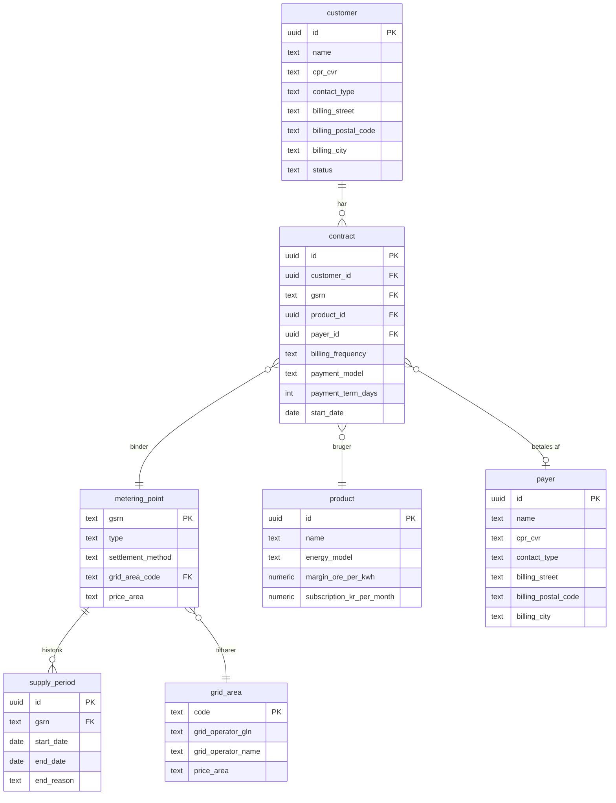
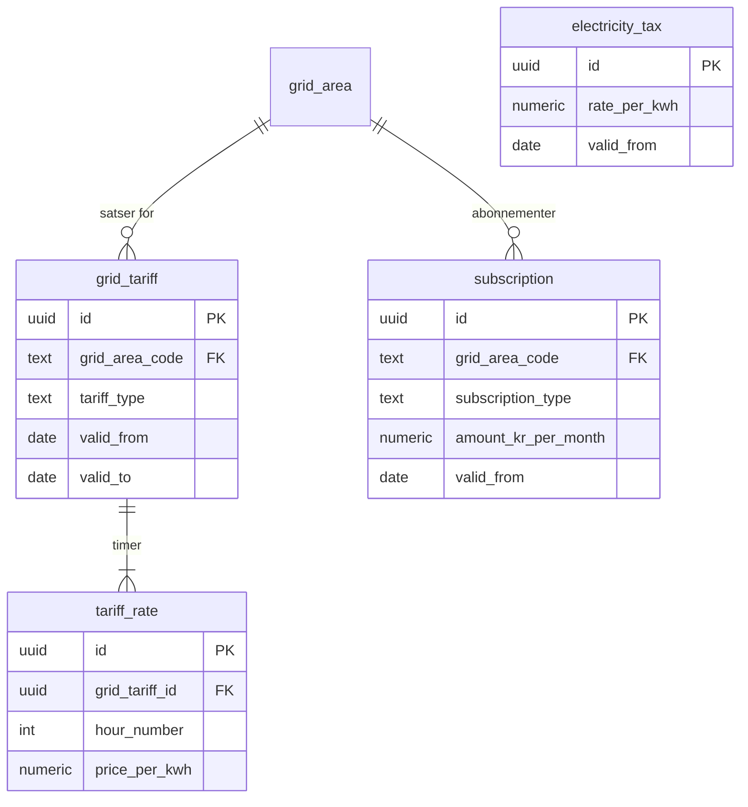
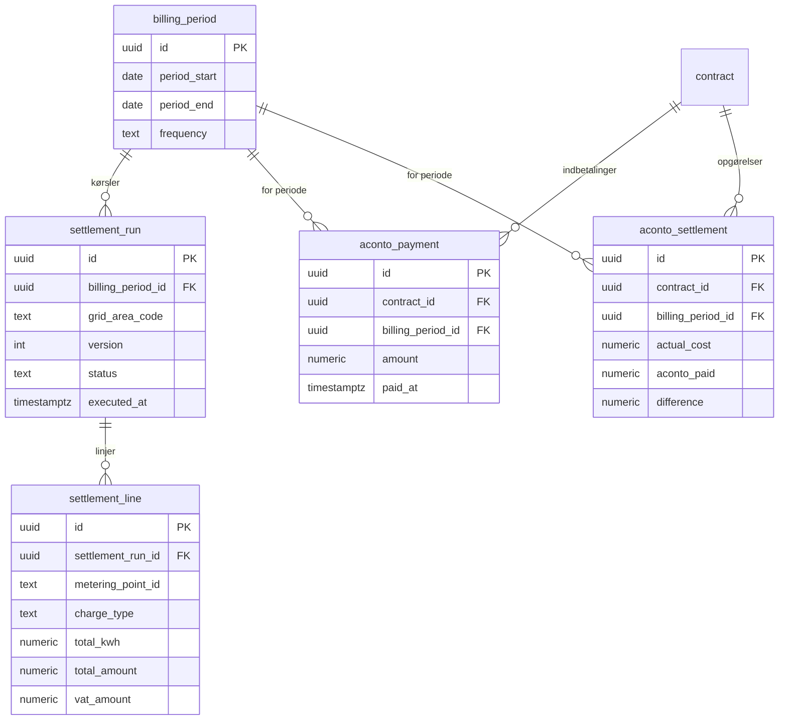

# DataHub 3: Database Model (PostgreSQL + TimescaleDB)

Physical database schema for the settlement system. Based on the conceptual [domain model (class diagram)](datahub3-class-diagram.md) and the technology choices described in the [architecture document](datahub3-proposed-architecture.md).

**Choice:** PostgreSQL with the TimescaleDB extension. A single database instance covers both time series and relational data.

---

## Schema Overview

```
┌─────────────────────────────────────────────────────────────────────┐
│  PostgreSQL + TimescaleDB                                           │
│                                                                     │
│  Schema: portfolio          Schema: metering          Schema: tariff│
│  ├── customer               ├── metering_data (hyper) ├── grid_tariff
│  ├── metering_point         ├── daily_summary (cont.) ├── tariff_rate
│  ├── supply_period          └── spot_price            ├── subscription
│  ├── contract                                         └── electricity_tax
│  ├── grid_area              Schema: settlement
│  ├── payer                  ├── billing_period        Schema: datahub
│  └── product
│                             ├── settlement_run        ├── inbound_message
│  Schema: lifecycle          ├── settlement_line       ├── outbound_request
│  ├── process_request        ├── aconto_payment        ├── processed_message_id
│  └── process_event          └── aconto_settlement     └── dead_letter
│
│                             Schema: invoicing
│                             ├── invoice
│                             └── invoice_line
└─────────────────────────────────────────────────────────────────────┘
```

---

## Schema: `portfolio`

### customer

```sql
CREATE TABLE portfolio.customer (
    id              UUID PRIMARY KEY DEFAULT gen_random_uuid(),
    name            TEXT NOT NULL,
    cpr_cvr         TEXT NOT NULL,                -- CPR (10) or CVR (8), encrypted at rest
    contact_type    TEXT NOT NULL CHECK (contact_type IN ('private', 'business')),
    email           TEXT,
    phone           TEXT,
    -- Billing/contact address (distinct from supply point address)
    billing_street          TEXT,               -- e.g. 'Vestergade'
    billing_house_number    TEXT,               -- e.g. '12A'
    billing_floor           TEXT,               -- e.g. '3' or 'st'
    billing_door            TEXT,               -- e.g. 'th', 'tv', 'mf'
    billing_postal_code     TEXT,               -- 4 digits, e.g. '8000'
    billing_city            TEXT,               -- e.g. 'Aarhus C'
    status          TEXT NOT NULL DEFAULT 'active' CHECK (status IN ('active', 'inactive', 'archived')),
    created_at      TIMESTAMPTZ NOT NULL DEFAULT now(),
    updated_at      TIMESTAMPTZ NOT NULL DEFAULT now()
);

CREATE INDEX idx_customer_cpr_cvr ON portfolio.customer (cpr_cvr);
CREATE INDEX idx_customer_status ON portfolio.customer (status);
```

**GDPR note:** `cpr_cvr` must be encrypted at rest (column-level encryption or transparent data encryption). Consider storing only a hash for lookups and the encrypted value separately.

**Address note:** The billing address is where the customer lives and receives correspondence. This is distinct from the supply point (metering point location), which is identified by GSRN. A customer may have supply at one address but live at another (e.g., summer house, rental property).

### payer

The payer is the entity that pays the invoice. In most cases the customer is the payer, but they can differ (e.g., parent paying for child's apartment, company paying for employee's home).

```sql
CREATE TABLE portfolio.payer (
    id                      UUID PRIMARY KEY DEFAULT gen_random_uuid(),
    name                    TEXT NOT NULL,
    cpr_cvr                 TEXT NOT NULL,
    contact_type            TEXT NOT NULL CHECK (contact_type IN ('private', 'business')),
    email                   TEXT,
    phone                   TEXT,
    billing_street          TEXT,
    billing_house_number    TEXT,
    billing_floor           TEXT,
    billing_door            TEXT,
    billing_postal_code     TEXT,
    billing_city            TEXT,
    created_at              TIMESTAMPTZ NOT NULL DEFAULT now(),
    updated_at              TIMESTAMPTZ NOT NULL DEFAULT now()
);

CREATE INDEX idx_payer_cpr_cvr ON portfolio.payer (cpr_cvr);
```

When `contract.payer_id` is NULL, the customer is the payer (default). When set, invoices for that contract go to the payer instead.

### metering_point

```sql
CREATE TABLE portfolio.metering_point (
    gsrn                TEXT PRIMARY KEY,          -- 18 digits, e.g. '571313100000012345'
    type                TEXT NOT NULL CHECK (type IN ('E17', 'E18')),  -- E17=consumption, E18=production
    settlement_method   TEXT NOT NULL CHECK (settlement_method IN ('flex', 'non_profiled')),
    connection_status   TEXT NOT NULL DEFAULT 'connected'
                        CHECK (connection_status IN ('connected', 'disconnected', 'closed_down')),
    grid_area_code      TEXT NOT NULL REFERENCES portfolio.grid_area(code),
    grid_operator_gln   TEXT NOT NULL,             -- 13 digits
    price_area          TEXT NOT NULL CHECK (price_area IN ('DK1', 'DK2')),
    activated_at        TIMESTAMPTZ,
    deactivated_at      TIMESTAMPTZ,
    created_at          TIMESTAMPTZ NOT NULL DEFAULT now(),
    updated_at          TIMESTAMPTZ NOT NULL DEFAULT now()
);

CREATE INDEX idx_metering_point_grid_area ON portfolio.metering_point (grid_area_code);
CREATE INDEX idx_metering_point_status ON portfolio.metering_point (connection_status);
```

### grid_area

```sql
CREATE TABLE portfolio.grid_area (
    code                TEXT PRIMARY KEY,           -- e.g. '344', '791'
    grid_operator_gln   TEXT NOT NULL,
    grid_operator_name  TEXT NOT NULL,
    price_area          TEXT NOT NULL CHECK (price_area IN ('DK1', 'DK2')),
    created_at          TIMESTAMPTZ NOT NULL DEFAULT now()
);
```

### supply_period

```sql
CREATE TABLE portfolio.supply_period (
    id              UUID PRIMARY KEY DEFAULT gen_random_uuid(),
    gsrn            TEXT NOT NULL REFERENCES portfolio.metering_point(gsrn),
    start_date      DATE NOT NULL,
    end_date        DATE,                          -- NULL = active supply period
    end_reason      TEXT CHECK (end_reason IN ('supplier_switch', 'move_out', 'non_payment')),
    created_at      TIMESTAMPTZ NOT NULL DEFAULT now()
);

CREATE INDEX idx_supply_period_gsrn ON portfolio.supply_period (gsrn);
CREATE INDEX idx_supply_period_active ON portfolio.supply_period (gsrn) WHERE end_date IS NULL;
```

### product

```sql
CREATE TABLE portfolio.product (
    id                      UUID PRIMARY KEY DEFAULT gen_random_uuid(),
    name                    TEXT NOT NULL,              -- e.g. 'Spot Standard', 'Green', 'Fixed Price 12 mo.'
    energy_model            TEXT NOT NULL CHECK (energy_model IN ('spot', 'fixed_price', 'mixed')),
    margin_ore_per_kwh      NUMERIC(8,4) NOT NULL,     -- supplier margin in ore/kWh (øre/kWh)
    supplement_ore_per_kwh  NUMERIC(8,4),              -- optional product supplement (green energy etc.)
    subscription_kr_per_month NUMERIC(10,2) NOT NULL,  -- supplier subscription in DKK/month
    binding_period_months   INT,                        -- NULL = no binding period
    is_active               BOOLEAN NOT NULL DEFAULT true,
    created_at              TIMESTAMPTZ NOT NULL DEFAULT now(),
    updated_at              TIMESTAMPTZ NOT NULL DEFAULT now()
);
```

### contract

```sql
CREATE TABLE portfolio.contract (
    id                  UUID PRIMARY KEY DEFAULT gen_random_uuid(),
    customer_id         UUID NOT NULL REFERENCES portfolio.customer(id),
    gsrn                TEXT NOT NULL REFERENCES portfolio.metering_point(gsrn),
    product_id          UUID NOT NULL REFERENCES portfolio.product(id),
    payer_id            UUID REFERENCES portfolio.payer(id),  -- NULL = customer is the payer
    billing_frequency   TEXT NOT NULL CHECK (billing_frequency IN ('monthly', 'quarterly')),
    payment_model       TEXT NOT NULL CHECK (payment_model IN ('aconto', 'post_payment')),
    payment_term_days   INT NOT NULL DEFAULT 30,
    start_date          DATE NOT NULL,
    end_date            DATE,
    created_at          TIMESTAMPTZ NOT NULL DEFAULT now(),
    updated_at          TIMESTAMPTZ NOT NULL DEFAULT now(),

    UNIQUE (gsrn, start_date)                      -- at most one contract per metering point per start date
);

CREATE INDEX idx_contract_customer ON portfolio.contract (customer_id);
CREATE INDEX idx_contract_gsrn ON portfolio.contract (gsrn);
CREATE INDEX idx_contract_active ON portfolio.contract (gsrn) WHERE end_date IS NULL;
```

### ER diagram: portfolio



---

## Schema: `metering`

### metering_data (TimescaleDB hypertable)

The largest table in the system. Approximately 230M rows/month at PT15M resolution.

```sql
CREATE TABLE metering.metering_data (
    metering_point_id   TEXT NOT NULL,              -- GSRN
    timestamp           TIMESTAMPTZ NOT NULL,       -- UTC, start of interval
    resolution          TEXT NOT NULL CHECK (resolution IN ('PT15M', 'PT1H', 'P1M')),
    quantity_kwh        NUMERIC(12,3) NOT NULL,     -- max 3 decimals per CIM
    quality_code        TEXT NOT NULL CHECK (quality_code IN ('A01', 'A02', 'A03', 'A06')),
    source_message_id   TEXT NOT NULL,              -- DataHub MessageId (traceability)
    received_at         TIMESTAMPTZ NOT NULL DEFAULT now(),

    PRIMARY KEY (metering_point_id, timestamp)
);

-- Convert to TimescaleDB hypertable with monthly chunks
SELECT create_hypertable(
    'metering.metering_data',
    by_range('timestamp', INTERVAL '1 month')
);

-- Composite index for settlement queries (already PK)
-- Additional index for traceability
CREATE INDEX idx_metering_data_source ON metering.metering_data (source_message_id);
```

**Compression (after data is "settled"):**

```sql
ALTER TABLE metering.metering_data SET (
    timescaledb.compress,
    timescaledb.compress_segmentby = 'metering_point_id',
    timescaledb.compress_orderby = 'timestamp'
);

-- Automatically compress data older than 3 months
SELECT add_compression_policy('metering.metering_data', INTERVAL '3 months');
```

**Retention policy:**

```sql
-- Delete raw data older than 5 years (legal requirement)
SELECT add_retention_policy('metering.metering_data', INTERVAL '5 years');
```

### daily_summary (TimescaleDB continuous aggregate)

Pre-aggregated daily overview — reduces settlement queries from 230M to 2.4M rows/month.

```sql
CREATE MATERIALIZED VIEW metering.daily_summary
WITH (timescaledb.continuous) AS
SELECT
    metering_point_id,
    time_bucket('1 day', timestamp)     AS date,
    SUM(quantity_kwh)                   AS total_kwh,
    COUNT(*)                            AS data_points,
    MIN(quality_code)                   AS worst_quality  -- A01 < A02 < A03 (lowest = worst)
FROM metering.metering_data
GROUP BY metering_point_id, time_bucket('1 day', timestamp);

-- Refresh automatically (1 hour delay to avoid race conditions)
SELECT add_continuous_aggregate_policy('metering.daily_summary',
    start_offset    => INTERVAL '3 days',
    end_offset      => INTERVAL '1 hour',
    schedule_interval => INTERVAL '1 hour'
);
```

### spot_price

```sql
CREATE TABLE metering.spot_price (
    price_area      TEXT NOT NULL CHECK (price_area IN ('DK1', 'DK2')),
    hour            TIMESTAMPTZ NOT NULL,           -- UTC, start of the hour
    price_per_kwh   NUMERIC(10,6) NOT NULL,         -- DKK/kWh
    source          TEXT,                            -- e.g. 'nordpool', 'energidataservice'
    fetched_at      TIMESTAMPTZ NOT NULL DEFAULT now(),

    PRIMARY KEY (price_area, hour)
);
```

---

## Schema: `tariff`

### grid_tariff

```sql
CREATE TABLE tariff.grid_tariff (
    id                  UUID PRIMARY KEY DEFAULT gen_random_uuid(),
    grid_area_code      TEXT NOT NULL REFERENCES portfolio.grid_area(code),
    charge_owner_id     TEXT NOT NULL,              -- GLN for the tariff owner
    tariff_type         TEXT NOT NULL CHECK (tariff_type IN ('grid', 'system', 'transmission')),
    charge_type_code    TEXT,                        -- CIM code from the Charges queue
    valid_from          DATE NOT NULL,
    valid_to            DATE,                        -- NULL = still valid
    source_message_id   TEXT,                        -- DataHub Charges queue MessageId
    created_at          TIMESTAMPTZ NOT NULL DEFAULT now(),

    UNIQUE (grid_area_code, tariff_type, valid_from)
);

CREATE INDEX idx_grid_tariff_area_validity ON tariff.grid_tariff (grid_area_code, valid_from, valid_to);
```

### tariff_rate

```sql
CREATE TABLE tariff.tariff_rate (
    id              UUID PRIMARY KEY DEFAULT gen_random_uuid(),
    grid_tariff_id  UUID NOT NULL REFERENCES tariff.grid_tariff(id) ON DELETE CASCADE,
    hour_number     INT NOT NULL CHECK (hour_number BETWEEN 1 AND 24),  -- DB convention: 1-24
    price_per_kwh   NUMERIC(10,6) NOT NULL,         -- DKK/kWh

    UNIQUE (grid_tariff_id, hour_number)
);
```

**Example:** A grid tariff (nettarif) with day/night/peak differentiation:

```
hour_number | price_per_kwh
  1-6       | 0.06          (night)
  7-16      | 0.18          (day)
  17-20     | 0.54          (peak)
  21-24     | 0.06          (night)
```

### subscription

```sql
CREATE TABLE tariff.subscription (
    id                  UUID PRIMARY KEY DEFAULT gen_random_uuid(),
    grid_area_code      TEXT REFERENCES portfolio.grid_area(code),  -- NULL for supplier subscription
    subscription_type   TEXT NOT NULL CHECK (subscription_type IN ('grid', 'supplier')),
    amount_kr_per_month NUMERIC(10,2) NOT NULL,
    valid_from          DATE NOT NULL,
    valid_to            DATE,
    source_message_id   TEXT,                       -- NULL for supplier subscription (our own)
    created_at          TIMESTAMPTZ NOT NULL DEFAULT now()
);

CREATE INDEX idx_subscription_area ON tariff.subscription (grid_area_code, valid_from);
```

### electricity_tax

```sql
CREATE TABLE tariff.electricity_tax (
    id              UUID PRIMARY KEY DEFAULT gen_random_uuid(),
    rate_per_kwh    NUMERIC(10,6) NOT NULL,         -- DKK/kWh
    valid_from      DATE NOT NULL,
    valid_to        DATE,
    description     TEXT,                            -- e.g. 'Electricity tax (elafgift) 2025'
    created_at      TIMESTAMPTZ NOT NULL DEFAULT now(),

    UNIQUE (valid_from)
);
```

### ER diagram: tariff



---

## Schema: `settlement`

### billing_period

```sql
CREATE TABLE settlement.billing_period (
    id              UUID PRIMARY KEY DEFAULT gen_random_uuid(),
    period_start    DATE NOT NULL,
    period_end      DATE NOT NULL,
    frequency       TEXT NOT NULL CHECK (frequency IN ('monthly', 'quarterly')),
    created_at      TIMESTAMPTZ NOT NULL DEFAULT now(),

    UNIQUE (period_start, period_end),
    CHECK (period_end > period_start)
);
```

### settlement_run

```sql
CREATE TABLE settlement.settlement_run (
    id                  UUID PRIMARY KEY DEFAULT gen_random_uuid(),
    billing_period_id   UUID NOT NULL REFERENCES settlement.billing_period(id),
    grid_area_code      TEXT,                       -- NULL = all grid areas, otherwise partitioned
    version             INT NOT NULL DEFAULT 1,     -- incremented on recalculation
    status              TEXT NOT NULL DEFAULT 'running'
                        CHECK (status IN ('running', 'completed', 'failed')),
    executed_at         TIMESTAMPTZ NOT NULL DEFAULT now(),
    completed_at        TIMESTAMPTZ,
    error_details       TEXT,
    metering_points_count INT,                      -- number of processed metering points

    UNIQUE (billing_period_id, grid_area_code, version)
);

CREATE INDEX idx_settlement_run_period ON settlement.settlement_run (billing_period_id);
CREATE INDEX idx_settlement_run_status ON settlement.settlement_run (status) WHERE status = 'running';
```

### settlement_line

```sql
CREATE TABLE settlement.settlement_line (
    id                  UUID PRIMARY KEY DEFAULT gen_random_uuid(),
    settlement_run_id   UUID NOT NULL REFERENCES settlement.settlement_run(id) ON DELETE CASCADE,
    metering_point_id   TEXT NOT NULL,              -- GSRN
    charge_type         TEXT NOT NULL CHECK (charge_type IN (
                            'energy', 'grid_tariff', 'system_tariff', 'transmission_tariff',
                            'electricity_tax', 'grid_subscription', 'supplier_subscription'
                        )),
    total_kwh           NUMERIC(12,3),              -- NULL for subscriptions
    total_amount        NUMERIC(12,2) NOT NULL,     -- DKK excl. VAT
    vat_amount          NUMERIC(12,2) NOT NULL,     -- 25% VAT (moms)
    currency            TEXT NOT NULL DEFAULT 'DKK'
);

CREATE INDEX idx_settlement_line_run ON settlement.settlement_line (settlement_run_id);
CREATE INDEX idx_settlement_line_mp ON settlement.settlement_line (metering_point_id);
```

### aconto_payment

```sql
CREATE TABLE settlement.aconto_payment (
    id                  UUID PRIMARY KEY DEFAULT gen_random_uuid(),
    contract_id         UUID NOT NULL REFERENCES portfolio.contract(id),
    billing_period_id   UUID NOT NULL REFERENCES settlement.billing_period(id),
    amount              NUMERIC(12,2) NOT NULL,     -- DKK incl. VAT
    paid_at             TIMESTAMPTZ,                -- NULL = expected but not yet paid
    created_at          TIMESTAMPTZ NOT NULL DEFAULT now(),

    UNIQUE (contract_id, billing_period_id)
);
```

### aconto_settlement

```sql
CREATE TABLE settlement.aconto_settlement (
    id                  UUID PRIMARY KEY DEFAULT gen_random_uuid(),
    contract_id         UUID NOT NULL REFERENCES portfolio.contract(id),
    billing_period_id   UUID NOT NULL REFERENCES settlement.billing_period(id),
    actual_cost         NUMERIC(12,2) NOT NULL,     -- actual settled amount incl. VAT
    aconto_paid         NUMERIC(12,2) NOT NULL,     -- aconto amount paid in
    difference          NUMERIC(12,2) NOT NULL,     -- actual_cost - aconto_paid (positive = customer owes)
    new_aconto_amount   NUMERIC(12,2),              -- recalculated aconto for next period
    settled_at          TIMESTAMPTZ NOT NULL DEFAULT now(),

    UNIQUE (contract_id, billing_period_id)
);
```

### ER diagram: settlement



---

## Schema: `invoicing`

### invoice

```sql
CREATE TABLE invoicing.invoice (
    id                  UUID PRIMARY KEY DEFAULT gen_random_uuid(),
    customer_id         UUID NOT NULL REFERENCES portfolio.customer(id),
    payer_id            UUID REFERENCES portfolio.payer(id),  -- NULL = customer is the payer
    billing_period_id   UUID NOT NULL REFERENCES settlement.billing_period(id),
    settlement_run_id   UUID REFERENCES settlement.settlement_run(id),
    invoice_type        TEXT NOT NULL CHECK (invoice_type IN (
                            'standard', 'aconto_combined', 'final_settlement', 'credit_note', 'debit_note'
                        )),
    status              TEXT NOT NULL DEFAULT 'draft' CHECK (status IN (
                            'draft', 'issued', 'sent', 'paid', 'overdue', 'cancelled'
                        )),
    invoice_number      TEXT UNIQUE,                -- assigned upon issuance
    issued_at           TIMESTAMPTZ,
    due_date            DATE,
    total_ex_vat        NUMERIC(12,2) NOT NULL,
    vat_amount          NUMERIC(12,2) NOT NULL,
    total_incl_vat      NUMERIC(12,2) NOT NULL,
    currency            TEXT NOT NULL DEFAULT 'DKK',
    created_at          TIMESTAMPTZ NOT NULL DEFAULT now(),
    updated_at          TIMESTAMPTZ NOT NULL DEFAULT now()
);

CREATE INDEX idx_invoice_customer ON invoicing.invoice (customer_id);
CREATE INDEX idx_invoice_status ON invoicing.invoice (status);
CREATE INDEX idx_invoice_period ON invoicing.invoice (billing_period_id);
```

### invoice_line

```sql
CREATE TABLE invoicing.invoice_line (
    id              UUID PRIMARY KEY DEFAULT gen_random_uuid(),
    invoice_id      UUID NOT NULL REFERENCES invoicing.invoice(id) ON DELETE CASCADE,
    sort_order      INT NOT NULL,                   -- display order on the invoice
    charge_type     TEXT NOT NULL CHECK (charge_type IN (
                        'energy', 'grid_tariff', 'system_tariff', 'transmission_tariff',
                        'electricity_tax', 'grid_subscription', 'supplier_subscription',
                        'aconto_settlement', 'aconto_new_period', 'vat'
                    )),
    description     TEXT NOT NULL,                   -- e.g. 'Electricity supply (spot + margin)'
    quantity        NUMERIC(12,3),                   -- kWh, days, or units
    unit_price      NUMERIC(12,6),                   -- DKK per unit
    amount          NUMERIC(12,2) NOT NULL,          -- DKK (line total amount)

    UNIQUE (invoice_id, sort_order)
);

CREATE INDEX idx_invoice_line_invoice ON invoicing.invoice_line (invoice_id);
```

---

## Schema: `lifecycle`

### process_request

```sql
CREATE TABLE lifecycle.process_request (
    id                      UUID PRIMARY KEY DEFAULT gen_random_uuid(),
    process_type            TEXT NOT NULL CHECK (process_type IN (
                                'supplier_switch', 'short_notice_switch', 'move_in',
                                'end_of_supply', 'forced_end_of_supply', 'move_out',
                                'cancel_switch', 'cancel_end_of_supply',
                                'incorrect_switch', 'incorrect_move'
                            )),
    gsrn                    TEXT NOT NULL,
    status                  TEXT NOT NULL DEFAULT 'pending' CHECK (status IN (
                                'pending', 'sent_to_datahub', 'acknowledged', 'rejected',
                                'effectuation_pending', 'completed', 'cancelled'
                            )),
    effective_date          DATE,                    -- requested effective date
    datahub_correlation_id  TEXT,                     -- from RSM-001 acknowledgement
    requested_at            TIMESTAMPTZ NOT NULL DEFAULT now(),
    completed_at            TIMESTAMPTZ,
    created_at              TIMESTAMPTZ NOT NULL DEFAULT now(),
    updated_at              TIMESTAMPTZ NOT NULL DEFAULT now()
);

CREATE INDEX idx_process_request_gsrn ON lifecycle.process_request (gsrn);
CREATE INDEX idx_process_request_status ON lifecycle.process_request (status)
    WHERE status NOT IN ('completed', 'cancelled', 'rejected');
CREATE INDEX idx_process_request_correlation ON lifecycle.process_request (datahub_correlation_id)
    WHERE datahub_correlation_id IS NOT NULL;
```

### process_event (event sourcing)

```sql
CREATE TABLE lifecycle.process_event (
    id                  UUID PRIMARY KEY DEFAULT gen_random_uuid(),
    process_request_id  UUID NOT NULL REFERENCES lifecycle.process_request(id),
    occurred_at         TIMESTAMPTZ NOT NULL DEFAULT now(),
    event_type          TEXT NOT NULL,               -- e.g. 'sent', 'acknowledged', 'rejected', 'completed'
    payload             JSONB,                       -- message content, rejection reason, etc.
    source              TEXT                          -- 'system', 'datahub', 'operator'
);

CREATE INDEX idx_process_event_request ON lifecycle.process_event (process_request_id, occurred_at);
```

---

## Schema: `datahub`

### inbound_message

```sql
CREATE TABLE datahub.inbound_message (
    id                  UUID PRIMARY KEY DEFAULT gen_random_uuid(),
    datahub_message_id  TEXT NOT NULL,               -- MessageId from peek header
    message_type        TEXT NOT NULL,               -- e.g. 'RSM-012', 'RSM-022', 'RSM-014'
    correlation_id      TEXT,                        -- CorrelationId from header (always store!)
    queue_name          TEXT NOT NULL,               -- 'timeseries', 'masterdata', 'aggregations', 'charges'
    status              TEXT NOT NULL DEFAULT 'received'
                        CHECK (status IN ('received', 'parsed', 'processed', 'dead_lettered')),
    raw_payload_size    INT,                         -- bytes (we do not store the full payload)
    error_details       TEXT,
    received_at         TIMESTAMPTZ NOT NULL DEFAULT now(),
    processed_at        TIMESTAMPTZ
);

CREATE INDEX idx_inbound_message_datahub_id ON datahub.inbound_message (datahub_message_id);
CREATE INDEX idx_inbound_message_status ON datahub.inbound_message (status)
    WHERE status NOT IN ('processed');
CREATE INDEX idx_inbound_message_received ON datahub.inbound_message (received_at DESC);
```

### outbound_request

```sql
CREATE TABLE datahub.outbound_request (
    id                  UUID PRIMARY KEY DEFAULT gen_random_uuid(),
    process_type        TEXT NOT NULL,               -- e.g. 'BRS-001', 'RSM-015'
    gsrn                TEXT,
    status              TEXT NOT NULL DEFAULT 'sent'
                        CHECK (status IN ('sent', 'acknowledged_ok', 'acknowledged_error', 'timed_out')),
    correlation_id      TEXT,                        -- from DataHub response
    sent_at             TIMESTAMPTZ NOT NULL DEFAULT now(),
    response_at         TIMESTAMPTZ,
    error_details       TEXT
);

CREATE INDEX idx_outbound_request_correlation ON datahub.outbound_request (correlation_id)
    WHERE correlation_id IS NOT NULL;
CREATE INDEX idx_outbound_request_pending ON datahub.outbound_request (status)
    WHERE status = 'sent';
```

### processed_message_id (idempotency)

```sql
CREATE TABLE datahub.processed_message_id (
    message_id      TEXT PRIMARY KEY,               -- DataHub MessageId
    processed_at    TIMESTAMPTZ NOT NULL DEFAULT now()
);

-- Automatic deletion of old entries (older than 90 days)
-- Implemented via cron job or TimescaleDB retention
```

### dead_letter

```sql
CREATE TABLE datahub.dead_letter (
    id                  UUID PRIMARY KEY DEFAULT gen_random_uuid(),
    original_message_id TEXT,
    queue_name          TEXT NOT NULL,
    error_reason        TEXT NOT NULL,
    raw_payload         JSONB,                       -- the failed message (for reprocessing)
    failed_at           TIMESTAMPTZ NOT NULL DEFAULT now(),
    resolved            BOOLEAN NOT NULL DEFAULT false,
    resolved_at         TIMESTAMPTZ,
    resolved_by         TEXT                          -- operator ID
);

CREATE INDEX idx_dead_letter_unresolved ON datahub.dead_letter (failed_at DESC)
    WHERE NOT resolved;
```

---

## Useful Queries

### Retrieve consumption for a metering point in a period

```sql
SELECT
    metering_point_id,
    timestamp,
    quantity_kwh,
    quality_code
FROM metering.metering_data
WHERE metering_point_id = '571313100000012345'
  AND timestamp >= '2025-01-01'
  AND timestamp < '2025-02-01'
ORDER BY timestamp;
```

### Daily consumption via continuous aggregate

```sql
SELECT date, total_kwh, data_points
FROM metering.daily_summary
WHERE metering_point_id = '571313100000012345'
  AND date >= '2025-01-01'
  AND date < '2025-02-01'
ORDER BY date;
```

### Retrieve applicable tariffs for a grid area

```sql
SELECT gt.tariff_type, tr.hour_number, tr.price_per_kwh
FROM tariff.grid_tariff gt
JOIN tariff.tariff_rate tr ON tr.grid_tariff_id = gt.id
WHERE gt.grid_area_code = '344'
  AND gt.valid_from <= '2025-01-15'
  AND (gt.valid_to IS NULL OR gt.valid_to > '2025-01-15')
ORDER BY gt.tariff_type, tr.hour_number;
```

### Settlement calculation: energy line for one month

```sql
SELECT
    md.metering_point_id,
    SUM(md.quantity_kwh * (sp.price_per_kwh + p.margin_ore_per_kwh / 100.0)) AS energy_amount
FROM metering.metering_data md
JOIN metering.spot_price sp
    ON sp.price_area = 'DK1'
    AND sp.hour = date_trunc('hour', md.timestamp)
JOIN portfolio.contract c ON c.gsrn = md.metering_point_id AND c.end_date IS NULL
JOIN portfolio.product p ON p.id = c.product_id
WHERE md.metering_point_id = '571313100000012345'
  AND md.timestamp >= '2025-01-01'
  AND md.timestamp < '2025-02-01'
GROUP BY md.metering_point_id;
```

### Unresolved dead letters

```sql
SELECT id, queue_name, error_reason, failed_at
FROM datahub.dead_letter
WHERE NOT resolved
ORDER BY failed_at DESC;
```

---

## Migration and Maintenance

### Setup (in order)

```sql
-- 1. Extensions
CREATE EXTENSION IF NOT EXISTS timescaledb;
CREATE EXTENSION IF NOT EXISTS pgcrypto;    -- for gen_random_uuid() and optional encryption

-- 2. Schemas
CREATE SCHEMA IF NOT EXISTS portfolio;
CREATE SCHEMA IF NOT EXISTS metering;
CREATE SCHEMA IF NOT EXISTS tariff;
CREATE SCHEMA IF NOT EXISTS settlement;
CREATE SCHEMA IF NOT EXISTS invoicing;
CREATE SCHEMA IF NOT EXISTS lifecycle;
CREATE SCHEMA IF NOT EXISTS datahub;

-- 3. Tables (portfolio first due to FK references)
-- 4. Hypertables and continuous aggregates
-- 5. Compression policies
-- 6. Retention policies
```

### Storage Requirements (estimate, 80K customers, PT15M)

| Table | Rows/month | Raw size | With compression |
|-------|------------|----------|------------------|
| metering_data | ~230M | ~9 GB | ~0.7 GB |
| daily_summary | ~2.4M | ~100 MB | (view) |
| spot_price | ~1,500 | <1 MB | -- |
| settlement_line | ~560K | ~30 MB | -- |
| Everything else | -- | ~50 MB | -- |
| **Total per month** | | | **~1 GB** |

---

## Sources

- [Class diagram (domain model)](datahub3-class-diagram.md) -- conceptual model
- [Proposed system architecture](datahub3-proposed-architecture.md) -- data architecture and technology choices
- [Product structure and billing](datahub3-product-and-billing.md) -- all invoice parameters
- [Settlement overview](datahub3-settlement-overview.md) -- settlement calculation
