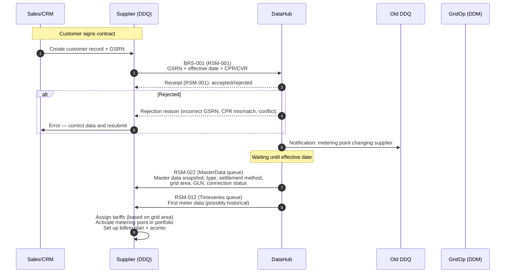
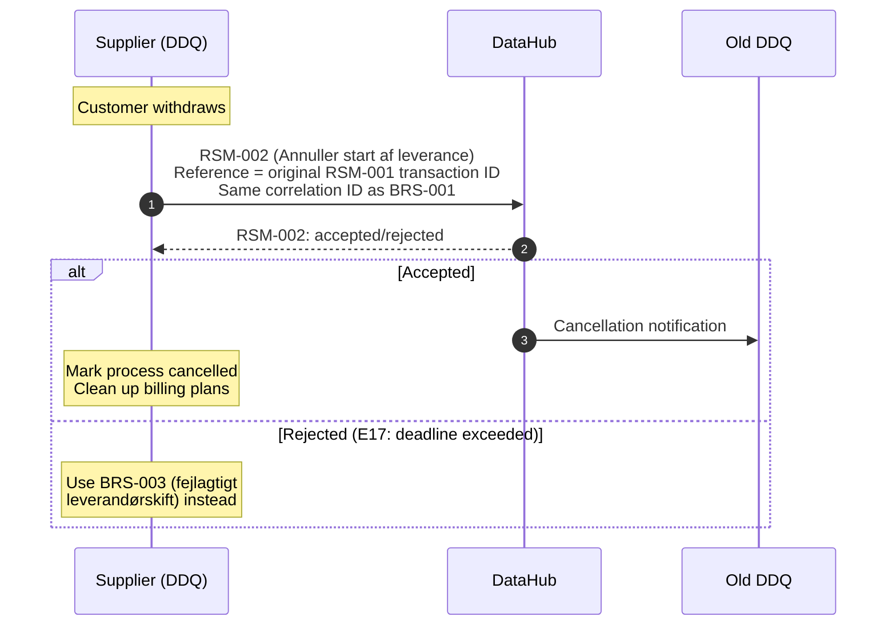
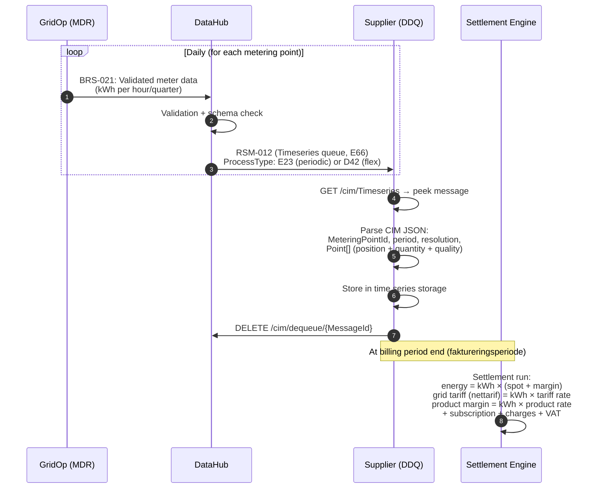
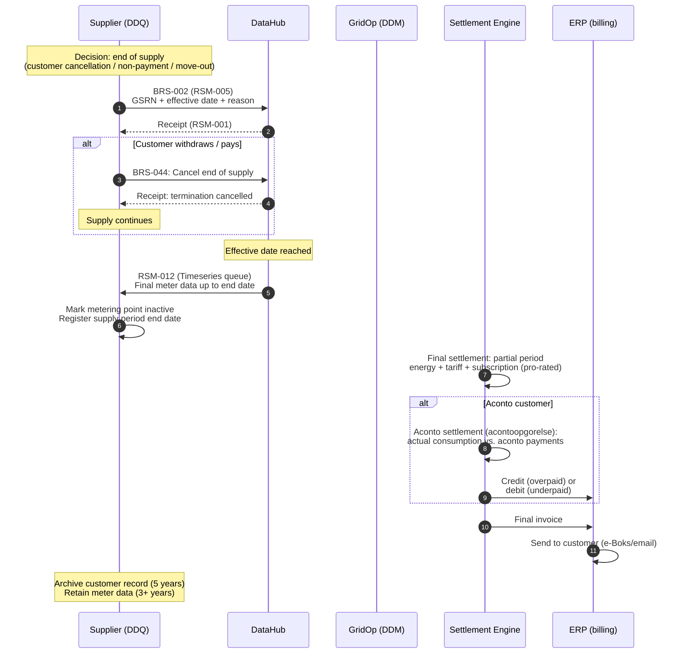
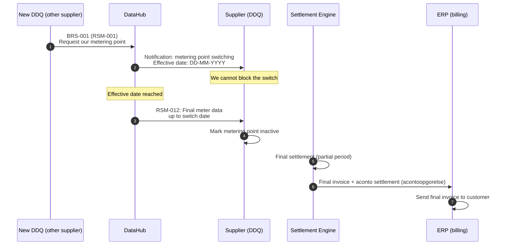
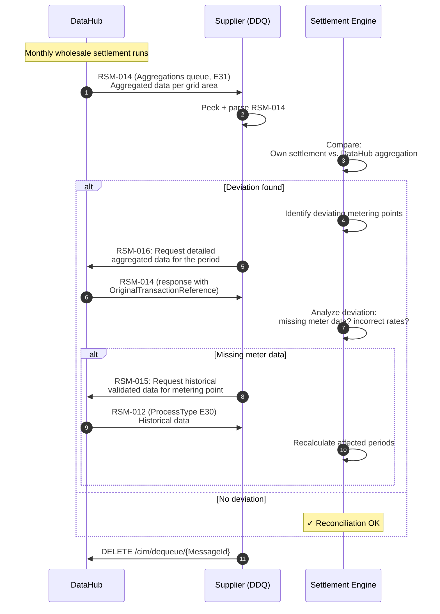
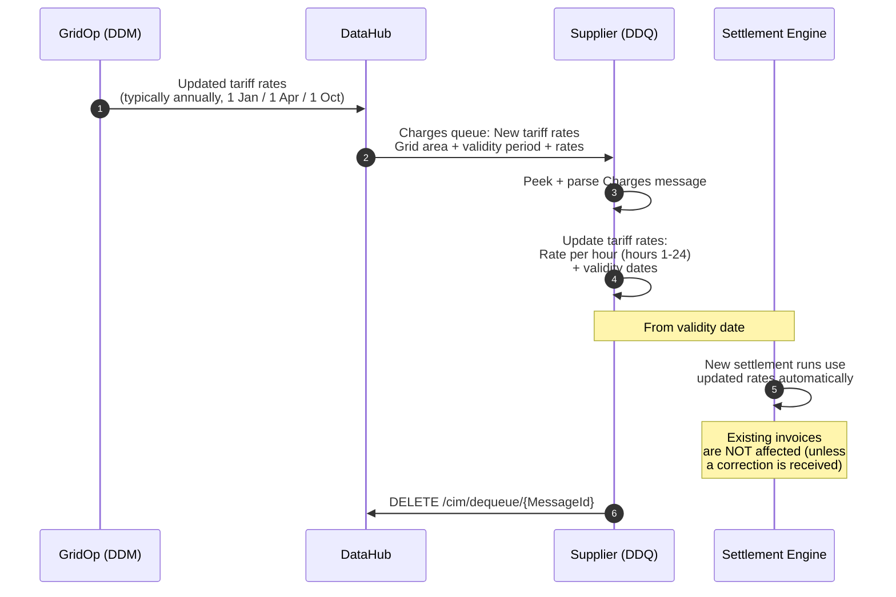
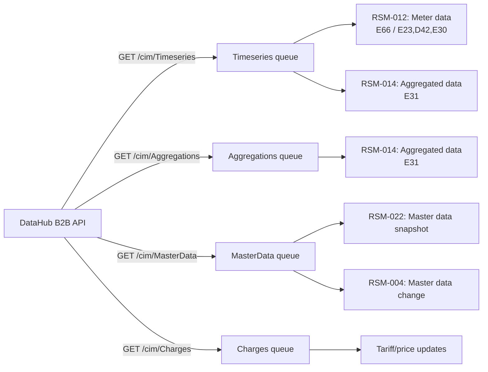

# DataHub 3: Sequence Diagrams for Message Flows

The diagrams show the communication between actors in the most important business processes. Used as a supplement to [Customer Lifecycle](datahub3-customer-lifecycle.md).

**Actors:**
- **Supplier (DDQ)** — electricity supplier (elleverandor)
- **DataHub** — Energinet's central data hub
- **GridOp (DDM/MDR)** — grid operator / metered data responsible (netvirksomhed / maledataansvarlig)
- **Old DDQ** — the outgoing supplier (during a switch)
- **New DDQ** — the incoming supplier (during an incoming switch)
- **Settl** — internal settlement system (afregningssystem)
- **ERP** — billing/ERP system (e.g. D365, SAP, e-conomic)

---

## 1. BRS-001: Supplier Switch (we take over a customer)

The most common onboarding flow. The customer has chosen us as their new supplier.

**Deadlines:** Min. 15 business days notice (BRS-001).

**Cancellation:** Customer withdraws before effective date → send **RSM-002** (Annuller start af leverance) within the same BRS-001 process, referencing the original RSM-001 transaction. DataHub responds with RSM-002 accept/reject. Same correlation ID throughout. Must be submitted no later than the day before the effective date. After the cancellation deadline, use BRS-003 (fejlagtigt leverandørskift) instead.

> **Source:** [Energinet BRS-forretningsprocesser](https://energinet.dk/media/2nqdysv3/brs-forretningsprocesser-for-det-danske-elmarked.pdf), §4.1.9–4.1.10, §4.1.14.

### 1b. BRS-001 Cancellation (before effective date)

**Validation rules** (§4.1.10):
| Code | Rule |
|------|------|
| E10 | Metering point must be identifiable |
| D05 | Metering point must match original RSM-001 |
| E16 | Supplier must be the same as in original request |
| E17 | Must be within deadline (day before effective date) |
| D06 | Reference must match original transaction ID |
| D19 | Function code must be "Annullering" (cancellation) |

**Note:** BRS-003 (Håndtering af fejlagtigt leverandørskift) is a completely separate process for reversing a switch **after** the effective date. It uses RSM-003 and is initiated by the old/current DDQ — not covered in our current implementation.

---

## 2. RSM-012: Daily Meter Data Flow (operations)

The daily heartbeat — the grid operator reads meters, DataHub validates and forwards.

**Important fields in RSM-012:**
- `Series/MarketEvaluationPoint/mRID` = GSRN (18 digits)
- `Series/Period/resolution` = PT15M, PT1H or P1M
- `Series/Period/Point/quantity` = kWh (max 3 decimals)
- `Series/Period/Point/quality` = A01/A02/A03/A06

---

## 3. BRS-002: End of Supply (we terminate)

The customer cancels or moves out. We initiate the termination.

**Offboarding scenarios:**
- **Scenario A:** Another supplier sends BRS-001 for our metering point → we receive, not initiate
- **Scenario B/D:** We send BRS-002 (cancellation / non-payment)
- **Scenario C:** Move-out → BRS-010

---

## 4. BRS-001 Incoming: Supplier Switch (we lose a customer)

Another supplier takes over our customer. We are the passive party.

---

## 5. Wholesale Settlement and Reconciliation (BRS-027)

Monthly reconciliation of our own settlement calculations against DataHub's wholesale settlement (engrosopgorelse).

**Aggregation types (Warning: VERIFY codes):**
- D03 = Preliminary aggregation (forelobig)
- D04 = Corrected aggregation (korrigeret)
- D05 = Final aggregation (endelig)

---

## 6. Tariff Update (Charges Queue)

The grid operator changes tariff rates — affects future settlement calculations.

---

## 7. Overview: Queue Routing

Overview of which messages arrive in which queues:

---

## Sources

- [Customer Lifecycle: Onboarding to Offboarding](datahub3-customer-lifecycle.md)
- [Edge Cases and Error Handling](datahub3-edge-cases.md)
- [DataHub 3 DDQ Business Process Reference](datahub3-ddq-business-processes.md)
- [RSM-012 Meter Data Reference](rsm-012-datahub3-measure-data.md)
- [Proposed System Architecture](datahub3-proposed-architecture.md)
- [Authentication and Security](datahub3-authentication-security.md)
- [Energinet BRS-forretningsprocesser for det danske elmarked](https://energinet.dk/media/2nqdysv3/brs-forretningsprocesser-for-det-danske-elmarked.pdf) (Doc. 15/00718-195, primary reference for all BRS/RSM flows)
- CIM Webservice Interface (Doc. 22/03077-1)
- CIM EDI Guide (Doc. 15/00718-191)
