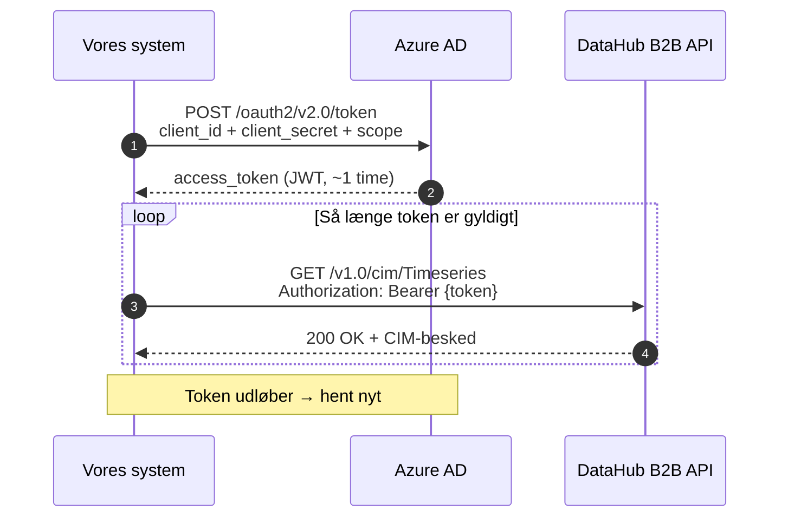

# DataHub 3: Authentication and Security

This guide covers everything required to authenticate against the DataHub 3 B2B API and comply with the security requirements as a market participant (markedsaktør).

---

## Overview

```
┌──────────────────┐    OAuth2 token    ┌──────────────┐    B2B API     ┌──────────┐
│  Vores system    │───────────────────→│  Azure AD    │               │          │
│                  │←───────────────────│  (token)     │               │          │
│                  │                    └──────────────┘               │ DataHub  │
│                  │────── Bearer token ──────────────────────────────→│ 3        │
│                  │←──── CIM JSON/XML ──────────────────────────────│          │
└──────────────────┘                                                  └──────────┘
```

All communication with DataHub 3 requires:
1. **OAuth2 access token** from Azure AD (Client Credentials Grant)
2. **HTTPS** — all traffic is encrypted in transit
3. **Actor identification** (aktør-identifikation) — GLN number identifies who we are

---

## OAuth2 Client Credentials

### Flow

DataHub 3 uses **OAuth 2.0 Client Credentials Grant**. There is no user login — the system authenticates itself with a client ID and a client secret.



### Token Request (token-anmodning)

```http
POST https://login.microsoftonline.com/{tenant-id}/oauth2/v2.0/token
Content-Type: application/x-www-form-urlencoded

grant_type=client_credentials
&client_id={client-id}
&client_secret={client-secret}
&scope={scope}/.default
```

**Response:**
```json
{
  "access_token": "eyJ0eXAiOiJKV1Q...",
  "token_type": "Bearer",
  "expires_in": 3599
}
```

- `expires_in: 3599` = token is valid for ~1 hour
- `scope` is specified with a `/.default` suffix — the exact scope value is obtained from the actor portal (aktørportalen)

### Environment-Specific Parameters (miljøspecifikke parametre)

| Environment | Tenant ID | API Host |
|-------------|-----------|----------|
| **Actor Test** (Aktørtest) | `5a396c36-d56e-4db4-880b-c7894f2d9966` | `api.itlev.datahub.dk` |
| **Preprod** | `20e7a6b4-86e0-4e7a-a34d-6dc5a75d1982` | `preprod.b2b.datahub3.dk` |
| **Production** (Produktion) | `4b8c3f88-6cca-480c-af02-b2d2f220913f` | `b2b.datahub3.dk` |

Each environment has **separate credentials** — a client ID and secret from one environment will not work in another.

---

## Credential Management (credential-administration)

### Creation (oprettelse)

Credentials are created in the **DataHub actor portal** (aktørportalen) under the "B2B adgang" tab:

1. Log in to the actor portal with MitID (a person authorized to act on behalf of the actor)
2. Select the actor (GLN) you want to create credentials for
3. Go to "B2B adgang" and create a new client
4. The system generates a `client_id` and `client_secret`
5. **Save the secret immediately** — it cannot be retrieved later

### Lifetime and Rotation (levetid og rotation)

| Property | Value |
|----------|-------|
| Client secret lifetime | **12 months** from creation |
| Number of active secrets | Up to 2 simultaneously (enables rotation without downtime) |
| Reminder | The actor portal sends an email before expiry |

**Rotation strategy:**
1. Create a new secret (secret B) while the old one (secret A) is still valid
2. Update the system configuration to use secret B
3. Verify that the system authenticates correctly with secret B
4. Delete secret A in the actor portal

```
Tid ──────────────────────────────────────────────→

Secret A: ████████████████████████████████░░░░░  (udløber)
Secret B:                    ████████████████████████████████████
                             ↑
                    Skift her (overlap-periode)
```

### Configuration in the System (konfiguration i systemet)

Credentials must **never** be hardcoded in the source code. Recommended approach:

```
┌─────────────────────────────────────────────────┐
│  Hemmelighedslagring (vælg én)                  │
│                                                  │
│  • Azure Key Vault (anbefalet til Azure-hosted) │
│  • HashiCorp Vault                               │
│  • AWS Secrets Manager                           │
│  • Environment variables (minimum for dev)       │
└──────────────────────┬──────────────────────────┘
                       │
                       ▼
┌─────────────────────────────────────────────────┐
│  Applikationskonfiguration                      │
│                                                  │
│  DataHub:Environment = prod                     │
│  DataHub:TenantId    = (fra vault)              │
│  DataHub:ClientId    = (fra vault)              │
│  DataHub:ClientSecret = (fra vault)             │
│  DataHub:BaseUrl     = https://b2b.datahub3.dk  │
│  DataHub:ActorGLN    = (vores GLN)              │
└─────────────────────────────────────────────────┘
```

---

## Token Handling in Practice (token-håndtering i praksis)

### Caching and Proactive Renewal

You should **not** fetch a new token for every API call. Instead:

1. **Cache** the active token in memory
2. **Renew proactively** before it expires (e.g., with a 5-minute margin)
3. **Handle 401** as a fallback — if DataHub returns 401, fetch a new token and retry

```
Token-livscyklus:

  Hent token ──→ Brug token ──→ Brug token ──→ ... ──→ Forny
  (t=0)          (t=1 min)      (t=2 min)              (t=55 min)
                                                         ↓
                                                    Hent nyt token
                                                    (t=55 min)
```

**Implementation recommendation (.NET):**

Use a `DelegatingHandler` in `HttpClientFactory` that automatically inserts the Bearer token and renews it:

```
HttpClient-pipeline:
  Request → [TokenHandler: indsæt/forny Bearer] → [RetryHandler] → DataHub API
```

### Error Scenarios (fejlscenarier)

| HTTP Code | Meaning | Action |
|-----------|---------|--------|
| **401 Unauthorized** | Token expired or invalid | Fetch new token, retry |
| **403 Forbidden** | Incorrect actor role or missing permission | Check credentials and GLN in the actor portal |
| **429 Too Many Requests** | Rate limit exceeded | Wait and retry with backoff |
| **5xx** | DataHub server error | Retry with exponential backoff |

---

## Authorization Model (autorisationsmodel)

### Actor Identity (aktør-identitet)

DataHub identifies actors via **GLN** (Global Location Number, 13 digits). The actor's market role determines which data is accessible:

| Market Role (markedsrolle) | Code | Access |
|----------------------------|------|--------|
| **Electricity supplier** (Elleverandør) | DDQ | Metering data + master data for own metering points |
| **Grid company** (Netvirksomhed) | DDM | Metering data + master data for own grid area |
| **Metered data responsible** (Måledataansvarlig) | MDR | Submission of metering data |
| **Balance responsible party** (Balanceansvarlig) | DDK | Aggregated data for own balance |

As an electricity supplier (DDQ) we can only:
- **Read** metering data (RSM-012) for metering points where we are the active supplier
- **Read** master data (RSM-022) for our own metering points
- **Send** supplier switch requests (BRS-001) and terminations (BRS-002)
- **Read** aggregated wholesale data (RSM-014) for our own grid areas

We **cannot** access data for metering points belonging to other suppliers.

### Delegation

An IT vendor can be authorized to communicate with DataHub **on behalf of** one or more actors:

1. The actor (e.g., an electricity supplier) logs in to the actor portal
2. Under "B2B adgang" a delegation is created for the IT vendor's CVR number
3. The IT vendor receives their own credentials granting access to the actor's data
4. The delegation can be revoked at any time

This makes it possible for a single system to handle DataHub communication for multiple actors.

---

## Data Protection and GDPR (databeskyttelse og GDPR)

### Personal Data (personfølsomme data)

The following data from DataHub contains personal information:

| Data | Type | Source |
|------|------|--------|
| **CPR number** (civil registration number) | Directly personally identifiable | BRS-001 (supplier switch) |
| **CVR number** (business registration number) | Business identification | BRS-001 |
| **Customer name** | Personal data | RSM-022 (master data / stamdata) |
| **Address** | Personal data | RSM-022 |
| **Consumption data** (forbrugsdata) | Indirectly personally identifiable | RSM-012 (can reveal behavioral patterns) |

### Handling Requirements (krav til håndtering)

| Requirement | Implementation |
|-------------|---------------|
| **Encryption at rest** | CPR/CVR is encrypted in the database (column-level encryption or transparent data encryption) |
| **Encryption in transit** | All communication via HTTPS/TLS |
| **Access control** (adgangskontrol) | Only authorized system components can access personal data |
| **Logging** (logning) | All access to personal data is logged with user/system identity and timestamp |
| **Data retention** (dataopbevaring) | Maximum 5 years after end of customer relationship (per the electricity supply regulation / elleveringsbekendtgørelsen) |
| **Data minimization** (dataminimering) | Store only what is necessary for settlement and legal requirements |
| **Deletion** (sletning) | Automatic deletion of personal data after the retention period |

### GSRN Is Not Personal Data

GSRN numbers (metering point IDs) are **not** directly personally identifiable — they identify a physical connection point, not a person. However, when combined with customer data they can indirectly identify individuals, so they should be handled with care.

---

## Audit Log (auditlog)

### What Should Be Logged

As a market participant you are subject to regulatory requirements (Forskrift C1, ISAE 3402 Type 2). The system should log:

| Event | Log Content |
|-------|-------------|
| **Token retrieval** | Timestamp, environment, success/failure |
| **API calls to DataHub** | Timestamp, endpoint, HTTP status, CorrelationId |
| **Received messages** (modtagne beskeder) | MessageId, MessageType, GSRN, timestamp |
| **Settlement calculations** (afregningsberegninger) | GSRN, period, calculation result, timestamp |
| **Data changes** (dataændringer) | What was changed, by whom/what, old vs. new |
| **Credential rotation** | When, by whom (not the secret itself!) |

### CorrelationId

DataHub includes a `CorrelationId` header in all API responses. **Always save this** — it is used for troubleshooting with Energinet support:

```
GET /v1.0/cim/Timeseries
→ Response headers:
  MessageId: abc-123
  MessageType: RSM-012
  CorrelationId: xyz-789    ← gem denne
```

---

## Test Environments (testmiljøer)

### Actor Test (Aktørtest / ATS)

The actor test environment is used for integration and testing before production:

| Property | Detail |
|----------|--------|
| **Purpose** | Testing of B2B integration, BRS/RSM flows |
| **Access** | Requires separate approval from Energinet |
| **Credentials** | Separate from production (own client_id/secret) |
| **Data** | Test data — not real customer data |
| **Tenant ID** | `5a396c36-d56e-4db4-880b-c7894f2d9966` |
| **API Host** | `api.itlev.datahub.dk` |

### Approval Process (godkendelsesproces)

To gain access to the DataHub B2B API (including the test environment):

1. **Actor registration** (aktørregistrering) — the company must be registered as a market participant with Energinet
2. **Actor portal access** — an authorized person logs in with MitID
3. **B2B approval** (B2B-godkendelse) — request B2B access in the actor portal
4. **Credential creation** (credential-oprettelse) — create client credentials under "B2B adgang"
5. **Test verification** (testverifikation) — Energinet may require completed integration testing before granting production access

### Preprod

The preprod environment is closer to production and is used for final testing:

| Property | Detail |
|----------|--------|
| **Tenant ID** | `20e7a6b4-86e0-4e7a-a34d-6dc5a75d1982` |
| **API Host** | `preprod.b2b.datahub3.dk` |
| **Data** | More production-like test data |

---

## Security Checklist (sikkerhedstjekliste)

Checklist to ensure the system complies with security requirements:

- [ ] OAuth2 credentials stored in a vault (not in source code or config files)
- [ ] Token is cached in memory and renewed proactively
- [ ] 401 responses are handled with automatic token renewal
- [ ] Separate credentials per environment (test/preprod/prod)
- [ ] Credential rotation planned (at least every 12 months)
- [ ] CPR/CVR data encrypted at rest
- [ ] All communication over HTTPS
- [ ] Audit log for all API calls and data changes
- [ ] CorrelationId saved from all DataHub responses
- [ ] Access control: only necessary components can access personal data
- [ ] Automatic deletion of personal data after the retention period
- [ ] ISAE 3402 requirements identified and documented

---

## Sources (kilder)

- CIM Webservice Interface (Dok. 22/03077-1)
- CIM EDI Guide (Dok. 15/00718-191)
- [Proposed system architecture](datahub3-proposed-architecture.md) — OAuth2 integration and configuration
- [Business processes](datahub3-ddq-business-processes.md) — API endpoints and authentication details
- [RSM-012 reference](rsm-012-datahub3-measure-data.md) — authentication and API calls in practice
- [Settlement overview](datahub3-settlement-overview.md) — technical integration with DataHub
- Energinet Forskrift C1 — IT security requirements for market participants
