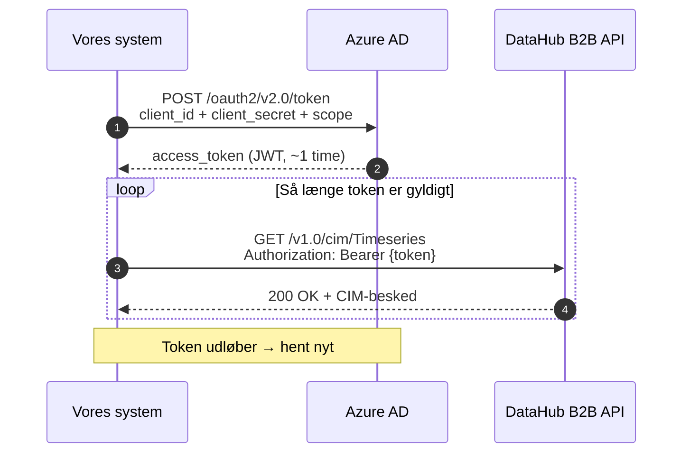

# DataHub 3: Autentificering og sikkerhed

Denne guide dækker alt hvad der kræves for at autentificere mod DataHub 3 B2B API'et og overholde sikkerhedskravene som markedsaktør.

---

## Overblik

```
┌──────────────────┐    OAuth2 token    ┌──────────────┐    B2B API     ┌──────────┐
│  Vores system    │───────────────────→│  Azure AD    │               │          │
│                  │←───────────────────│  (token)     │               │          │
│                  │                    └──────────────┘               │ DataHub  │
│                  │────── Bearer token ──────────────────────────────→│ 3        │
│                  │←──── CIM JSON/XML ──────────────────────────────│          │
└──────────────────┘                                                  └──────────┘
```

Al kommunikation med DataHub 3 kræver:
1. **OAuth2 access token** fra Azure AD (Client Credentials Grant)
2. **HTTPS** — al trafik er krypteret i transit
3. **Aktør-identifikation** — GLN-nummer identificerer hvem vi er

---

## OAuth2 Client Credentials

### Flow

DataHub 3 bruger **OAuth 2.0 Client Credentials Grant**. Der er ingen brugerlogin — systemet autentificerer sig selv med et client ID og en client secret.



### Token-anmodning

```http
POST https://login.microsoftonline.com/{tenant-id}/oauth2/v2.0/token
Content-Type: application/x-www-form-urlencoded

grant_type=client_credentials
&client_id={client-id}
&client_secret={client-secret}
&scope={scope}/.default
```

**Svar:**
```json
{
  "access_token": "eyJ0eXAiOiJKV1Q...",
  "token_type": "Bearer",
  "expires_in": 3599
}
```

- `expires_in: 3599` = token er gyldigt i ~1 time
- `scope` angives med `/.default` suffix — den præcise scope-værdi fås fra aktørportalen

### Miljøspecifikke parametre

| Miljø | Tenant ID | API-host |
|-------|-----------|----------|
| **Aktørtest** | `5a396c36-d56e-4db4-880b-c7894f2d9966` | `api.itlev.datahub.dk` |
| **Preprod** | `20e7a6b4-86e0-4e7a-a34d-6dc5a75d1982` | `preprod.b2b.datahub3.dk` |
| **Produktion** | `4b8c3f88-6cca-480c-af02-b2d2f220913f` | `b2b.datahub3.dk` |

Hvert miljø har **separate credentials** — client ID og secret fra ét miljø virker ikke i et andet.

---

## Credential-administration

### Oprettelse

Credentials oprettes i **DataHub aktørportalen** under fanen "B2B adgang":

1. Log ind på aktørportalen med MitID (person med fuldmagt til aktøren)
2. Vælg den aktør (GLN) du vil oprette credentials for
3. Gå til "B2B adgang" → opret ny client
4. Systemet genererer `client_id` og `client_secret`
5. **Gem secret med det samme** — den kan ikke hentes igen bagefter

### Levetid og rotation

| Egenskab | Værdi |
|----------|-------|
| Client secret levetid | **12 måneder** fra oprettelse |
| Antal aktive secrets | Op til 2 samtidige (muliggør rotation uden nedetid) |
| Påmindelse | Aktørportalen sender e-mail inden udløb |

**Rotationsstrategi:**
1. Opret ny secret (secret B) mens den gamle (secret A) stadig er gyldig
2. Opdatér systemets konfiguration til at bruge secret B
3. Verificér at systemet autentificerer korrekt med secret B
4. Slet secret A i aktørportalen

```
Tid ──────────────────────────────────────────────→

Secret A: ████████████████████████████████░░░░░  (udløber)
Secret B:                    ████████████████████████████████████
                             ↑
                    Skift her (overlap-periode)
```

### Konfiguration i systemet

Credentials skal **aldrig** hardcodes i kildekoden. Anbefalet tilgang:

```
┌─────────────────────────────────────────────────┐
│  Hemmelighedslagring (vælg én)                  │
│                                                  │
│  • Azure Key Vault (anbefalet til Azure-hosted) │
│  • HashiCorp Vault                               │
│  • AWS Secrets Manager                           │
│  • Environment variables (minimum for dev)       │
└──────────────────────┬──────────────────────────┘
                       │
                       ▼
┌─────────────────────────────────────────────────┐
│  Applikationskonfiguration                      │
│                                                  │
│  DataHub:Environment = prod                     │
│  DataHub:TenantId    = (fra vault)              │
│  DataHub:ClientId    = (fra vault)              │
│  DataHub:ClientSecret = (fra vault)             │
│  DataHub:BaseUrl     = https://b2b.datahub3.dk  │
│  DataHub:ActorGLN    = (vores GLN)              │
└─────────────────────────────────────────────────┘
```

---

## Token-håndtering i praksis

### Caching og proaktiv fornyelse

Man skal **ikke** hente nyt token til hver API-kald. I stedet:

1. **Cache** det aktive token i hukommelsen
2. **Forny proaktivt** inden det udløber (f.eks. med 5 minutters margin)
3. **Håndtér 401** som fallback — hvis DataHub returnerer 401, hent nyt token og genforsøg

```
Token-livscyklus:

  Hent token ──→ Brug token ──→ Brug token ──→ ... ──→ Forny
  (t=0)          (t=1 min)      (t=2 min)              (t=55 min)
                                                         ↓
                                                    Hent nyt token
                                                    (t=55 min)
```

**Implementeringsanbefaling (.NET):**

Brug en `DelegatingHandler` i `HttpClientFactory` der automatisk indsætter Bearer token og fornyer det:

```
HttpClient-pipeline:
  Request → [TokenHandler: indsæt/forny Bearer] → [RetryHandler] → DataHub API
```

### Fejlscenarier

| HTTP-kode | Betydning | Handling |
|-----------|-----------|---------|
| **401 Unauthorized** | Token udløbet eller ugyldigt | Hent nyt token, genforsøg |
| **403 Forbidden** | Forkert aktør-rolle eller manglende rettighed | Tjek credentials og GLN i aktørportalen |
| **429 Too Many Requests** | Rate limit overskredet | Vent og genforsøg med backoff |
| **5xx** | DataHub-serverfejl | Genforsøg med eksponentiel backoff |

---

## Autorisationsmodel

### Aktør-identitet

DataHub identificerer aktører via **GLN** (Global Location Number, 13 cifre). Aktørens markedsrolle bestemmer hvilke data der er tilgængelige:

| Markedsrolle | Kode | Adgang |
|-------------|------|--------|
| **Elleverandør** | DDQ | Måledata + stamdata for egne målepunkter |
| **Netvirksomhed** | DDM | Måledata + stamdata for eget netområde |
| **Måledataansvarlig** | MDR | Indrapportering af måledata |
| **Balanceansvarlig** | DDK | Aggregerede data for egen balance |

Som elleverandør (DDQ) kan vi kun:
- **Læse** måledata (RSM-012) for målepunkter hvor vi er aktiv leverandør
- **Læse** stamdata (RSM-007) for egne målepunkter
- **Sende** leverandørskifte-anmodninger (BRS-001) og ophør (BRS-002)
- **Læse** aggregerede engrosdata (RSM-014) for egne netområder

Vi kan **ikke** tilgå data for målepunkter der tilhører andre leverandører.

### Delegation

En IT-leverandør kan godkendes til at kommunikere med DataHub **på vegne af** en eller flere aktører:

1. Aktøren (f.eks. en elleverandør) logger ind på aktørportalen
2. Under "B2B adgang" oprettes en delegation til IT-leverandørens CVR
3. IT-leverandøren får egne credentials der giver adgang til aktørens data
4. Delegationen kan tilbagekaldes når som helst

Dette gør det muligt for ét system at håndtere flere aktørers DataHub-kommunikation.

---

## Databeskyttelse og GDPR

### Personfølsomme data

Følgende data fra DataHub indeholder personoplysninger:

| Data | Type | Kilde |
|------|------|-------|
| **CPR-nummer** | Direkte personhenførbar | BRS-001 (leverandørskifte) |
| **CVR-nummer** | Virksomhedsidentifikation | BRS-001 |
| **Kundenavn** | Persondata | RSM-007 (stamdata) |
| **Adresse** | Persondata | RSM-007 |
| **Forbrugsdata** | Indirekte personhenførbar | RSM-012 (kan afsløre adfærdsmønstre) |

### Krav til håndtering

| Krav | Implementering |
|------|---------------|
| **Kryptering at rest** | CPR/CVR krypteres i databasen (column-level encryption eller transparent data encryption) |
| **Kryptering in transit** | Al kommunikation via HTTPS/TLS |
| **Adgangskontrol** | Kun autoriserede systemkomponenter kan tilgå persondata |
| **Logning** | Al adgang til persondata logges med bruger/system-identitet og tidspunkt |
| **Dataopbevaring** | Maksimalt 5 år efter kundeforholdets ophør (elleveringsbekendtgørelsen) |
| **Dataminimering** | Gem kun hvad der er nødvendigt for afregning og lovkrav |
| **Sletning** | Automatisk sletning af persondata efter opbevaringsperioden |

### GSRN er ikke persondata

GSRN-numre (målepunkts-ID) er **ikke** direkte personhenførbare — de identificerer en fysisk tilslutning, ikke en person. Men kombineret med kundedata kan de indirekte identificere personer, så de bør behandles med omhu.

---

## Auditlog

### Hvad skal logges

Som markedsaktør er man underlagt regulatoriske krav (Forskrift C1, ISAE 3402 Type 2). Systemet bør logge:

| Hændelse | Logindhold |
|----------|------------|
| **Token-hentning** | Tidspunkt, miljø, succes/fejl |
| **API-kald til DataHub** | Tidspunkt, endpoint, HTTP-status, CorrelationId |
| **Modtagne beskeder** | MessageId, MessageType, GSRN, tidspunkt |
| **Afregningsberegninger** | GSRN, periode, beregningsresultat, tidspunkt |
| **Dataændringer** | Hvad blev ændret, af hvem/hvad, gammelt vs. nyt |
| **Credential-rotation** | Hvornår, af hvem (ikke selve secret'en!) |

### CorrelationId

DataHub inkluderer en `CorrelationId` header i alle API-svar. **Gem denne altid** — den bruges til fejlsøgning med Energinets support:

```
GET /v1.0/cim/Timeseries
→ Response headers:
  MessageId: abc-123
  MessageType: RSM-012
  CorrelationId: xyz-789    ← gem denne
```

---

## Testmiljøer

### Aktørtest (ATS)

Aktørtestmiljøet bruges til integration og test inden produktion:

| Egenskab | Detalje |
|----------|---------|
| **Formål** | Test af B2B-integration, BRS/RSM-flows |
| **Adgang** | Kræver separat godkendelse fra Energinet |
| **Credentials** | Separate fra produktion (egen client_id/secret) |
| **Data** | Testdata — ikke rigtige kundedata |
| **Tenant ID** | `5a396c36-d56e-4db4-880b-c7894f2d9966` |
| **API-host** | `api.itlev.datahub.dk` |

### Godkendelsesproces

For at få adgang til DataHub B2B API (også testmiljø):

1. **Aktørregistrering** — virksomheden skal være registreret som markedsaktør hos Energinet
2. **Aktørportal-adgang** — en person med fuldmagt logger ind med MitID
3. **B2B-godkendelse** — anmod om B2B-adgang i aktørportalen
4. **Credential-oprettelse** — opret client credentials under "B2B adgang"
5. **Testverifikation** — Energinet kan kræve gennemført integrationstest inden produktionsadgang

### Preprod

Preprod-miljøet ligger tættere på produktion og bruges til sluttest:

| Egenskab | Detalje |
|----------|---------|
| **Tenant ID** | `20e7a6b4-86e0-4e7a-a34d-6dc5a75d1982` |
| **API-host** | `preprod.b2b.datahub3.dk` |
| **Data** | Mere produktionslignende testdata |

---

## Sikkerhedstjekliste

Tjekliste for at sikre at systemet overholder sikkerhedskravene:

- [ ] OAuth2 credentials gemt i vault (ikke i kildekode eller config-filer)
- [ ] Token caches i hukommelsen og fornyes proaktivt
- [ ] 401-svar håndteres med automatisk token-fornyelse
- [ ] Separate credentials pr. miljø (test/preprod/prod)
- [ ] Credential-rotation planlagt (mindst hvert 12. måned)
- [ ] CPR/CVR-data krypteret at rest
- [ ] Al kommunikation over HTTPS
- [ ] Auditlog for alle API-kald og dataændringer
- [ ] CorrelationId gemt fra alle DataHub-svar
- [ ] Adgangskontrol: kun nødvendige komponenter kan tilgå persondata
- [ ] Automatisk sletning af persondata efter opbevaringsperioden
- [ ] ISAE 3402-krav identificeret og dokumenteret

---

## Kilder

- CIM Webservice Interface (Dok. 22/03077-1)
- CIM EDI Guide (Dok. 15/00718-191)
- [Foreslået systemarkitektur](datahub3-proposed-architecture.md) — OAuth2-integration og konfiguration
- [Forretningsprocesser](datahub3-ddq-business-processes.md) — API-endpoints og autentificeringsdetaljer
- [RSM-012 reference](rsm-012-datahub3-measure-data.md) — autentificering og API-kald i praksis
- [Afregningsoverblik](datahub3-settlement-overview.md) — teknisk integration med DataHub
- Energinet Forskrift C1 — krav til IT-sikkerhed for markedsaktører
