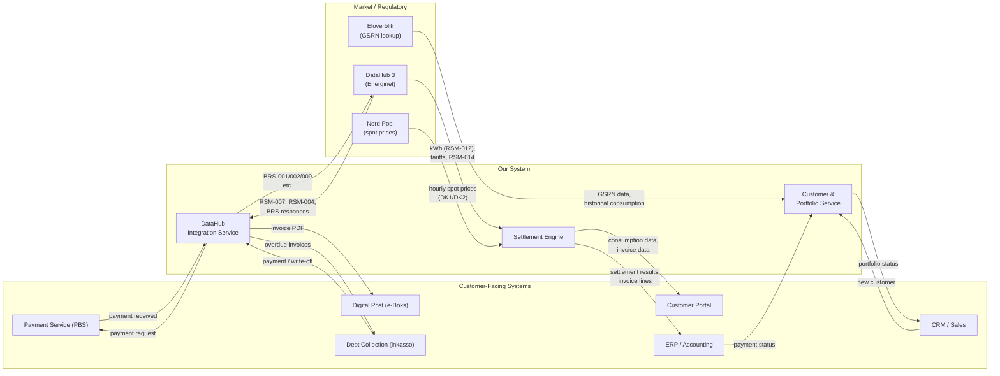

# CIS Platform and External System Integrations

How our DataHub settlement system fits within a DDQ's broader CIS landscape, and how it integrates with external systems like ERP, customer portals, payment services, and market data providers.

---

## What is a CIS?

A **CIS (Customer Information System)** is the core IT platform that an electricity supplier (DDQ) uses to run its business. It covers all customer-facing and back-office processes — from signing contracts to sending invoices to handling complaints.

In the Danish electricity market, a DDQ's CIS typically handles:

```
┌───────────────────────────────────────────────────────────────────┐
│  CIS PLATFORM — What a DDQ needs to operate                       │
│                                                                   │
│  Customer management    Contracts, CPR/CVR, contact details       │
│  Product management     Products, pricing models, subscriptions   │
│  DataHub integration    Market communication (BRS/RSM)            │
│  Metering data          Reception, storage, validation            │
│  Settlement             Consumption × prices → amounts owed       │
│  Billing                Invoice generation, dispatch              │
│  Payment processing     Betalingsservice, card, MobilePay         │
│  Customer self-service  Portal for consumption, invoices, etc.    │
│  Debt collection        Reminders, inkasso, write-off             │
│  Reporting              Revenue, consumption analytics, KPIs      │
│  Wholesale settlement   Reconciliation against DataHub (BRS-027)  │
│  Regulatory compliance  GDPR, bookkeeping, data retention         │
└───────────────────────────────────────────────────────────────────┘
```

**Our system** covers the DataHub-facing core: integration, metering data, settlement, portfolio management, and wholesale reconciliation. Everything else is handled by **external systems** that integrate with ours via APIs.

---

## System Boundary



### What our system owns

| Capability | Description |
|------------|-------------|
| **DataHub communication** | OAuth2 auth, queue polling, CIM message parsing, BRS/RSM request/response |
| **Metering data storage** | Time series ingestion, correction detection, historical data |
| **Portfolio management** | Metering points, supply periods, customer records, lifecycle state machine |
| **Settlement calculation** | kWh × prices per hour, tariff application, invoice line generation |
| **Wholesale reconciliation** | Compare own settlement against DataHub aggregations (RSM-014) |
| **Rate management** | Grid tariffs, Energinet tariffs, product margins, subscriptions |

### What external systems own

| System | Responsibility |
|--------|---------------|
| **ERP / Accounting** | General ledger, accounts receivable/payable, financial reporting, VAT reporting |
| **Customer portal** | Self-service UI, consumption graphs, invoice download, contract overview |
| **CRM / Sales** | Lead management, contract signing, campaign management |
| **Payment service** | Payment collection (Betalingsservice/PBS, card, MobilePay), bank transfers |
| **Digital post** | Invoice delivery via e-Boks or Digital Post |
| **Debt collection** | Reminder letters, inkasso handoff, write-off management |
| **Market data provider** | Nord Pool spot prices, forward curves |

---

## Integration Points

### 1. ERP / Accounting System

The most critical integration. Settlement results must flow to the ERP for invoice generation, financial posting, and VAT reporting.

**Common ERP systems for Danish DDQs:** Dynamics 365 (D365), SAP, e-conomic, Navision (Business Central)

**Data flow:**

```
Our system                              ERP / Accounting
    │                                        │
    │ Settlement run completes               │
    ├───── Settlement export ───────────────►│ Create invoice draft
    │      (customer, period, lines,         │ Post to general ledger
    │       amounts, VAT)                    │ Generate PDF
    │                                        │ Dispatch (e-Boks/email/post)
    │                                        │
    │                                        │ Payment received
    │◄──── Payment confirmation ─────────────┤ Match to invoice
    │      (invoice ID, amount, date)        │
    │                                        │
    │ Credit/debit note                      │
    │ (correction, aconto settlement)        │
    ├───── Credit/debit export ─────────────►│ Post adjustment
    │                                        │
    │                                        │ Invoice overdue
    │◄──── Overdue notification ─────────────┤ Trigger reminder flow
    │                                        │
```

**API contract (our system exposes):**

| Endpoint | Method | Description |
|----------|--------|-------------|
| `/api/settlement/export` | GET | Settlement results for a period, ready for ERP import |
| `/api/settlement/{id}/lines` | GET | Detailed invoice lines for a settlement run |
| `/api/customers/{id}/balance` | GET | Outstanding balance across all invoices |
| `/api/settlement/credit-notes` | GET | Credit/debit notes pending export |

**API contract (ERP exposes / we consume):**

| Endpoint / event | Description |
|------------------|-------------|
| Payment webhook / file | Notification when a payment is received and matched |
| Invoice status callback | Invoice created, sent, paid, overdue |
| Customer financial status | Outstanding balance, payment history |

**Settlement export format:**

| Field | Description |
|-------|-------------|
| `customer_id` | Internal customer reference |
| `gsrn` | Metering point (for multi-point customers) |
| `period_start` / `period_end` | Billing period |
| `lines[]` | Array of invoice lines (energy, grid tariff, system tariff, transmission tariff, elafgift, subscriptions) |
| `lines[].amount_excl_vat` | Line amount excluding VAT |
| `lines[].vat_amount` | VAT for the line |
| `total_excl_vat` | Sum of all lines |
| `total_vat` | Total VAT |
| `total_incl_vat` | Invoice total |
| `aconto_paid` | Aconto payments received in the period (if applicable) |
| `aconto_difference` | Over-/underpayment from aconto settlement |
| `net_amount_due` | Final amount the customer owes |

**Design considerations:**
- **Batch vs. real-time:** Settlement export can be batch (nightly file) or event-driven (webhook per settlement). Most ERP integrations prefer batch files (CSV/XML) or scheduled API calls
- **Idempotency:** The ERP integration must handle re-exports gracefully (same settlement exported twice should not create duplicate invoices)
- **Currency:** All amounts in DKK with 2 decimal places
- **VAT reporting:** The ERP owns VAT reporting — our system provides the breakdown per line

---

### 2. Customer Self-Service Portal

The portal gives customers access to their consumption data, invoices, and contract details. It reads from our system but does not write to it (except for simple profile updates).

**Data flow:**

```
Customer Portal                     Our system (API)
    │                                    │
    │ GET consumption data               │
    ├───────────────────────────────────►│ Query metering_data for GSRN + period
    │◄──── kWh per hour/day/month ───────┤
    │                                    │
    │ GET invoice history                │
    ├───────────────────────────────────►│ Query settlement results
    │◄──── Invoice lines + totals ───────┤
    │                                    │
    │ GET contract details               │
    ├───────────────────────────────────►│ Query product + metering point
    │◄──── Product, rates, billing freq. ┤
    │                                    │
    │ GET current aconto amount          │
    ├───────────────────────────────────►│ Query aconto parameters
    │◄──── Quarterly estimate + history ─┤
    │                                    │
```

**API contract (our system exposes):**

| Endpoint | Method | Description |
|----------|--------|-------------|
| `/api/portal/consumption` | GET | Consumption data (hourly/daily/monthly) for a customer's metering point |
| `/api/portal/invoices` | GET | Invoice history with line-level detail |
| `/api/portal/contract` | GET | Product, billing frequency, payment model, metering point details |
| `/api/portal/aconto` | GET | Current aconto amount, settlement history, next settlement date |
| `/api/portal/notifications` | GET | Alerts (e.g. unusual consumption, rate changes) |

**Design considerations:**
- **Authentication:** The portal authenticates the customer (NemID/MitID or email/password) and maps to a customer record in our system. Our API validates the customer's access to their own data only
- **Read-heavy:** The portal is almost entirely read-only from our system's perspective
- **Aggregation:** Raw hourly data should be pre-aggregated for daily/weekly/monthly views to keep the portal fast
- **Legal requirement:** The Electricity Supply Order (elleveringsbekendtgørelsen) §9 requires monthly access to consumption data — the portal satisfies this

---

### 3. CRM / Sales System

The CRM manages the sales funnel and hands off new customers to our system for DataHub onboarding.

**Data flow:**

```
CRM / Sales                         Our system                    Eloverblik API
    │                                    │                              │
    │ New contract signed                │                              │
    ├───── Customer + GSRN + product ───►│                              │
    │                                    ├── Lookup GSRN ──────────────►│
    │                                    │◄── Metering point data, ─────┤
    │                                    │    historical consumption    │
    │                                    │                              │
    │                                    │ Validate GSRN, pre-assign
    │                                    │ tariffs, calculate aconto
    │                                    │
    │                                    │ Initiate BRS-001 (supplier switch)
    │                                    │ or BRS-009 (move-in)
    │◄──── Process status ───────────────┤
    │      (pending / accepted / rejected)│
    │                                    │
    │ Customer cancels                   │
    ├───── Cancel request ──────────────►│ Send BRS-003 (cancel switch)
    │◄──── Cancellation confirmed ───────┤
    │                                    │
    │ Query portfolio                    │
    ├───────────────────────────────────►│ Active customers, metering points
    │◄──── Portfolio summary ────────────┤
    │                                    │
```

**API contract (our system exposes):**

| Endpoint | Method | Description |
|----------|--------|-------------|
| `/api/metering-points/{gsrn}/lookup` | GET | Look up a GSRN via Eloverblik — returns metering point data, grid area, historical consumption |
| `/api/customers` | POST | Create a new customer + metering point association |
| `/api/customers/{id}/switch` | POST | Initiate a supplier switch (BRS-001 / BRS-043) |
| `/api/customers/{id}/move-in` | POST | Initiate a move-in (BRS-009) |
| `/api/processes/{id}` | GET | Check the status of a pending DataHub process |
| `/api/processes/{id}/cancel` | POST | Cancel a pending process (BRS-003) |
| `/api/portfolio/summary` | GET | Overview of active customers and metering points |

**Onboarding data required from CRM:**

| Field | Description | Validation |
|-------|-------------|------------|
| `gsrn` | 18-digit metering point ID | Must be valid GSRN (Luhn check) |
| `customer_name` | Full name | Required |
| `cpr` or `cvr` | Personal or business ID | Must match DataHub records |
| `email` / `phone` | Contact details | For portal access and communication |
| `product_id` | Chosen product plan | Must exist in product catalog |
| `desired_start_date` | Requested effective date | Min. 15 business days ahead (BRS-001) |
| `billing_frequency` | Monthly or quarterly | Required |
| `payment_model` | Aconto or actual consumption | Required |

---

### 4. Payment Service

Payment collection is handled by an external payment service. The most common setup for Danish DDQs:

| Payment method | Service | Description |
|---------------|---------|-------------|
| **Betalingsservice (PBS)** | Nets/Mastercard Payment Services | Automated direct debit — the standard for recurring utility payments in Denmark |
| **Indbetalingskort** | Nets | Physical payment slip (declining usage) |
| **Card payment** | Payment gateway (e.g. Nets, Adyen, Stripe) | One-off or recurring card payments |
| **MobilePay** | MobilePay (Vipps MobilePay) | Invoice payment via mobile |
| **Bank transfer** | Customer's bank | Manual transfer with invoice reference (OCR/FI line) |

**Data flow (Betalingsservice — most common):**

```
Our system                  PBS / Nets                  Customer's bank
    │                           │                            │
    │ Settlement complete       │                            │
    │ Create payment request    │                            │
    ├──── PBS file (601) ──────►│                            │
    │     (customer ID, amount, │                            │
    │      due date, PBS no.)   │                            │
    │                           ├──── Debit instruction ────►│
    │                           │                            │ Deduct amount
    │                           │◄──── Confirmation ─────────┤
    │◄── PBS response (602) ────┤                            │
    │    (paid / rejected /     │                            │
    │     insufficient funds)   │                            │
    │                           │                            │
    │ Update payment status     │                            │
    │ in our system + ERP       │                            │
    │                           │                            │
```

**Key integration points:**

| Direction | Data | Format |
|-----------|------|--------|
| Our system → PBS | Payment requests (amount, due date, PBS agreement number) | PBS 601 file or API |
| PBS → Our system | Payment confirmations / rejections | PBS 602 file or API |
| Our system → ERP | Payment status update | API webhook or batch |

**Design considerations:**
- **PBS agreement management:** When a customer signs up, they set up a Betalingsservice agreement (tilmeldingsaftale). The PBS agreement number must be stored in our customer record
- **Payment matching:** Each payment carries a reference (FI-kreditor number + customer number) that must match our invoice
- **Failed payments:** Rejected debits (insufficient funds, cancelled agreement) trigger the reminder/collections flow
- **Timing:** PBS files are exchanged on fixed banking days — payment requests must be submitted 4-5 banking days before the due date

---

### 5. Digital Post (e-Boks / Digital Post)

Danish citizens receive official mail digitally via **e-Boks** (or the public Digital Post system). Invoices and settlement notices are typically dispatched this way.

**Integration pattern:**

| Step | Action |
|------|--------|
| 1 | Settlement run completes → invoice lines exported to ERP |
| 2 | ERP generates invoice PDF |
| 3 | ERP or dispatch service sends PDF to e-Boks via API |
| 4 | Customer receives notification and views invoice in e-Boks |

**Design consideration:** Our system does not integrate directly with e-Boks — the ERP or a separate dispatch service handles document delivery. Our system provides the data; the ERP formats and dispatches.

**Fallback channels:** Email, physical post (for customers not registered for digital post)

---

### 6. Debt Collection (Inkasso)

When a customer does not pay after reminders, the case is handed off to a debt collection agency or handled internally.

**Data flow:**

```
Our system / ERP                    Debt collection
    │                                    │
    │ Invoice overdue > X days           │
    │ Reminders exhausted                │
    ├───── Case handoff ────────────────►│ Customer, amount, invoice ref.,
    │      (customer data, amount,       │ metering point, consumption docs
    │       invoice history)             │
    │                                    │
    │                                    │ Collection attempt
    │                                    │
    │◄──── Payment received ─────────────┤
    │      or                            │
    │◄──── Write-off recommendation ─────┤
    │                                    │
    │ If persistent non-payment:         │
    │ Initiate BRS-002 (supply           │
    │ termination)                       │
    │                                    │
```

**Integration with supply termination:**
- Non-payment is one of the triggers for BRS-002 (end of supply) — see [Customer lifecycle Phase 5](datahub3-customer-lifecycle.md#phase-5-offboarding)
- Before initiating BRS-002, the customer must have received the legally required reminders
- If the customer pays after BRS-002 is sent but before the effective date, send BRS-044 to cancel the termination

---

### 7. Market Data Provider (Nord Pool Spot Prices)

Spot prices are the foundation of the energy line on every invoice. They are fetched from an external market data feed.

**Data flow:**

```
Nord Pool / Market data              Our system
    │                                    │
    │ Day-ahead prices published         │
    │ (typically 13:00 CET for next day) │
    ├───── 24 hourly prices (DKK/MWh) ──►│ Convert to DKK/kWh
    │      per price area (DK1/DK2)      │ Store in spot_price table
    │                                    │
    │                                    │ At settlement run:
    │                                    │ energy = kWh × (spot + margin)
    │                                    │
```

**API contract (we consume):**

| Source | Format | Frequency |
|--------|--------|-----------|
| Nord Pool day-ahead auction | JSON/XML API or file download | Daily (day-ahead prices for next day) |
| Price area | DK1 (West Denmark) or DK2 (East Denmark) | Per metering point's grid area |

**Design considerations:**
- **Price areas:** Denmark has two price areas (DK1, DK2). The metering point's grid area determines which price area applies
- **Missing prices:** If spot prices are not available at settlement time, the settlement run must halt — see [Error handling](datahub3-proposed-architecture.md#error-handling-and-recovery)
- **Historical prices:** Store all historical spot prices for recalculation of corrections
- **Units:** Nord Pool publishes in EUR/MWh or DKK/MWh — convert to DKK/kWh for settlement (÷ 1000)

---

### 8. Eloverblik (Onboarding Data)

**Eloverblik** (eloverblik.dk) is Energinet's portal for accessing metering point data. It is a **core part of the onboarding flow** — not an optional verification tool.

**Why Eloverblik is essential for onboarding:**

Before we are the active supplier on a metering point, we do **not** receive any data through DataHub's B2B API (RSM-007, RSM-012, etc.). The B2B queues only deliver data for metering points where we are the registered supplier. During signup, we need Eloverblik to get the data required to onboard the customer and submit the switch request (BRS-001).

**What Eloverblik provides:**

| Data | Used for |
|------|----------|
| GSRN validation | Confirm the metering point exists and matches the customer's address |
| Metering point type (E17/E18) | Determine settlement method, detect solar installations |
| Current supplier | Know who we are switching from |
| Grid area | Pre-assign tariff plan before RSM-007 arrives |
| Settlement method (flex/profile) | Set up correct billing |
| Historical consumption (12 months) | Calculate the first aconto amount for aconto customers |
| Estimated annual consumption | Fallback if historical data is insufficient |

**The onboarding flow with Eloverblik:**

```
Customer                CRM / Sales              Our system              Eloverblik API
    │                       │                        │                        │
    │ Signs contract,       │                        │                        │
    │ provides GSRN         │                        │                        │
    ├──────────────────────►│                        │                        │
    │                       │                        │                        │
    │                       ├── Create customer ────►│                        │
    │                       │   + GSRN               │                        │
    │                       │                        │                        │
    │                       │                        ├── Lookup GSRN ────────►│
    │                       │                        │◄── Metering point      │
    │                       │                        │    data + historical   │
    │                       │                        │    consumption         │
    │                       │                        │                        │
    │                       │                        │ Validate GSRN          │
    │                       │                        │ Pre-assign grid area   │
    │                       │                        │ Calculate aconto       │
    │                       │                        │ estimate               │
    │                       │                        │                        │
    │                       │                        ├── BRS-001 ────────────►│ (DataHub,
    │                       │                        │   (supplier switch)    │  not Eloverblik)
    │                       │                        │                        │
```

**After activation:** Once we are the active supplier, we receive all data through DataHub's B2B API (RSM-007 for master data, RSM-012 for metering data). Eloverblik is no longer needed for day-to-day operations, but remains available for dispute resolution where customers can independently verify their data.

**Eloverblik has two interfaces:**

| Interface | Users | Purpose |
|-----------|-------|---------|
| **Customer portal** (eloverblik.dk) | Consumers | Look up own GSRN, consumption history, current supplier |
| **Third-party API** | DDQs, energy apps, comparison sites | Programmatic access with customer consent |

**Eloverblik API access:**
- Requires registration as a third-party data accessor (WARNING: VERIFY current access model)
- Customer must grant explicit consent for the DDQ to access their data
- API provides metering point details, historical consumption, and current supplier information
- Separate from the DataHub B2B API — different authentication, different endpoints

---

## Integration Architecture

### API-first approach

Our system exposes a **REST API** that all external systems consume. No external system accesses the database directly.

```
┌─────────┐  ┌─────────┐  ┌─────────┐  ┌─────────┐
│  CRM    │  │  ERP    │  │ Portal  │  │ Payment │
│         │  │         │  │         │  │ Service │
└────┬────┘  └────┬────┘  └────┬────┘  └────┬────┘
     │            │            │            │
     └────────────┼────────────┼────────────┘
                  │            │
           ┌──────┴────────────┴──────┐
           │      API Gateway          │
           │      (authentication,     │
           │       rate limiting,      │
           │       routing)            │
           └──────────────┬───────────┘
                          │
        ┌─────────────────┼─────────────────┐
        │                 │                 │
 ┌──────┴──────┐  ┌───────┴──────┐  ┌───────┴───────┐
 │ DataHub     │  │ Settlement   │  │ Customer &    │
 │ Integration │  │ Engine       │  │ Portfolio     │
 └─────────────┘  └──────────────┘  └───────────────┘
```

### Authentication and authorization

| Consumer | Authentication | Authorization |
|----------|---------------|---------------|
| ERP / Accounting | API key or OAuth2 client credentials | Full access to settlement export, payment status |
| CRM / Sales | API key or OAuth2 client credentials | Customer creation, process initiation, portfolio read |
| Customer portal | Customer login (MitID / email+password) → JWT | Own data only (own metering points, own invoices) |
| Payment service | API key (server-to-server) | Payment status write, balance read |
| Backoffice UI | Employee login → JWT with role claims | Role-based: admin, support, read-only |

### Event-driven integration

For real-time integrations, the system publishes domain events that external systems can subscribe to:

| Event | Triggered when | Typical subscriber |
|-------|---------------|-------------------|
| `settlement.completed` | Settlement run finishes for a billing period | ERP (create invoices) |
| `settlement.correction` | A correction recalculates a historical period | ERP (create credit/debit note) |
| `customer.activated` | Metering point becomes active (supplier switch complete) | CRM (update status), portal (enable access) |
| `customer.offboarded` | Supply ends (switch, move-out, termination) | ERP (final invoice), CRM (update status), portal (disable access) |
| `payment.received` | Payment confirmation from PBS/payment service | Settlement (update balance), CRM (clear warning) |
| `payment.overdue` | Invoice exceeds payment deadline | ERP (trigger reminder), debt collection (if escalated) |
| `process.status_changed` | A DataHub process changes state | CRM (update process tracker) |

**Implementation:** Start with webhooks (HTTP callbacks). Migrate to a message broker (RabbitMQ / Azure Service Bus) if subscriber count or reliability requirements grow.

---

## Common CIS Platforms in Denmark

For reference, these are established CIS platforms used by Danish DDQs:

| Platform | Vendor | Description |
|----------|--------|-------------|
| **Zyrian / El:Forsyning** | CGI | Full CIS platform, widely used by Danish utilities. Covers DataHub integration, billing, customer management |
| **Forte Utility Suite** | Forte (now part of Netcompany) | CIS for utilities including electricity, gas, water. DataHub 3 integration built in |
| **SAP IS-U** | SAP | Enterprise utility CIS. Used by larger suppliers. Expensive but comprehensive |
| **Dynamics 365** | Microsoft | Not a CIS per se, but used as ERP/billing backbone by some DDQs combined with custom DataHub integration |
| **Custom-built** | Various | Some smaller DDQs build their own CIS or use a combination of standard systems |

**Our system's position:** We are building the DataHub integration and settlement core as an open source component. It can serve as the backbone of a custom CIS, or integrate into an existing CIS platform via the APIs described above.

---

## Deployment Patterns

### Pattern A: Our system as the CIS core

For DDQs building a custom CIS stack:

```
┌─────────────────────────────────────────────────────────────┐
│  Our system (DataHub core)                                    │
│  ┌─────────────┐  ┌──────────┐  ┌────────────────────┐     │
│  │ DataHub     │  │Settlement│  │ Customer &         │     │
│  │ Integration │  │ Engine   │  │ Portfolio          │     │
│  └─────────────┘  └──────────┘  └────────────────────┘     │
│                        │                                     │
│                   API Gateway                                │
└────────────────────────┼────────────────────────────────────┘
                         │
          ┌──────────────┼──────────────┐
          │              │              │
    ┌─────┴─────┐  ┌─────┴─────┐  ┌────┴────┐
    │ e-conomic │  │  React    │  │  Nets   │
    │ (ERP)     │  │  Portal   │  │  (PBS)  │
    └───────────┘  └───────────┘  └─────────┘
```

### Pattern B: Our system integrated into an existing CIS

For DDQs that already have a CIS (e.g. Zyrian, Forte) but want to replace or supplement the DataHub/settlement component:

```
┌────────────────────────────────────────┐
│  Existing CIS (e.g. Zyrian)            │
│  ┌──────────┐  ┌──────────┐           │
│  │ Billing  │  │ Customer │           │
│  │          │  │ Mgmt     │           │
│  └────┬─────┘  └────┬─────┘           │
│       └──────┬───────┘                 │
│              │ Internal API            │
└──────────────┼─────────────────────────┘
               │
        ┌──────┴──────┐
        │ Our system  │
        │ (DataHub    │
        │  core)      │
        └──────┬──────┘
               │
        ┌──────┴──────┐
        │ DataHub 3   │
        └─────────────┘
```

---

## Sources

- [Settlement overview](datahub3-settlement-overview.md) — what settlement is and how it works
- [System architecture](datahub3-proposed-architecture.md) — API gateway, core services, technology choices
- [Customer lifecycle](datahub3-customer-lifecycle.md) — phases from onboarding to closing
- [Product structure and billing](datahub3-product-and-billing.md) — invoice lines, aconto, payment models
- [Edge cases and error handling](datahub3-edge-cases.md) — corrections, disputes, reconciliation
- [Authentication and security](datahub3-authentication-security.md) — OAuth2, GDPR, audit logging
