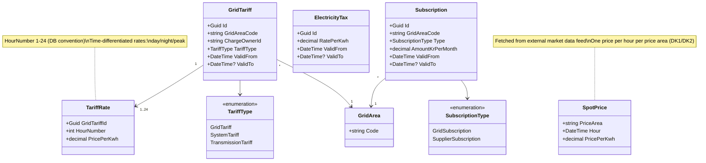
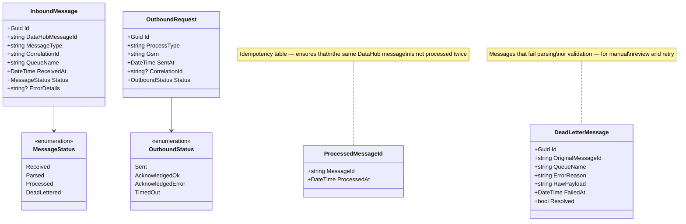

# DataHub 3: Class Diagram (v1)

The domain model for the settlement system, divided into bounded contexts. The diagrams show the central entities and their relationships — not the final database model, but a conceptual overview that can drive the initial design.

---

## Full Overview

```mermaid
classDiagram
    direction LR

    namespace Portfolio {
        class Customer
        class MeteringPoint
        class SupplyPeriod
        class Contract
        class GridArea
    }

    namespace Product {
        class Product
        class EnergyModel
    }

    namespace MeteringData {
        class MeteringData
        class DailySummary
    }

    namespace Rates {
        class GridTariff
        class TariffRate
        class Subscription
        class ElectricityTax
        class SpotPrice
    }

    namespace Settlement {
        class SettlementRun
        class SettlementLine
        class BillingPeriod
        class AcontoPayment
        class AcontoSettlement
    }

    namespace Invoicing {
        class Invoice
        class InvoiceLine
    }

    namespace DataHubIntegration {
        class InboundMessage
        class OutboundRequest
        class ProcessedMessageId
    }

    namespace Lifecycle {
        class ProcessRequest
        class ProcessEvent
    }

    Customer "1" --> "*" Contract
    Contract "1" --> "1" MeteringPoint
    Contract "1" --> "1" Product
    MeteringPoint "1" --> "*" SupplyPeriod
    MeteringPoint "1" --> "*" MeteringData
    MeteringPoint "*" --> "1" GridArea
    GridArea "1" --> "*" GridTariff
    SettlementRun "1" --> "*" SettlementLine
    SettlementLine "*" --> "1" MeteringPoint
    Invoice "1" --> "*" InvoiceLine
    Invoice "*" --> "1" Customer
```

---

## Portfolio and Customer


**Key relationships:**
- A **Customer** has one or more **Contracts** (typically one per metering point)
- A **Contract** binds a customer to a **MeteringPoint** and a **Product**
- A **MeteringPoint** has a history of **SupplyPeriods** (we are only the supplier during the active period)
- A **MeteringPoint** belongs to a **GridArea** (netområde) — this determines which tariffs apply

---

## Product


**The product determines:**
- **EnergyModel** — how the spot price is handled (spot / fixed / mixed)
- **MarginOrePerKwh** — the supplier's margin on top of the spot price
- **SupplementOrePerKwh** — optional product supplement (e.g. green energy)
- **SubscriptionKrPerMonth** — the supplier subscription fee (leverandørabonnement)

**Contract** binds a product to the specific customer and adds individual parameters (payment model, billing frequency, payment terms).

---

## Metering Data (Time Series) (Måledata)


**MeteringData** is the system's largest table. Partitioned monthly on `timestamp`. **DailySummary** is a pre-aggregation that reduces settlement queries from 230M to 2.4M rows.

---

## Rates and Prices (Satser og priser)



**Price sources:**
- **GridTariff + TariffRate** — time-differentiated rates from the grid operator (netvirksomhed) (via the Charges queue)
- **Subscription** — fixed monthly fees (grid + supplier)
- **ElectricityTax** (elafgift) — statutory electricity tax (updated annually)
- **SpotPrice** — Nordpool hourly price (external market data)

---

## Settlement (Afregning)


**Settlement flow:**
1. **SettlementRun** runs for a **BillingPeriod** (per grid area for parallelization)
2. Produces **SettlementLines** per metering point per ChargeType
3. For aconto customers: **AcontoSettlement** (acontoopgørelse) compares actual settlement against **AcontoPayments**
4. Each run is a **versioned, immutable snapshot** — recalculations create new versions

---

## Invoicing (Fakturering)


---

## Lifecycle (State Machine) (Livscyklus)


**State machine for supplier switch (leverandørskifte) (BRS-001):**


---

## DataHub Integration



---

## Relationship Overview (All Domains)

```
Customer ──1:*── Contract ──1:1── MeteringPoint ──*:1── GridArea
                    │                    │
                    │ 1:1                │ 1:*
                    ▼                    ▼
                 Product            MeteringData
                                         │
                                         │ aggregated into
                                         ▼
                                    DailySummary
                                         │
                                         │ used by
                                         ▼
GridArea ──1:*── GridTariff ──1:*── TariffRate
    │                                    │
    │ 1:*                                │ settlement calculation
    ▼                                    ▼
Subscription                      SettlementRun ──1:*── SettlementLine
                                         │
                                         │ drives
                                         ▼
ElectricityTax                      Invoice ──1:*── InvoiceLine
SpotPrice                                │
                                         │ for aconto customers
                                         ▼
                              AcontoPayment / AcontoSettlement
```

---

## Enums Summary

| Enum | Values | Used by |
|------|--------|---------|
| **MeteringPointType** | E17_Consumption, E18_Production | MeteringPoint |
| **SettlementMethod** | Flex, NonProfiled | MeteringPoint |
| **ConnectionStatus** | Connected, Disconnected, ClosedDown | MeteringPoint |
| **EnergyModel** | Spot, FixedPrice, Mixed | Product |
| **BillingFrequency** | Monthly, Quarterly | Contract |
| **PaymentModel** | Aconto, PostPayment | Contract |
| **Resolution** | PT15M, PT1H, P1M | MeteringData |
| **QualityCode** | A01, A02, A03, A06 | MeteringData |
| **TariffType** | GridTariff, SystemTariff, TransmissionTariff | GridTariff |
| **ChargeType** | Energy, GridTariff, SystemTariff, TransmissionTariff, ElectricityTax, GridSubscription, SupplierSubscription | SettlementLine, InvoiceLine |
| **InvoiceType** | Standard, AcontoCombined, FinalSettlement, CreditNote, DebitNote | Invoice |
| **ProcessType** | SupplierSwitch, ShortNoticeSwitch, MoveIn, EndOfSupply, ... | ProcessRequest |
| **ProcessStatus** | Pending, SentToDataHub, Acknowledged, Rejected, Completed, Cancelled | ProcessRequest |

---

## Sources

- [Proposed system architecture](datahub3-proposed-architecture.md) — services, data model, technology choices
- [Product structure and billing](datahub3-product-and-billing.md) — all invoice parameters
- [Customer lifecycle](datahub3-customer-lifecycle.md) — phases and state transitions
- [Sequence diagrams](datahub3-sequence-diagrams.md) — message flows
- [Settlement overview](datahub3-settlement-overview.md) — settlement calculation
- [Database model](datahub3-database-model.md) — physical PostgreSQL/TimescaleDB schema
