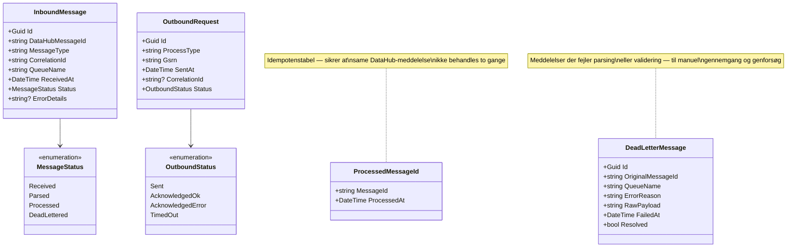

# DataHub 3: Klassediagram (v1)

Domænemodellen for afregningssystemet, opdelt i bounded contexts. Diagrammerne viser de centrale entiteter og deres relationer — ikke den endelige databasemodel, men en konceptuel oversigt der kan drive det første design.

---

## Samlet overblik


---

## Portefølje og kunde


**Nøglerelationer:**
- En **Customer** har én eller flere **Contracts** (typisk én pr. målepunkt)
- En **Contract** binder en kunde til et **MeteringPoint** og et **Product**
- Et **MeteringPoint** har en historik af **SupplyPeriods** (vi er kun leverandør i den aktive periode)
- Et **MeteringPoint** tilhører et **GridArea** — det bestemmer hvilke tariffer der gælder

---

## Produkt


**Produktet bestemmer:**
- **EnergyModel** — hvordan spotprisen håndteres (spot / fast / blanding)
- **MarginOrePerKwh** — leverandørens margin oven på spotprisen
- **SupplementOrePerKwh** — evt. produkttillæg (f.eks. grøn energi)
- **SubscriptionKrPerMonth** — leverandørabonnementet

**Contract** binder et produkt til den specifikke kunde og tilføjer individuelle parametre (betalingsmodel, faktureringsfrekvens, betalingsfrist).

---

## Måledata (tidsserie)


**MeteringData** er systemets største tabel. Partitioneret månedligt på `timestamp`. **DailySummary** er en præ-aggregering der reducerer afregningsforespørgsler fra 230M til 2,4M rækker.

---

## Satser og priser


**Priskilder:**
- **GridTariff + TariffRate** — tidsdifferentierede satser fra netvirksomheden (via Charges-kø)
- **Subscription** — faste månedsgebyrer (net + leverandør)
- **ElectricityTax** — lovbestemt elafgift (opdateres årligt)
- **SpotPrice** — Nordpool-timepris (ekstern markedsdata)

---

## Afregning


**Afregningsflow:**
1. **SettlementRun** kører for en **BillingPeriod** (pr. netområde for parallelisering)
2. Producerer **SettlementLines** pr. målepunkt pr. ChargeType
3. For acontokunder: **AcontoSettlement** sammenligner faktisk afregning mod **AcontoPayments**
4. Hver kørsel er et **versioneret, uforanderligt snapshot** — genberegninger skaber nye versioner

---

## Fakturering


---

## Livscyklus (tilstandsmaskine)


**Tilstandsmaskine for leverandørskifte (BRS-001):**


---

## DataHub-integration



---

## Relationsoversigt (alle domæner)

```
Customer ──1:*── Contract ──1:1── MeteringPoint ──*:1── GridArea
                    │                    │
                    │ 1:1                │ 1:*
                    ▼                    ▼
                 Product            MeteringData
                                         │
                                         │ aggregeres til
                                         ▼
                                    DailySummary
                                         │
                                         │ bruges af
                                         ▼
GridArea ──1:*── GridTariff ──1:*── TariffRate
    │                                    │
    │ 1:*                                │ afregningsberegning
    ▼                                    ▼
Subscription                      SettlementRun ──1:*── SettlementLine
                                         │
                                         │ driver
                                         ▼
ElectricityTax                      Invoice ──1:*── InvoiceLine
SpotPrice                                │
                                         │ for acontokunder
                                         ▼
                              AcontoPayment / AcontoSettlement
```

---

## Enums samlet

| Enum | Værdier | Bruges af |
|------|---------|-----------|
| **MeteringPointType** | E17_Consumption, E18_Production | MeteringPoint |
| **SettlementMethod** | Flex, NonProfiled | MeteringPoint |
| **ConnectionStatus** | Connected, Disconnected, ClosedDown | MeteringPoint |
| **EnergyModel** | Spot, FixedPrice, Mixed | Product |
| **BillingFrequency** | Monthly, Quarterly | Contract |
| **PaymentModel** | Aconto, PostPayment | Contract |
| **Resolution** | PT15M, PT1H, P1M | MeteringData |
| **QualityCode** | A01, A02, A03, A06 | MeteringData |
| **TariffType** | GridTariff, SystemTariff, TransmissionTariff | GridTariff |
| **ChargeType** | Energy, GridTariff, SystemTariff, TransmissionTariff, ElectricityTax, GridSubscription, SupplierSubscription | SettlementLine, InvoiceLine |
| **InvoiceType** | Standard, AcontoCombined, FinalSettlement, CreditNote, DebitNote | Invoice |
| **ProcessType** | SupplierSwitch, ShortNoticeSwitch, MoveIn, EndOfSupply, ... | ProcessRequest |
| **ProcessStatus** | Pending, SentToDataHub, Acknowledged, Rejected, Completed, Cancelled | ProcessRequest |

---

## Kilder

- [Foreslået systemarkitektur](datahub3-proposed-architecture.md) — services, datamodel, teknologivalg
- [Produktopbygning og fakturering](datahub3-product-and-billing.md) — alle fakturaparametre
- [Kundelivscyklus](datahub3-customer-lifecycle.md) — faser og tilstandsovergange
- [Sekvensdiagrammer](datahub3-sequence-diagrams.md) — meddelelsesflows
- [Afregningsoverblik](datahub3-settlement-overview.md) — afregningsberegning
- [Databasemodel](datahub3-database-model.md) — fysisk PostgreSQL/TimescaleDB-skema
