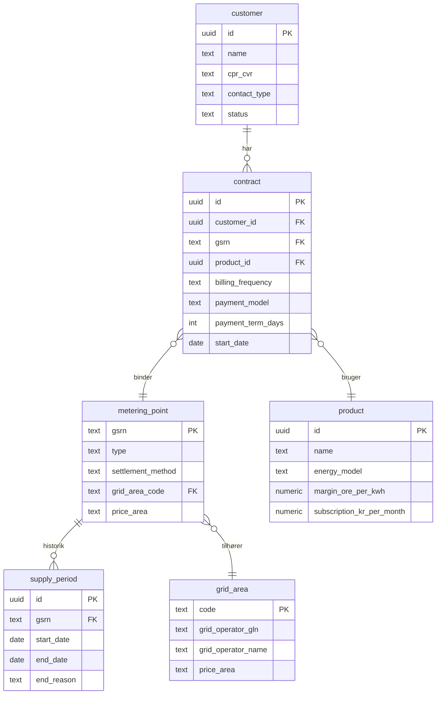
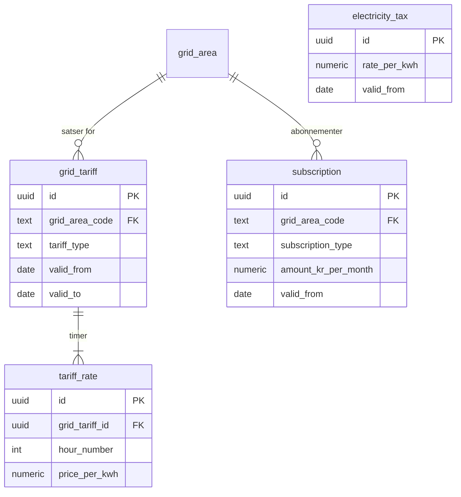
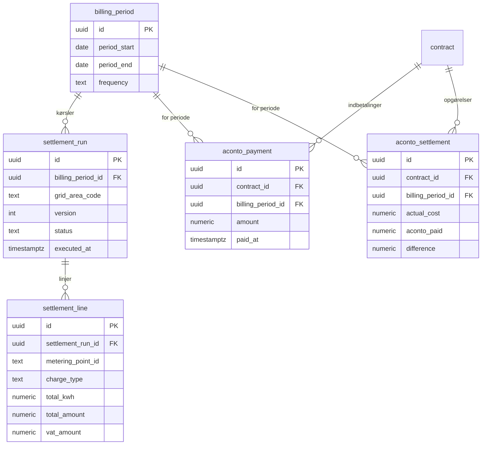

# DataHub 3: Databasemodel (PostgreSQL + TimescaleDB)

Fysisk databaseskema for afregningssystemet. Baseret på den konceptuelle [domænemodel (klassediagram)](datahub3-class-diagram.md) og de teknologivalg beskrevet i [arkitekturdokumentet](datahub3-proposed-architecture.md).

**Valg:** PostgreSQL med TimescaleDB-extension. Én databaseinstans dækker både tidsserier og relationelle data.

---

## Skemaoverblik

```
┌─────────────────────────────────────────────────────────────────────┐
│  PostgreSQL + TimescaleDB                                           │
│                                                                     │
│  Schema: portfolio          Schema: metering          Schema: tariff│
│  ├── customer               ├── metering_data (hyper) ├── grid_tariff
│  ├── metering_point         ├── daily_summary (cont.) ├── tariff_rate
│  ├── supply_period          └── spot_price            ├── subscription
│  ├── contract                                         └── electricity_tax
│  ├── grid_area              Schema: settlement
│  └── product                ├── billing_period        Schema: datahub
│                             ├── settlement_run        ├── inbound_message
│  Schema: lifecycle          ├── settlement_line       ├── outbound_request
│  ├── process_request        ├── aconto_payment        ├── processed_message_id
│  └── process_event          └── aconto_settlement     └── dead_letter
│
│                             Schema: invoicing
│                             ├── invoice
│                             └── invoice_line
└─────────────────────────────────────────────────────────────────────┘
```

---

## Schema: `portfolio`

### customer

```sql
CREATE TABLE portfolio.customer (
    id              UUID PRIMARY KEY DEFAULT gen_random_uuid(),
    name            TEXT NOT NULL,
    cpr_cvr         TEXT NOT NULL,                -- CPR (10) eller CVR (8), krypteret at rest
    contact_type    TEXT NOT NULL CHECK (contact_type IN ('private', 'business')),
    email           TEXT,
    phone           TEXT,
    status          TEXT NOT NULL DEFAULT 'active' CHECK (status IN ('active', 'inactive', 'archived')),
    created_at      TIMESTAMPTZ NOT NULL DEFAULT now(),
    updated_at      TIMESTAMPTZ NOT NULL DEFAULT now()
);

CREATE INDEX idx_customer_cpr_cvr ON portfolio.customer (cpr_cvr);
CREATE INDEX idx_customer_status ON portfolio.customer (status);
```

**GDPR-note:** `cpr_cvr` skal krypteres at rest (column-level encryption eller transparent data encryption). Overvej at gemme kun hash til opslag og den krypterede værdi separat.

### metering_point

```sql
CREATE TABLE portfolio.metering_point (
    gsrn                TEXT PRIMARY KEY,          -- 18 cifre, f.eks. '571313100000012345'
    type                TEXT NOT NULL CHECK (type IN ('E17', 'E18')),  -- E17=forbrug, E18=produktion
    settlement_method   TEXT NOT NULL CHECK (settlement_method IN ('flex', 'non_profiled')),
    connection_status   TEXT NOT NULL DEFAULT 'connected'
                        CHECK (connection_status IN ('connected', 'disconnected', 'closed_down')),
    grid_area_code      TEXT NOT NULL REFERENCES portfolio.grid_area(code),
    grid_operator_gln   TEXT NOT NULL,             -- 13 cifre
    price_area          TEXT NOT NULL CHECK (price_area IN ('DK1', 'DK2')),
    activated_at        TIMESTAMPTZ,
    deactivated_at      TIMESTAMPTZ,
    created_at          TIMESTAMPTZ NOT NULL DEFAULT now(),
    updated_at          TIMESTAMPTZ NOT NULL DEFAULT now()
);

CREATE INDEX idx_metering_point_grid_area ON portfolio.metering_point (grid_area_code);
CREATE INDEX idx_metering_point_status ON portfolio.metering_point (connection_status);
```

### grid_area

```sql
CREATE TABLE portfolio.grid_area (
    code                TEXT PRIMARY KEY,           -- f.eks. '344', '791'
    grid_operator_gln   TEXT NOT NULL,
    grid_operator_name  TEXT NOT NULL,
    price_area          TEXT NOT NULL CHECK (price_area IN ('DK1', 'DK2')),
    created_at          TIMESTAMPTZ NOT NULL DEFAULT now()
);
```

### supply_period

```sql
CREATE TABLE portfolio.supply_period (
    id              UUID PRIMARY KEY DEFAULT gen_random_uuid(),
    gsrn            TEXT NOT NULL REFERENCES portfolio.metering_point(gsrn),
    start_date      DATE NOT NULL,
    end_date        DATE,                          -- NULL = aktiv leveranceperiode
    end_reason      TEXT CHECK (end_reason IN ('supplier_switch', 'move_out', 'non_payment')),
    created_at      TIMESTAMPTZ NOT NULL DEFAULT now()
);

CREATE INDEX idx_supply_period_gsrn ON portfolio.supply_period (gsrn);
CREATE INDEX idx_supply_period_active ON portfolio.supply_period (gsrn) WHERE end_date IS NULL;
```

### product

```sql
CREATE TABLE portfolio.product (
    id                      UUID PRIMARY KEY DEFAULT gen_random_uuid(),
    name                    TEXT NOT NULL,              -- f.eks. 'Spot Standard', 'Grøn', 'Fastpris 12 mdr.'
    energy_model            TEXT NOT NULL CHECK (energy_model IN ('spot', 'fixed_price', 'mixed')),
    margin_ore_per_kwh      NUMERIC(8,4) NOT NULL,     -- leverandørmargin i øre/kWh
    supplement_ore_per_kwh  NUMERIC(8,4),              -- evt. produkttillæg (grøn energi etc.)
    subscription_kr_per_month NUMERIC(10,2) NOT NULL,  -- leverandørabonnement i kr./måned
    binding_period_months   INT,                        -- NULL = ingen binding
    is_active               BOOLEAN NOT NULL DEFAULT true,
    created_at              TIMESTAMPTZ NOT NULL DEFAULT now(),
    updated_at              TIMESTAMPTZ NOT NULL DEFAULT now()
);
```

### contract

```sql
CREATE TABLE portfolio.contract (
    id                  UUID PRIMARY KEY DEFAULT gen_random_uuid(),
    customer_id         UUID NOT NULL REFERENCES portfolio.customer(id),
    gsrn                TEXT NOT NULL REFERENCES portfolio.metering_point(gsrn),
    product_id          UUID NOT NULL REFERENCES portfolio.product(id),
    billing_frequency   TEXT NOT NULL CHECK (billing_frequency IN ('monthly', 'quarterly')),
    payment_model       TEXT NOT NULL CHECK (payment_model IN ('aconto', 'post_payment')),
    payment_term_days   INT NOT NULL DEFAULT 30,
    start_date          DATE NOT NULL,
    end_date            DATE,
    created_at          TIMESTAMPTZ NOT NULL DEFAULT now(),
    updated_at          TIMESTAMPTZ NOT NULL DEFAULT now(),

    UNIQUE (gsrn, start_date)                      -- højst én kontrakt pr. målepunkt pr. startdato
);

CREATE INDEX idx_contract_customer ON portfolio.contract (customer_id);
CREATE INDEX idx_contract_gsrn ON portfolio.contract (gsrn);
CREATE INDEX idx_contract_active ON portfolio.contract (gsrn) WHERE end_date IS NULL;
```

### ER-diagram: portfolio



---

## Schema: `metering`

### metering_data (TimescaleDB hypertable)

Den største tabel i systemet. ~230M rækker/måned ved PT15M-opløsning.

```sql
CREATE TABLE metering.metering_data (
    metering_point_id   TEXT NOT NULL,              -- GSRN
    timestamp           TIMESTAMPTZ NOT NULL,       -- UTC, start af interval
    resolution          TEXT NOT NULL CHECK (resolution IN ('PT15M', 'PT1H', 'P1M')),
    quantity_kwh        NUMERIC(12,3) NOT NULL,     -- max 3 decimaler jf. CIM
    quality_code        TEXT NOT NULL CHECK (quality_code IN ('A01', 'A02', 'A03', 'A06')),
    source_message_id   TEXT NOT NULL,              -- DataHub MessageId (sporbarhed)
    received_at         TIMESTAMPTZ NOT NULL DEFAULT now(),

    PRIMARY KEY (metering_point_id, timestamp)
);

-- Konvertér til TimescaleDB hypertable med månedlige chunks
SELECT create_hypertable(
    'metering.metering_data',
    by_range('timestamp', INTERVAL '1 month')
);

-- Sammensat indeks til afregningsforespørgsler (allerede PK)
-- Ekstra indeks til sporbarhed
CREATE INDEX idx_metering_data_source ON metering.metering_data (source_message_id);
```

**Komprimering (efter data er "settled"):**

```sql
ALTER TABLE metering.metering_data SET (
    timescaledb.compress,
    timescaledb.compress_segmentby = 'metering_point_id',
    timescaledb.compress_orderby = 'timestamp'
);

-- Komprimér automatisk data ældre end 3 måneder
SELECT add_compression_policy('metering.metering_data', INTERVAL '3 months');
```

**Opbevaringspolitik:**

```sql
-- Slet rå data ældre end 5 år (lovkrav)
SELECT add_retention_policy('metering.metering_data', INTERVAL '5 years');
```

### daily_summary (TimescaleDB continuous aggregate)

Præ-aggregeret daglig oversigt — reducerer afregningsforespørgsler fra 230M til 2,4M rækker/måned.

```sql
CREATE MATERIALIZED VIEW metering.daily_summary
WITH (timescaledb.continuous) AS
SELECT
    metering_point_id,
    time_bucket('1 day', timestamp)     AS date,
    SUM(quantity_kwh)                   AS total_kwh,
    COUNT(*)                            AS data_points,
    MIN(quality_code)                   AS worst_quality  -- A01 < A02 < A03 (laveste = dårligst)
FROM metering.metering_data
GROUP BY metering_point_id, time_bucket('1 day', timestamp);

-- Opdatér automatisk (1 times forsinkelse for at undgå race conditions)
SELECT add_continuous_aggregate_policy('metering.daily_summary',
    start_offset    => INTERVAL '3 days',
    end_offset      => INTERVAL '1 hour',
    schedule_interval => INTERVAL '1 hour'
);
```

### spot_price

```sql
CREATE TABLE metering.spot_price (
    price_area      TEXT NOT NULL CHECK (price_area IN ('DK1', 'DK2')),
    hour            TIMESTAMPTZ NOT NULL,           -- UTC, start af timen
    price_per_kwh   NUMERIC(10,6) NOT NULL,         -- DKK/kWh
    source          TEXT,                            -- f.eks. 'nordpool', 'energidataservice'
    fetched_at      TIMESTAMPTZ NOT NULL DEFAULT now(),

    PRIMARY KEY (price_area, hour)
);
```

---

## Schema: `tariff`

### grid_tariff

```sql
CREATE TABLE tariff.grid_tariff (
    id                  UUID PRIMARY KEY DEFAULT gen_random_uuid(),
    grid_area_code      TEXT NOT NULL REFERENCES portfolio.grid_area(code),
    charge_owner_id     TEXT NOT NULL,              -- GLN for tariffens ejer
    tariff_type         TEXT NOT NULL CHECK (tariff_type IN ('grid', 'system', 'transmission')),
    charge_type_code    TEXT,                        -- CIM-kode fra Charges-kø
    valid_from          DATE NOT NULL,
    valid_to            DATE,                        -- NULL = gælder fortsat
    source_message_id   TEXT,                        -- DataHub Charges-kø MessageId
    created_at          TIMESTAMPTZ NOT NULL DEFAULT now(),

    UNIQUE (grid_area_code, tariff_type, valid_from)
);

CREATE INDEX idx_grid_tariff_area_validity ON tariff.grid_tariff (grid_area_code, valid_from, valid_to);
```

### tariff_rate

```sql
CREATE TABLE tariff.tariff_rate (
    id              UUID PRIMARY KEY DEFAULT gen_random_uuid(),
    grid_tariff_id  UUID NOT NULL REFERENCES tariff.grid_tariff(id) ON DELETE CASCADE,
    hour_number     INT NOT NULL CHECK (hour_number BETWEEN 1 AND 24),  -- DB-konvention: 1-24
    price_per_kwh   NUMERIC(10,6) NOT NULL,         -- DKK/kWh

    UNIQUE (grid_tariff_id, hour_number)
);
```

**Eksempel:** En nettarif med dag/nat/spids-differentiering:

```
hour_number | price_per_kwh
  1-6       | 0.06          (nat)
  7-16      | 0.18          (dag)
  17-20     | 0.54          (spids)
  21-24     | 0.06          (nat)
```

### subscription

```sql
CREATE TABLE tariff.subscription (
    id                  UUID PRIMARY KEY DEFAULT gen_random_uuid(),
    grid_area_code      TEXT REFERENCES portfolio.grid_area(code),  -- NULL for leverandørabonnement
    subscription_type   TEXT NOT NULL CHECK (subscription_type IN ('grid', 'supplier')),
    amount_kr_per_month NUMERIC(10,2) NOT NULL,
    valid_from          DATE NOT NULL,
    valid_to            DATE,
    source_message_id   TEXT,                       -- NULL for leverandørabonnement (vores eget)
    created_at          TIMESTAMPTZ NOT NULL DEFAULT now()
);

CREATE INDEX idx_subscription_area ON tariff.subscription (grid_area_code, valid_from);
```

### electricity_tax

```sql
CREATE TABLE tariff.electricity_tax (
    id              UUID PRIMARY KEY DEFAULT gen_random_uuid(),
    rate_per_kwh    NUMERIC(10,6) NOT NULL,         -- DKK/kWh
    valid_from      DATE NOT NULL,
    valid_to        DATE,
    description     TEXT,                            -- f.eks. 'Elafgift 2025'
    created_at      TIMESTAMPTZ NOT NULL DEFAULT now(),

    UNIQUE (valid_from)
);
```

### ER-diagram: tariff



---

## Schema: `settlement`

### billing_period

```sql
CREATE TABLE settlement.billing_period (
    id              UUID PRIMARY KEY DEFAULT gen_random_uuid(),
    period_start    DATE NOT NULL,
    period_end      DATE NOT NULL,
    frequency       TEXT NOT NULL CHECK (frequency IN ('monthly', 'quarterly')),
    created_at      TIMESTAMPTZ NOT NULL DEFAULT now(),

    UNIQUE (period_start, period_end),
    CHECK (period_end > period_start)
);
```

### settlement_run

```sql
CREATE TABLE settlement.settlement_run (
    id                  UUID PRIMARY KEY DEFAULT gen_random_uuid(),
    billing_period_id   UUID NOT NULL REFERENCES settlement.billing_period(id),
    grid_area_code      TEXT,                       -- NULL = alle netområder, ellers partitioneret
    version             INT NOT NULL DEFAULT 1,     -- øges ved genberegning
    status              TEXT NOT NULL DEFAULT 'running'
                        CHECK (status IN ('running', 'completed', 'failed')),
    executed_at         TIMESTAMPTZ NOT NULL DEFAULT now(),
    completed_at        TIMESTAMPTZ,
    error_details       TEXT,
    metering_points_count INT,                      -- antal behandlede målepunkter

    UNIQUE (billing_period_id, grid_area_code, version)
);

CREATE INDEX idx_settlement_run_period ON settlement.settlement_run (billing_period_id);
CREATE INDEX idx_settlement_run_status ON settlement.settlement_run (status) WHERE status = 'running';
```

### settlement_line

```sql
CREATE TABLE settlement.settlement_line (
    id                  UUID PRIMARY KEY DEFAULT gen_random_uuid(),
    settlement_run_id   UUID NOT NULL REFERENCES settlement.settlement_run(id) ON DELETE CASCADE,
    metering_point_id   TEXT NOT NULL,              -- GSRN
    charge_type         TEXT NOT NULL CHECK (charge_type IN (
                            'energy', 'grid_tariff', 'system_tariff', 'transmission_tariff',
                            'electricity_tax', 'grid_subscription', 'supplier_subscription'
                        )),
    total_kwh           NUMERIC(12,3),              -- NULL for abonnementer
    total_amount        NUMERIC(12,2) NOT NULL,     -- DKK ekskl. moms
    vat_amount          NUMERIC(12,2) NOT NULL,     -- 25% moms
    currency            TEXT NOT NULL DEFAULT 'DKK'
);

CREATE INDEX idx_settlement_line_run ON settlement.settlement_line (settlement_run_id);
CREATE INDEX idx_settlement_line_mp ON settlement.settlement_line (metering_point_id);
```

### aconto_payment

```sql
CREATE TABLE settlement.aconto_payment (
    id                  UUID PRIMARY KEY DEFAULT gen_random_uuid(),
    contract_id         UUID NOT NULL REFERENCES portfolio.contract(id),
    billing_period_id   UUID NOT NULL REFERENCES settlement.billing_period(id),
    amount              NUMERIC(12,2) NOT NULL,     -- DKK inkl. moms
    paid_at             TIMESTAMPTZ,                -- NULL = forventet men ikke betalt endnu
    created_at          TIMESTAMPTZ NOT NULL DEFAULT now(),

    UNIQUE (contract_id, billing_period_id)
);
```

### aconto_settlement

```sql
CREATE TABLE settlement.aconto_settlement (
    id                  UUID PRIMARY KEY DEFAULT gen_random_uuid(),
    contract_id         UUID NOT NULL REFERENCES portfolio.contract(id),
    billing_period_id   UUID NOT NULL REFERENCES settlement.billing_period(id),
    actual_cost         NUMERIC(12,2) NOT NULL,     -- faktisk afregnet beløb inkl. moms
    aconto_paid         NUMERIC(12,2) NOT NULL,     -- indbetalt acontobeløb
    difference          NUMERIC(12,2) NOT NULL,     -- actual_cost - aconto_paid (positiv = skylder)
    new_aconto_amount   NUMERIC(12,2),              -- genberegnet aconto for næste kvartal
    settled_at          TIMESTAMPTZ NOT NULL DEFAULT now(),

    UNIQUE (contract_id, billing_period_id)
);
```

### ER-diagram: settlement



---

## Schema: `invoicing`

### invoice

```sql
CREATE TABLE invoicing.invoice (
    id                  UUID PRIMARY KEY DEFAULT gen_random_uuid(),
    customer_id         UUID NOT NULL REFERENCES portfolio.customer(id),
    billing_period_id   UUID NOT NULL REFERENCES settlement.billing_period(id),
    settlement_run_id   UUID REFERENCES settlement.settlement_run(id),
    invoice_type        TEXT NOT NULL CHECK (invoice_type IN (
                            'standard', 'aconto_combined', 'final_settlement', 'credit_note', 'debit_note'
                        )),
    status              TEXT NOT NULL DEFAULT 'draft' CHECK (status IN (
                            'draft', 'issued', 'sent', 'paid', 'overdue', 'cancelled'
                        )),
    invoice_number      TEXT UNIQUE,                -- tildeles ved udstedelse
    issued_at           TIMESTAMPTZ,
    due_date            DATE,
    total_ex_vat        NUMERIC(12,2) NOT NULL,
    vat_amount          NUMERIC(12,2) NOT NULL,
    total_incl_vat      NUMERIC(12,2) NOT NULL,
    currency            TEXT NOT NULL DEFAULT 'DKK',
    created_at          TIMESTAMPTZ NOT NULL DEFAULT now(),
    updated_at          TIMESTAMPTZ NOT NULL DEFAULT now()
);

CREATE INDEX idx_invoice_customer ON invoicing.invoice (customer_id);
CREATE INDEX idx_invoice_status ON invoicing.invoice (status);
CREATE INDEX idx_invoice_period ON invoicing.invoice (billing_period_id);
```

### invoice_line

```sql
CREATE TABLE invoicing.invoice_line (
    id              UUID PRIMARY KEY DEFAULT gen_random_uuid(),
    invoice_id      UUID NOT NULL REFERENCES invoicing.invoice(id) ON DELETE CASCADE,
    sort_order      INT NOT NULL,                   -- rækkefølge på fakturaen
    charge_type     TEXT NOT NULL CHECK (charge_type IN (
                        'energy', 'grid_tariff', 'system_tariff', 'transmission_tariff',
                        'electricity_tax', 'grid_subscription', 'supplier_subscription',
                        'aconto_settlement', 'aconto_new_period', 'vat'
                    )),
    description     TEXT NOT NULL,                   -- f.eks. 'Elforsyning (spot + margin)'
    quantity        NUMERIC(12,3),                   -- kWh, dage, eller stk.
    unit_price      NUMERIC(12,6),                   -- DKK pr. enhed
    amount          NUMERIC(12,2) NOT NULL,          -- DKK (linjens totalbeløb)

    UNIQUE (invoice_id, sort_order)
);

CREATE INDEX idx_invoice_line_invoice ON invoicing.invoice_line (invoice_id);
```

---

## Schema: `lifecycle`

### process_request

```sql
CREATE TABLE lifecycle.process_request (
    id                      UUID PRIMARY KEY DEFAULT gen_random_uuid(),
    process_type            TEXT NOT NULL CHECK (process_type IN (
                                'supplier_switch', 'short_notice_switch', 'move_in',
                                'end_of_supply', 'forced_end_of_supply', 'move_out',
                                'cancel_switch', 'cancel_end_of_supply',
                                'incorrect_switch', 'incorrect_move'
                            )),
    gsrn                    TEXT NOT NULL,
    status                  TEXT NOT NULL DEFAULT 'pending' CHECK (status IN (
                                'pending', 'sent_to_datahub', 'acknowledged', 'rejected',
                                'effectuation_pending', 'completed', 'cancelled'
                            )),
    effective_date          DATE,                    -- ønsket ikrafttrædelsesdato
    datahub_correlation_id  TEXT,                     -- fra RSM-009 kvittering
    requested_at            TIMESTAMPTZ NOT NULL DEFAULT now(),
    completed_at            TIMESTAMPTZ,
    created_at              TIMESTAMPTZ NOT NULL DEFAULT now(),
    updated_at              TIMESTAMPTZ NOT NULL DEFAULT now()
);

CREATE INDEX idx_process_request_gsrn ON lifecycle.process_request (gsrn);
CREATE INDEX idx_process_request_status ON lifecycle.process_request (status)
    WHERE status NOT IN ('completed', 'cancelled', 'rejected');
CREATE INDEX idx_process_request_correlation ON lifecycle.process_request (datahub_correlation_id)
    WHERE datahub_correlation_id IS NOT NULL;
```

### process_event (event sourcing)

```sql
CREATE TABLE lifecycle.process_event (
    id                  UUID PRIMARY KEY DEFAULT gen_random_uuid(),
    process_request_id  UUID NOT NULL REFERENCES lifecycle.process_request(id),
    occurred_at         TIMESTAMPTZ NOT NULL DEFAULT now(),
    event_type          TEXT NOT NULL,               -- f.eks. 'sent', 'acknowledged', 'rejected', 'completed'
    payload             JSONB,                       -- beskedindhold, afvisningsårsag, etc.
    source              TEXT                          -- 'system', 'datahub', 'operator'
);

CREATE INDEX idx_process_event_request ON lifecycle.process_event (process_request_id, occurred_at);
```

---

## Schema: `datahub`

### inbound_message

```sql
CREATE TABLE datahub.inbound_message (
    id                  UUID PRIMARY KEY DEFAULT gen_random_uuid(),
    datahub_message_id  TEXT NOT NULL,               -- MessageId fra peek-header
    message_type        TEXT NOT NULL,               -- f.eks. 'RSM-012', 'RSM-007', 'RSM-014'
    correlation_id      TEXT,                        -- CorrelationId fra header (gem altid!)
    queue_name          TEXT NOT NULL,               -- 'timeseries', 'masterdata', 'aggregations', 'charges'
    status              TEXT NOT NULL DEFAULT 'received'
                        CHECK (status IN ('received', 'parsed', 'processed', 'dead_lettered')),
    raw_payload_size    INT,                         -- bytes (vi gemmer ikke hele payload)
    error_details       TEXT,
    received_at         TIMESTAMPTZ NOT NULL DEFAULT now(),
    processed_at        TIMESTAMPTZ
);

CREATE INDEX idx_inbound_message_datahub_id ON datahub.inbound_message (datahub_message_id);
CREATE INDEX idx_inbound_message_status ON datahub.inbound_message (status)
    WHERE status NOT IN ('processed');
CREATE INDEX idx_inbound_message_received ON datahub.inbound_message (received_at DESC);
```

### outbound_request

```sql
CREATE TABLE datahub.outbound_request (
    id                  UUID PRIMARY KEY DEFAULT gen_random_uuid(),
    process_type        TEXT NOT NULL,               -- f.eks. 'BRS-001', 'RSM-015'
    gsrn                TEXT,
    status              TEXT NOT NULL DEFAULT 'sent'
                        CHECK (status IN ('sent', 'acknowledged_ok', 'acknowledged_error', 'timed_out')),
    correlation_id      TEXT,                        -- fra DataHub-svar
    sent_at             TIMESTAMPTZ NOT NULL DEFAULT now(),
    response_at         TIMESTAMPTZ,
    error_details       TEXT
);

CREATE INDEX idx_outbound_request_correlation ON datahub.outbound_request (correlation_id)
    WHERE correlation_id IS NOT NULL;
CREATE INDEX idx_outbound_request_pending ON datahub.outbound_request (status)
    WHERE status = 'sent';
```

### processed_message_id (idempotens)

```sql
CREATE TABLE datahub.processed_message_id (
    message_id      TEXT PRIMARY KEY,               -- DataHub MessageId
    processed_at    TIMESTAMPTZ NOT NULL DEFAULT now()
);

-- Automatisk sletning af gamle entries (ældre end 90 dage)
-- Implementeres via cron-job eller TimescaleDB-retention
```

### dead_letter

```sql
CREATE TABLE datahub.dead_letter (
    id                  UUID PRIMARY KEY DEFAULT gen_random_uuid(),
    original_message_id TEXT,
    queue_name          TEXT NOT NULL,
    error_reason        TEXT NOT NULL,
    raw_payload         JSONB,                       -- den fejlede besked (til genbehandling)
    failed_at           TIMESTAMPTZ NOT NULL DEFAULT now(),
    resolved            BOOLEAN NOT NULL DEFAULT false,
    resolved_at         TIMESTAMPTZ,
    resolved_by         TEXT                          -- operatør-ID
);

CREATE INDEX idx_dead_letter_unresolved ON datahub.dead_letter (failed_at DESC)
    WHERE NOT resolved;
```

---

## Nyttige forespørgsler

### Hent forbrug for et målepunkt i en periode

```sql
SELECT
    metering_point_id,
    timestamp,
    quantity_kwh,
    quality_code
FROM metering.metering_data
WHERE metering_point_id = '571313100000012345'
  AND timestamp >= '2025-01-01'
  AND timestamp < '2025-02-01'
ORDER BY timestamp;
```

### Dagligt forbrug via continuous aggregate

```sql
SELECT date, total_kwh, data_points
FROM metering.daily_summary
WHERE metering_point_id = '571313100000012345'
  AND date >= '2025-01-01'
  AND date < '2025-02-01'
ORDER BY date;
```

### Hent gældende tariffer for et netområde

```sql
SELECT gt.tariff_type, tr.hour_number, tr.price_per_kwh
FROM tariff.grid_tariff gt
JOIN tariff.tariff_rate tr ON tr.grid_tariff_id = gt.id
WHERE gt.grid_area_code = '344'
  AND gt.valid_from <= '2025-01-15'
  AND (gt.valid_to IS NULL OR gt.valid_to > '2025-01-15')
ORDER BY gt.tariff_type, tr.hour_number;
```

### Afregningsberegning: energilinje for én måned

```sql
SELECT
    md.metering_point_id,
    SUM(md.quantity_kwh * (sp.price_per_kwh + p.margin_ore_per_kwh / 100.0)) AS energy_amount
FROM metering.metering_data md
JOIN metering.spot_price sp
    ON sp.price_area = 'DK1'
    AND sp.hour = date_trunc('hour', md.timestamp)
JOIN portfolio.contract c ON c.gsrn = md.metering_point_id AND c.end_date IS NULL
JOIN portfolio.product p ON p.id = c.product_id
WHERE md.metering_point_id = '571313100000012345'
  AND md.timestamp >= '2025-01-01'
  AND md.timestamp < '2025-02-01'
GROUP BY md.metering_point_id;
```

### Ubehandlede dead letters

```sql
SELECT id, queue_name, error_reason, failed_at
FROM datahub.dead_letter
WHERE NOT resolved
ORDER BY failed_at DESC;
```

---

## Migrering og vedligeholdelse

### Opsætning (i rækkefølge)

```sql
-- 1. Extensions
CREATE EXTENSION IF NOT EXISTS timescaledb;
CREATE EXTENSION IF NOT EXISTS pgcrypto;    -- til gen_random_uuid() og evt. kryptering

-- 2. Skemaer
CREATE SCHEMA IF NOT EXISTS portfolio;
CREATE SCHEMA IF NOT EXISTS metering;
CREATE SCHEMA IF NOT EXISTS tariff;
CREATE SCHEMA IF NOT EXISTS settlement;
CREATE SCHEMA IF NOT EXISTS invoicing;
CREATE SCHEMA IF NOT EXISTS lifecycle;
CREATE SCHEMA IF NOT EXISTS datahub;

-- 3. Tabeller (portfolio først pga. FK-referencer)
-- 4. Hypertables og continuous aggregates
-- 5. Komprimeringspolitikker
-- 6. Retentionspolitikker
```

### Lagringskrav (estimat, 80K kunder, PT15M)

| Tabel | Rækker/måned | Rå størrelse | Med komprimering |
|-------|-------------|-------------|-----------------|
| metering_data | ~230M | ~9 GB | ~0,7 GB |
| daily_summary | ~2,4M | ~100 MB | (view) |
| spot_price | ~1.500 | <1 MB | — |
| settlement_line | ~560K | ~30 MB | — |
| Alt andet | — | ~50 MB | — |
| **Total pr. måned** | | | **~1 GB** |

---

## Kilder

- [Klassediagram (domænemodel)](datahub3-class-diagram.md) — konceptuel model
- [Foreslået systemarkitektur](datahub3-proposed-architecture.md) — dataarkitektur og teknologivalg
- [Produktopbygning og fakturering](datahub3-product-and-billing.md) — alle fakturaparametre
- [Afregningsoverblik](datahub3-settlement-overview.md) — afregningsberegning
