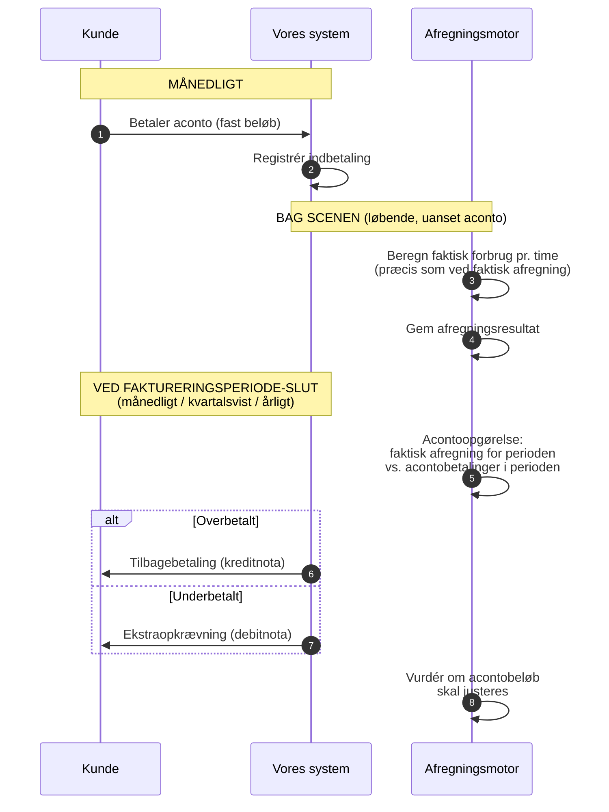

# Produktopbygning og fakturering: Privatkunde

Hvad bestemmer en privatkunde's faktura? Denne guide gennemgår alle parametre der påvirker beløbet — fra produktvalg til acontoopgørelse.

---

## Kundens produkt = en samling af prisparametre

Når en privatkunde tegner en aftale, vælger de et **produkt** (f.eks. "Verdo Spot", "Verdo Grøn", "Verdo Fast"). Produktet bestemmer de variable parametre vi selv kontrollerer. Resten er bestemt af eksterne parter.

```
┌─────────────────────────────────────────────────────────────┐
│  PRODUKTET (det vi selv bestemmer)                           │
│                                                              │
│  • Energimodel:      Spot / fast pris / blanding            │
│  • Verdo-margin:     X øre/kWh oven på spotpris             │
│  • Produkttillæg:    Ekstra øre/kWh (f.eks. grøn energi)   │
│  • Abonnement:       Fast månedligt gebyr (kr./md.)         │
│  • Faktureringsfrekvens:  Månedligt / kvartalsvist / årligt │
│  • Betalingsmodel:   Aconto / faktisk forbrug               │
│  • Bindingsperiode:  Ingen / 3 mdr. / 6 mdr. / 12 mdr.    │
│  • Betalingsfrist:   Netto 14 / 30 dage                    │
└─────────────────────────────────────────────────────────────┘

┌─────────────────────────────────────────────────────────────┐
│  EKSTERNE PARAMETRE (bestemt af andre — ens for alle)        │
│                                                              │
│  • Nordpool spotpris:       Varierer time for time          │
│  • Nettarif:                Bestemt af kundens netvirksomhed│
│  • Systemtarif:             Bestemt af Energinet            │
│  • Transmissionstarif:      Bestemt af Energinet            │
│  • Netabonnement:           Fast gebyr fra netvirksomheden  │
│  • Elafgift:                Lovbestemt (staten)             │
│  • Moms:                    25% (staten)                    │
└─────────────────────────────────────────────────────────────┘
```

Produktet styrer altså kun **en del** af fakturaen. Resten er gennemfakturering af eksterne omkostninger.

---

## Alle fakturalinjer for en privatkunde

En typisk månedsfaktura for en privatkunde på spotprodukt:

```
┌───────────────────────────────────────────────────────────────────────┐
│  FAKTURA — januar 2025                                                │
│  Kunde: Anders Hansen, GSRN 571313100000012345                       │
│  Periode: 01-01-2025 → 31-01-2025 (744 timer)                       │
├───────────────────────────────────────────────────────────────────────┤
│                                                                       │
│  ENERGI                                                               │
│  Elforsyning (spot + margin)          450 kWh × gns. 0,92 kr.  414,00│
│                                                                       │
│  TRANSPORT OG SYSTEMOMKOSTNINGER                                      │
│  Nettarif (N1/Radius/Verdo Net)       450 kWh × gns. 0,14 kr.   63,00│
│  Systemtarif (Energinet)              450 kWh × 0,054 kr.        24,30│
│  Transmissionstarif (Energinet)       450 kWh × 0,049 kr.        22,05│
│                                                                       │
│  AFGIFTER                                                             │
│  Elafgift                             450 kWh × 0,008 kr.         3,60│
│                                                                       │
│  ABONNEMENTER                                                         │
│  Netabonnement (N1/Radius/Verdo Net)                               49,00│
│  Verdo abonnement                                                  39,00│
│                                                                       │
│  ────────────────────────────────────────────────────────────         │
│  Subtotal                                                     614,95│
│  Moms (25%)                                                   153,74│
│  ────────────────────────────────────────────────────────────         │
│  TOTAL                                                        768,69│
│                                                                       │
│  Aconto indbetalt for januar:                               -650,00│
│  ────────────────────────────────────────────────────────────         │
│  SKYLDIG DETTE KVARTAL (tillægges næste acontoopkrævning)    118,69│
│                                                                       │
└───────────────────────────────────────────────────────────────────────┘
```

### Linje for linje

| # | Fakturalinje | Beregning | Hvem bestemmer prisen | Variabel/fast |
|---|-------------|-----------|----------------------|---------------|
| 1 | **Elforsyning** | kWh × (spotpris + Verdo-margin) pr. time, summeret | Nordpool + os | Variabel (time for time) |
| 2 | **Nettarif** | kWh × netvirksomhedens sats pr. time | Netvirksomheden | Variabel (tidsdifferentieret) |
| 3 | **Systemtarif** | kWh × Energinets sats | Energinet | Variabel (kWh-baseret, men sats sjældent ændres) |
| 4 | **Transmissionstarif** | kWh × Energinets sats | Energinet | Variabel (kWh-baseret, men sats sjældent ændres) |
| 5 | **Elafgift** | kWh × lovbestemt sats | Staten | Variabel (kWh-baseret, sats ændres årligt) |
| 6 | **Netabonnement** | Fast kr./måned | Netvirksomheden | Fast |
| 7 | **Verdo abonnement** | Fast kr./måned | Os | Fast |
| 8 | **Moms** | 25% af linje 1-7 | Staten | Beregnet |

**Nøglepointe:** Linje 1-5 er alle `kWh × sats` — det er derfor RSM-012 (forbrugsdata) er så central. Uden kWh-data kan vi ikke beregne 5 ud af 8 linjer.

---

## Energimodeller

Det vigtigste produktvalg er **energimodellen** — hvordan spotprisen håndteres:

| Model | Hvad kunden betaler | Verdos risiko | Typisk for |
|-------|--------------------|--------------| -----------|
| **Spot** | Nordpool-timepris + fast margin (f.eks. +4 øre/kWh) | Ingen — kunden bærer prisrisiko | De fleste privatkunder |
| **Fastpris** | Aftalt fast pris pr. kWh (f.eks. 0,95 kr.) for en periode | Verdo bærer prisrisiko (hedging nødvendig) | Kunder der vil have forudsigelighed |
| **Blanding** | Del spot, del fast — eller spotpris med prisloft | Delt risiko | Nicheprodukt |

For spot-modellen beregnes energilinjen pr. time:

```
Time 14:00-15:00:  1,5 kWh × (0,85 kr. spot + 0,04 kr. margin) = 1,335 kr.
Time 15:00-16:00:  1,2 kWh × (0,72 kr. spot + 0,04 kr. margin) = 0,912 kr.
...
Summeret over 744 timer = energilinjen på fakturaen
```

For fastpris-modellen er det simplere: `total kWh × aftalt pris`.

---

## Nettariffer — hvad der afhænger af kundens adresse

Nettariffen bestemmes af **hvilken netvirksomhed** der dækker kundens adresse. Når vi modtager stamdata (RSM-007) ved aktivering, får vi et **netområde** og en **netvirksomheds-GLN** — det fortæller os hvilke tariffer der gælder.

Danmark har ~40 netvirksomheder, og de har forskellige satser:

| Parameter | Eksempel (N1) | Eksempel (Radius) |
|-----------|--------------|-------------------|
| Nettarif dag (06-21) | 0,18 kr./kWh | 0,15 kr./kWh |
| Nettarif nat (21-06) | 0,06 kr./kWh | 0,05 kr./kWh |
| Nettarif spids (17-20) | 0,54 kr./kWh | — |
| Netabonnement | 49 kr./md. | 45 kr./md. |

Nettariffer er typisk **tidsdifferentierede** — forskellige satser for dag, nat og spidslast. Nogle netvirksomheder har 2 zoner (dag/nat), andre har 3 (dag/nat/spids).

Satserne modtager vi via **Charges-køen** fra DataHub og opdateres typisk 1-2 gange om året.

---

## Aconto: Detaljeret forklaring

### Hvad er aconto?

Aconto er en **betalingsmodel** hvor kunden betaler et **fast estimeret beløb** hver måned. Ved hver **faktureringsperiode** (månedlig, kvartalsvis eller årlig — afhængig af kontrakt) laves en **acontoopgørelse** der afstemmer de indbetalte acontobeløb mod det faktiske forbrug i perioden.

```
Eksempel: Kvartalsvis fakturering med månedlig aconto

Mdr. 1       Mdr. 2       Mdr. 3       Acontoopgørelse
  │            │            │                │
  ▼            ▼            ▼                ▼
650 kr.      650 kr.      650 kr.       Faktisk forbrug
(aconto)     (aconto)     (aconto)      for Q1 beregnes
                                             │
                                ┌────────────┴────────────┐
                                │                         │
                           Overbetalt              Underbetalt
                           → kreditnota            → ekstraopkrævning

Mdr. 4       Mdr. 5       Mdr. 6       Acontoopgørelse
  │            │            │                │
  ▼            ▼            ▼                ▼
650 kr.      650 kr.      650 kr.       Faktisk forbrug
(aconto)     (aconto)     (aconto)      for Q2 beregnes
  ...          ...          ...              ...
```

### Hvorfor aconto?

- **For kunden:** Forudsigelige udgifter — ingen overraskelser i kolde vintermåneder
- **For Verdo:** Jævn cash flow — vi modtager penge hele året, ikke kun i dyre perioder

### Hvordan beregnes acontobeløbet?

Ved **onboarding** (ny kunde):

```
Forventet årsforbrug (kWh)      ← Estimeret fra DataHub eller kundens oplysninger
× forventet gennemsnitspris     ← Baseret på aktuelle spot-/tarifniveauer
+ abonnementer (12 måneder)
+ afgifter
+ moms (25%)
= Estimeret årsomkostning
÷ 12
= Månedligt acontobeløb
```

Ved **genberegning** (eksisterende kunde — typisk ved acontoopgørelse):

```
Faktisk forbrug i seneste perioder (kWh)     ← Fra RSM-012-data i vores DB
× forventet gennemsnitspris fremadrettet     ← Baseret på markedsforventninger
+ abonnementer + afgifter + moms
= Nyt estimeret årsbeløb
÷ 12
= Nyt månedligt acontobeløb
```

### Acontoopgørelsen — afstemning ved faktureringsperiode

Ved slutningen af hver faktureringsperiode laves en acontoopgørelse. Eksempel for et kvartal:

```
ACONTOOPGØRELSE — Q1 2025 (januar-marts)

Faktisk forbrug i perioden:
  Energi (spot + margin, beregnet pr. time)         1.350,00 kr.
  Nettarif (pr. time)                                  189,00 kr.
  Systemtarif                                           72,90 kr.
  Transmissionstarif                                    66,15 kr.
  Elafgift                                              10,80 kr.
  Netabonnement (3 × 49 kr.)                           147,00 kr.
  Verdo abonnement (3 × 39 kr.)                        117,00 kr.
  ─────────────────────────────────────────────────
  Subtotal                                           1.952,85 kr.
  Moms (25%)                                           488,21 kr.
  ─────────────────────────────────────────────────
  Total faktisk omkostning                           2.441,06 kr.

Aconto indbetalinger (3 × 650 kr.):                  1.950,00 kr.

  ─────────────────────────────────────────────────
  DIFFERENCE:                                          491,06 kr.
  → Kunden har betalt FOR LIDT
  → Ekstraopkrævning: 491,06 kr.
  → Acontobeløb kan justeres for næste periode
```

### Aconto-flowet i systemet



### Vigtigt for systemdesign

Selv om kunden betaler aconto, kører afregningsberegningen **præcis som normalt** bag scenen. Vi beregner stadig `kWh × pris` pr. time for hver måned — vi sender bare ikke en individuel faktura for det. Beregningerne akkumuleres og bruges til acontoopgørelsen ved faktureringsperiodens slutning.

Det betyder:
- **Afregningsmotor** kører altid, uanset betalingsmodel
- **Acontobeløbet** er en ren betalings-/cash flow-parameter, ikke en afregningsparameter
- **Acontoopgørelsen** er en differenceberegning: `faktisk total for perioden − acontobetalinger i perioden`
- **Opgørelsesfrekvens** følger faktureringsfrekvensen (månedlig, kvartalsvis eller årlig)
- Ved **offboarding** laves acontoopgørelsen altid for den delvise periode

---

## Opsummering: Alle parametre der påvirker fakturaen

| Parameter | Kilde | Ændringsfrekvens | Påvirker |
|-----------|-------|-----------------|----------|
| Kundens forbrug (kWh/time) | RSM-012 fra DataHub | Dagligt | Alt kWh-baseret |
| Nordpool spotpris | Ekstern markedsdata | Time for time | Energilinje |
| Verdo-margin | Produktplan/kontrakt | Ved kontraktændring | Energilinje |
| Produkttillæg | Produktplan | Ved produktskift | Energilinje |
| Nettarif | Charges-kø (netvirksomhed) | 1-2x årligt | Nettariflinje |
| Systemtarif | Charges-kø (Energinet) | 1-2x årligt | Systemtariflinje |
| Transmissionstarif | Charges-kø (Energinet) | 1-2x årligt | Transmissionslinje |
| Elafgift | Lovgivning | Årligt (1. jan) | Afgiftslinje |
| Netabonnement | Charges-kø (netvirksomhed) | 1-2x årligt | Abonnementslinje |
| Verdo abonnement | Produktplan | Ved kontraktændring | Abonnementslinje |
| Moms | Lovgivning | Sjældent | Momslinje |
| Netområde | RSM-007 (ved aktivering) | Ved flytning | Bestemmer hvilke tariffer |
| Faktureringsfrekvens | Kontrakt | Ved kontraktændring | Periodeinddeling |
| Betalingsmodel (aconto/faktisk) | Kontrakt | Ved kontraktændring | Betalingsflow |
| Acontobeløb | Beregnet af os | Ved acontoopgørelse (kan justeres) | Månedlig betaling |
| Betalingsfrist | Kontrakt | Ved kontraktændring | Betalingsopfølgning |

---

## Videre læsning

| Dokument | Hvad det dækker |
|----------|-----------------|
| [Afregningsoverblik](datahub3-settlement-overview.md) | Systemflow: DataHub → afregning → faktura |
| [Kundelivscyklus](datahub3-customer-lifecycle.md) | Detaljeret gennemgang af alle 6 faser |
| [Systemarkitektur](datahub3-proposed-architecture.md) | Teknologivalg og datamodel |
