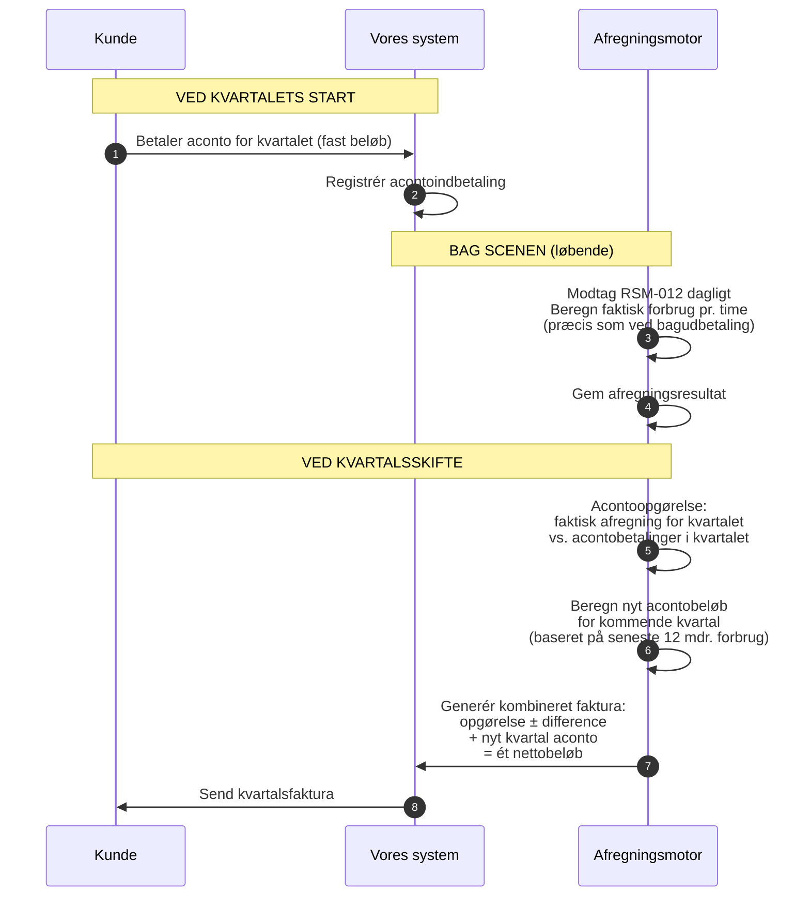

# Produktopbygning og fakturering: Privatkunde

Hvad bestemmer en privatkunde's faktura? Denne guide gennemgår alle parametre der påvirker beløbet — fra produktvalg til acontoopgørelse.

---

## Kundens produkt = en samling af prisparametre

Når en privatkunde tegner en aftale, vælger de et **produkt** (f.eks. "Verdo Spot", "Verdo Grøn", "Verdo Fast"). Produktet bestemmer de variable parametre vi selv kontrollerer. Resten er bestemt af eksterne parter.

```
┌─────────────────────────────────────────────────────────────┐
│  PRODUKTET (det vi selv bestemmer)                           │
│                                                              │
│  • Energimodel:      Spot / fast pris / blanding            │
│  • Verdo-margin:     X øre/kWh oven på spotpris             │
│  • Produkttillæg:    Ekstra øre/kWh (f.eks. grøn energi)   │
│  • Abonnement:       Fast månedligt gebyr (kr./md.)         │
│  • Faktureringsfrekvens:  Månedligt / kvartalsvist / årligt │
│  • Betalingsmodel:   Aconto / faktisk forbrug               │
│  • Bindingsperiode:  Ingen / 3 mdr. / 6 mdr. / 12 mdr.    │
│  • Betalingsfrist:   Netto 14 / 30 dage                    │
└─────────────────────────────────────────────────────────────┘

┌─────────────────────────────────────────────────────────────┐
│  EKSTERNE PARAMETRE (bestemt af andre — ens for alle)        │
│                                                              │
│  • Nordpool spotpris:       Varierer time for time          │
│  • Nettarif:                Bestemt af kundens netvirksomhed│
│  • Systemtarif:             Bestemt af Energinet            │
│  • Transmissionstarif:      Bestemt af Energinet            │
│  • Netabonnement:           Fast gebyr fra netvirksomheden  │
│  • Elafgift:                Lovbestemt (staten)             │
│  • Moms:                    25% (staten)                    │
└─────────────────────────────────────────────────────────────┘
```

Produktet styrer altså kun **en del** af fakturaen. Resten er gennemfakturering af eksterne omkostninger.

---

## Alle fakturalinjer for en privatkunde

En typisk månedsfaktura for en privatkunde på spotprodukt (bagudbetaling):

```
┌───────────────────────────────────────────────────────────────────────┐
│  FAKTURA — januar 2025                                                │
│  Kunde: Anders Hansen, GSRN 571313100000012345                       │
│  Periode: 01-01-2025 → 31-01-2025 (744 timer)                       │
├───────────────────────────────────────────────────────────────────────┤
│                                                                       │
│  ENERGI                                                               │
│  Elforsyning (spot + margin)          450 kWh × gns. 0,92 kr.  414,00│
│                                                                       │
│  TRANSPORT OG SYSTEMOMKOSTNINGER                                      │
│  Nettarif (N1/Radius/Verdo Net)       450 kWh × gns. 0,14 kr.   63,00│
│  Systemtarif (Energinet)              450 kWh × 0,054 kr.        24,30│
│  Transmissionstarif (Energinet)       450 kWh × 0,049 kr.        22,05│
│                                                                       │
│  AFGIFTER                                                             │
│  Elafgift                             450 kWh × 0,008 kr.         3,60│
│                                                                       │
│  ABONNEMENTER                                                         │
│  Netabonnement (N1/Radius/Verdo Net)                               49,00│
│  Verdo abonnement                                                  39,00│
│                                                                       │
│  ────────────────────────────────────────────────────────────         │
│  Subtotal                                                     614,95│
│  Moms (25%)                                                   153,74│
│  ────────────────────────────────────────────────────────────         │
│  AT BETALE                                                    768,69│
│                                                                       │
└───────────────────────────────────────────────────────────────────────┘
```

For acontokunder: denne beregning sker bag scenen. Kunden ser den først som del af den kombinerede kvartalsfaktura (se [aconto-sektionen](#den-kombinerede-kvartalsfaktura)).

### Linje for linje

| # | Fakturalinje | Beregning | Hvem bestemmer prisen | Variabel/fast |
|---|-------------|-----------|----------------------|---------------|
| 1 | **Elforsyning** | kWh × (spotpris + Verdo-margin) pr. time, summeret | Nordpool + os | Variabel (time for time) |
| 2 | **Nettarif** | kWh × netvirksomhedens sats pr. time | Netvirksomheden | Variabel (tidsdifferentieret) |
| 3 | **Systemtarif** | kWh × Energinets sats | Energinet | Variabel (kWh-baseret, men sats sjældent ændres) |
| 4 | **Transmissionstarif** | kWh × Energinets sats | Energinet | Variabel (kWh-baseret, men sats sjældent ændres) |
| 5 | **Elafgift** | kWh × lovbestemt sats | Staten | Variabel (kWh-baseret, sats ændres årligt) |
| 6 | **Netabonnement** | Fast kr./måned | Netvirksomheden | Fast |
| 7 | **Verdo abonnement** | Fast kr./måned | Os | Fast |
| 8 | **Moms** | 25% af linje 1-7 | Staten | Beregnet |

**Nøglepointe:** Linje 1-5 er alle `kWh × sats` — det er derfor RSM-012 (forbrugsdata) er så central. Uden kWh-data kan vi ikke beregne 5 ud af 8 linjer.

---

## Energimodeller

Det vigtigste produktvalg er **energimodellen** — hvordan spotprisen håndteres:

| Model | Hvad kunden betaler | Verdos risiko | Typisk for |
|-------|--------------------|--------------| -----------|
| **Spot** | Nordpool-timepris + fast margin (f.eks. +4 øre/kWh) | Ingen — kunden bærer prisrisiko | De fleste privatkunder |
| **Fastpris** | Aftalt fast pris pr. kWh (f.eks. 0,95 kr.) for en periode | Verdo bærer prisrisiko (hedging nødvendig) | Kunder der vil have forudsigelighed |
| **Blanding** | Del spot, del fast — eller spotpris med prisloft | Delt risiko | Nicheprodukt |

For spot-modellen beregnes energilinjen pr. time:

```
Time 14:00-15:00:  1,5 kWh × (0,85 kr. spot + 0,04 kr. margin) = 1,335 kr.
Time 15:00-16:00:  1,2 kWh × (0,72 kr. spot + 0,04 kr. margin) = 0,912 kr.
...
Summeret over 744 timer = energilinjen på fakturaen
```

For fastpris-modellen er det simplere: `total kWh × aftalt pris`.

---

## Nettariffer — hvad der afhænger af kundens adresse

Nettariffen bestemmes af **hvilken netvirksomhed** der dækker kundens adresse. Når vi modtager stamdata (RSM-007) ved aktivering, får vi et **netområde** og en **netvirksomheds-GLN** — det fortæller os hvilke tariffer der gælder.

Danmark har ~40 netvirksomheder, og de har forskellige satser:

| Parameter | Eksempel (N1) | Eksempel (Radius) |
|-----------|--------------|-------------------|
| Nettarif dag (06-21) | 0,18 kr./kWh | 0,15 kr./kWh |
| Nettarif nat (21-06) | 0,06 kr./kWh | 0,05 kr./kWh |
| Nettarif spids (17-20) | 0,54 kr./kWh | — |
| Netabonnement | 49 kr./md. | 45 kr./md. |

Nettariffer er typisk **tidsdifferentierede** — forskellige satser for dag, nat og spidslast. Nogle netvirksomheder har 2 zoner (dag/nat), andre har 3 (dag/nat/spids).

Satserne modtager vi via **Charges-køen** fra DataHub og opdateres typisk 1-2 gange om året.

---

## Betalingsmodeller: Aconto vs. bagudbetaling

En privatkunde kan typisk vælge mellem to betalingsmodeller. Valget påvirker **hvornår og hvordan** kunden betaler — men **ikke hvad** kunden betaler. Den samlede udgift over et år er den samme.

| | **Aconto** (forudbetaling) | **Bagudbetaling** (faktisk forbrug) |
|---|---|---|
| **Hvad kunden betaler** | Fast estimeret beløb pr. kvartal | Faktisk forbrug for foregående måned |
| **Faktureringsfrekvens** | Kvartalsvis (4 fakturaer/år) | Månedlig (12 fakturaer/år) |
| **Opgørelse** | Hvert kvartal: faktisk forbrug vs. aconto | Ingen opgørelse nødvendig — fakturaen ER endelig |
| **Betalingstidspunkt** | Forud (betaler for kommende periode) | Bagud (betaler for afsluttet periode) |
| **For Verdo** | Jævn, forudsigelig cash flow | Verdo lægger ud for net/afgifter inden kundens betaling |
| **For kunden** | Færre fakturaer, men periodevis opgørelse | Fuld gennemsigtighed, ingen overraskelser |
| **Betalingsgebyr** | 4 × gebyr pr. år | 12 × gebyr pr. år |

**Branchetrend:** Flere leverandører (Andel Energi, EWII) har afskaffet aconto helt og tilbyder kun bagudbetaling. Begrundelsen er at fjernaflæste målere gør månedlig afregning på faktisk forbrug mulig, og at aconto i praksis er et rentefrit lån fra kunden til leverandøren.

---

## Aconto: Detaljeret forklaring

### Hvad er aconto?

Aconto er en **forudbetalingsmodel** hvor kunden betaler et **fast estimeret beløb** forud for hver **faktureringsperiode** (typisk kvartal). Ved periodens slutning laves en **acontoopgørelse** der afstemmer det indbetalte acontobeløb mod det faktiske forbrug.

Alle fire kvartaler følger **samme cyklus** — der er ingen særlig årlig opgørelse.

### Hvorfor aconto?

Acontos primære formål er **cash flow for Verdo**:

- Vi modtager penge **forud** uanset sæsonudsving i forbrug og spotpriser
- Under engrosmodellen betaler vi netvirksomhed, Energinet og stat for kunden — aconto sikrer at vi har likviditet til dette
- Kunden opnår færre fakturaer (4 vs. 12 pr. år) og lavere betalingsgebyrer

### Engrosmodellen og aconto

Siden 1. april 2016 gælder **engrosmodellen** i Danmark. Kunden modtager **én samlet faktura** fra elleverandøren der dækker alle omkostninger: energi, nettarif, Energinet-tariffer, elafgift, abonnementer og moms.

Acontobeløbet skal derfor dække **hele omkostningsstakken** — ikke kun energiprisen. Det gør beregningen mere kompleks, fordi vi skal estimere fremtidige priser for alle komponenter.

### Beregning af acontobeløbet

**Ny kunde (ingen historik):**

```
Estimeret årsforbrug (kWh)                    ← Fra DataHub, eller standardestimat:
                                                  Lejlighed: ~2.500 kWh/år
                                                  Hus:       ~4.000 kWh/år
× forventet gennemsnitspris (alle komponenter)← Spot + margin + tariffer + afgifter
+ abonnementer (net + Verdo, 12 måneder)
+ moms (25%)
= Estimeret årsomkostning
÷ 4 kvartaler
= Kvartalsvis acontobeløb
```

**Eksisterende kunde (genberegning):**

```
Faktisk forbrug, seneste 12 måneder (kWh)    ← Fra RSM-012-data i vores DB
× forventet gennemsnitspris fremadrettet      ← Aktuelle spot-/tarifniveauer
+ abonnementer + afgifter + moms
= Nyt estimeret årsbeløb
÷ 4 kvartaler
= Nyt kvartalsvis acontobeløb
```

**Genberegning sker:**
- Automatisk ved hver kvartalsopgørelse
- Hvis kunden anmoder om det (f.eks. efter køb af elbil, varmepumpe, ny beboer)
- Hvis forbrugsmønstret afviger væsentligt fra estimatet

**Udfordring ved variable priser:** For spotprodukter skal vi estimere **både** fremtidigt forbrug **og** fremtidige spotpriser. Det gør aconto-estimatet iboende usikkert.

### Den kombinerede kvartalsfaktura

Hver kvartalsfaktura er et **samlet dokument** med to hoveddele:

```
┌───────────────────────────────────────────────────────────────────────┐
│  KVARTALSFAKTURA — maj 2025                                           │
│  Periode: Q1 opgørelse + Q2 aconto                                    │
│                                                                       │
│  ═══════════════════════════════════════════════════════════════       │
│  DEL 1: OPGØRELSE FOR Q1 (januar-marts)                               │
│  ═══════════════════════════════════════════════════════════════       │
│                                                                       │
│  Faktisk forbrug i Q1:                                                │
│    Energi (spot + margin, beregnet pr. time)         1.350,00 kr.    │
│    Nettarif (tidsdifferentieret)                        189,00 kr.    │
│    Systemtarif (Energinet)                               72,90 kr.    │
│    Transmissionstarif (Energinet)                        66,15 kr.    │
│    Elafgift                                              10,80 kr.    │
│    Netabonnement (3 × 49 kr.)                           147,00 kr.    │
│    Verdo abonnement (3 × 39 kr.)                        117,00 kr.    │
│    Moms (25%)                                           488,21 kr.    │
│    ───────────────────────────────────────────────                    │
│    Total faktisk omkostning Q1:                       2.441,06 kr.    │
│                                                                       │
│    Aconto indbetalt for Q1:                        − 1.950,00 kr.    │
│    ───────────────────────────────────────────────                    │
│    DIFFERENCE Q1:                                   +   491,06 kr.    │
│    (Du har betalt 491,06 kr. for lidt i Q1)                           │
│                                                                       │
│  ═══════════════════════════════════════════════════════════════       │
│  DEL 2: ACONTO FOR Q2 (april-juni)                                    │
│  ═══════════════════════════════════════════════════════════════       │
│                                                                       │
│    Forventet årsforbrug: 4.200 kWh                                    │
│    Q2-andel (20%): 840 kWh                                            │
│    Estimeret Q2-omkostning inkl. moms:                1.520,00 kr.    │
│                                                                       │
│    Aconto Q2:                                         1.520,00 kr.    │
│                                                                       │
│  ═══════════════════════════════════════════════════════════════       │
│  SAMLET BELØB                                                         │
│  ═══════════════════════════════════════════════════════════════       │
│                                                                       │
│    Q1 underbetaling:                                +   491,06 kr.    │
│    Q2 aconto:                                       + 1.520,00 kr.    │
│    ───────────────────────────────────────────────                    │
│    TOTAL AT BETALE:                                   2.011,06 kr.    │
│                                                                       │
│    Betalingsfrist: 10. maj 2025                                       │
│                                                                       │
└───────────────────────────────────────────────────────────────────────┘
```

**Nøglepointe:** Over-/underbetaling fra opgørelsen udlignes **på den samlede faktura** — der sendes ikke en separat kreditnota eller debitnota. Kunden betaler ét nettobeløb.

### De fire identiske kvartaler

Alle fire kvartaler følger nøjagtig samme cyklus:

```
              Q1                  Q2                  Q3                  Q4
          (jan-mar)           (apr-jun)           (jul-sep)           (okt-dec)
              │                   │                   │                   │
              ▼                   ▼                   ▼                   ▼
        ┌────────────┐     ┌────────────┐     ┌────────────┐     ┌────────────┐
        │ Faktura:   │     │ Faktura:   │     │ Faktura:   │     │ Faktura:   │
        │ Q4 opgør.  │     │ Q1 opgør.  │     │ Q2 opgør.  │     │ Q3 opgør.  │
        │ + Q1 aconto│     │ + Q2 aconto│     │ + Q3 aconto│     │ + Q4 aconto│
        │ = netbeløb │     │ = netbeløb │     │ = netbeløb │     │ = netbeløb │
        └────────────┘     └────────────┘     └────────────┘     └────────────┘
```

Ingen kvartalsfaktura er "speciel" — hver indeholder opgørelse af forrige kvartal + aconto for kommende kvartal.

### Aconto-flowet i systemet



### Slutafregning ved offboarding

Når en kunde forlader os (skifte, fraflytning, opsigelse), laves en **slutafregning** for den delvise periode:

1. Afregn faktisk forbrug fra kvartalets start til slutdato
2. Beregn difference mod indbetalte acontobeløb for perioden
3. Udsted **slutfaktura** — dette er det eneste tidspunkt hvor en separat kredit- eller debitnota udstedes
4. Frist: **4 uger** efter kundens afgang (jf. elleveringsbekendtgørelsen, pr. 17. januar 2025)
5. Hvis kunden har betalt for meget: tilbagebetaling til kundens bankkonto

### Vigtigt for systemdesign

Selv om kunden betaler aconto, kører afregningsberegningen **præcis som normalt** bag scenen. Vi beregner stadig `kWh × pris` pr. time for hver måned — vi sender bare ikke en individuel faktura for det.

Det betyder:
- **Afregningsmotor** kører altid, uanset betalingsmodel — aconto ændrer intet ved beregningen
- **Acontobeløbet** er en ren betalings-/cash flow-parameter, ikke en afregningsparameter
- **Acontoopgørelsen** er en differenceberegning: `faktisk total for perioden − acontobetalinger i perioden`
- **Den kombinerede faktura** er et præsentationsspørgsmål — to uafhængige beregninger (opgørelse + nyt aconto) samles i ét dokument
- **Opgørelsesfrekvens** følger faktureringsfrekvensen (typisk kvartalsvis)
- Ved **offboarding** laves slutafregning for den delvise periode inden for 4 uger
- **Over-/underbetaling** nettes på den kombinerede faktura — separate kreditnotaer kun ved slutafregning

### Lovmæssige krav

| Krav | Kilde |
|------|-------|
| Minimum én faktura baseret på faktisk forbrug pr. år | Elleveringsbekendtgørelsen §8 |
| Månedlig adgang til forbrugsoplysninger (kan være via portal) | Elleveringsbekendtgørelsen §9 |
| Slutafregning inden 4 uger ved leverandørskifte/fraflytning | Elleveringsbekendtgørelsen §17 |
| Kontrakten skal specificere afregningsformen (aconto/bagud) | Elleveringsbekendtgørelsen |
| Aconto er **ikke lovpligtigt** — leverandøren vælger frit | Elforsyningsloven |

---

## Opsummering: Alle parametre der påvirker fakturaen

| Parameter | Kilde | Ændringsfrekvens | Påvirker |
|-----------|-------|-----------------|----------|
| Kundens forbrug (kWh/time) | RSM-012 fra DataHub | Dagligt | Alt kWh-baseret |
| Nordpool spotpris | Ekstern markedsdata | Time for time | Energilinje |
| Verdo-margin | Produktplan/kontrakt | Ved kontraktændring | Energilinje |
| Produkttillæg | Produktplan | Ved produktskift | Energilinje |
| Nettarif | Charges-kø (netvirksomhed) | 1-2x årligt | Nettariflinje |
| Systemtarif | Charges-kø (Energinet) | 1-2x årligt | Systemtariflinje |
| Transmissionstarif | Charges-kø (Energinet) | 1-2x årligt | Transmissionslinje |
| Elafgift | Lovgivning | Årligt (1. jan) | Afgiftslinje |
| Netabonnement | Charges-kø (netvirksomhed) | 1-2x årligt | Abonnementslinje |
| Verdo abonnement | Produktplan | Ved kontraktændring | Abonnementslinje |
| Moms | Lovgivning | Sjældent | Momslinje |
| Netområde | RSM-007 (ved aktivering) | Ved flytning | Bestemmer hvilke tariffer |
| Faktureringsfrekvens | Kontrakt | Ved kontraktændring | Periodeinddeling |
| Betalingsmodel (aconto/faktisk) | Kontrakt | Ved kontraktændring | Betalingsflow |
| Acontobeløb | Beregnet af os | Ved acontoopgørelse (kan justeres) | Kvartalsvis betaling |
| Betalingsfrist | Kontrakt | Ved kontraktændring | Betalingsopfølgning |

---

## Videre læsning

| Dokument | Hvad det dækker |
|----------|-----------------|
| [Afregningsoverblik](datahub3-settlement-overview.md) | Systemflow: DataHub → afregning → faktura |
| [Kundelivscyklus](datahub3-customer-lifecycle.md) | Detaljeret gennemgang af alle 6 faser |
| [Systemarkitektur](datahub3-proposed-architecture.md) | Teknologivalg og datamodel |
