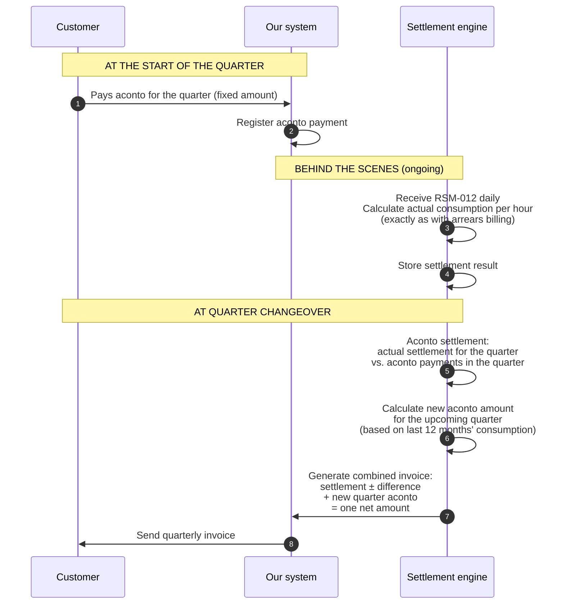

# Product Structure and Billing: Residential Customer

What determines a residential customer's invoice? This guide walks through all the parameters that affect the amount — from product selection to aconto settlement (acontoopgørelse).

---

## The customer's product = a collection of price parameters

When a residential customer signs an agreement, they choose a **product** (e.g. "Spot", "Green", "Fixed Price"). The product determines the variable parameters we control ourselves. The rest is determined by external parties.

```
┌─────────────────────────────────────────────────────────────┐
│  THE PRODUCT (what we control)                               │
│                                                              │
│  • Energy model:       Spot / fixed price / blend            │
│  • Supplier margin:    X øre/kWh on top of spot price        │
│  • Product surcharge:  Extra øre/kWh (e.g. green energy)     │
│  • Subscription:       Fixed monthly fee (DKK/month)         │
│  • Billing frequency:  Monthly / quarterly                   │
│  • Payment model:      Aconto / actual consumption           │
│  • Commitment period:  None / 3 mo. / 6 mo. / 12 mo.        │
│  • Payment terms:      Net 14 / 30 days                      │
└─────────────────────────────────────────────────────────────┘

┌─────────────────────────────────────────────────────────────┐
│  EXTERNAL PARAMETERS (set by others — same for everyone)     │
│                                                              │
│  • Nord Pool spot price:      Varies hour by hour            │
│  • Grid tariff (nettarif):    Set by customer's grid company │
│  • System tariff (systemtarif):  Set by Energinet            │
│  • Transmission tariff (transmissionstarif): Set by Energinet│
│  • Grid subscription (netabonnement): Fixed fee from grid co.│
│  • Electricity tax (elafgift):   Statutory (the state)       │
│  • VAT (moms):                   25% (the state)             │
└─────────────────────────────────────────────────────────────┘
```

The product therefore controls only **a portion** of the invoice. The rest is pass-through billing of external costs.

---

## All invoice lines for a residential customer

A typical monthly invoice for a residential customer on a spot product (arrears billing):

```
┌───────────────────────────────────────────────────────────────────────┐
│  INVOICE — January 2025                                                │
│  Customer: Anders Hansen, GSRN 571313100000012345                     │
│  Period: 01-01-2025 → 31-01-2025 (744 hours)                         │
├───────────────────────────────────────────────────────────────────────┤
│                                                                       │
│  ENERGY                                                               │
│  Electricity supply (spot + margin)  450 kWh × avg. 0.92 DKK  414.00│
│                                                                       │
│  TRANSPORT AND SYSTEM COSTS                                           │
│  Grid tariff (nettarif, grid co.)     450 kWh × avg. 0.14 DKK   63.00│
│  System tariff (Energinet)           450 kWh × 0.054 DKK        24.30│
│  Transmission tariff (Energinet)     450 kWh × 0.049 DKK        22.05│
│                                                                       │
│  TAXES AND DUTIES                                                     │
│  Electricity tax (elafgift)          450 kWh × 0.008 DKK         3.60│
│                                                                       │
│  SUBSCRIPTIONS                                                        │
│  Grid subscription (netabonnement)                                49.00│
│  Supplier subscription                                            39.00│
│                                                                       │
│  ────────────────────────────────────────────────────────────         │
│  Subtotal                                                     614.95│
│  VAT (25%)                                                    153.74│
│  ────────────────────────────────────────────────────────────         │
│  AMOUNT DUE                                                   768.69│
│                                                                       │
└───────────────────────────────────────────────────────────────────────┘
```

For aconto customers: this calculation happens behind the scenes. The customer only sees it as part of the combined quarterly invoice (see the [aconto section](#the-combined-quarterly-invoice)).

### Line by line

| # | Invoice line | Calculation | Who sets the price | Variable/fixed |
|---|-------------|-----------|----------------------|---------------|
| 1 | **Electricity supply** | kWh × (spot price + supplier margin) per hour, summed | Nord Pool + us | Variable (hour by hour) |
| 2 | **Grid tariff (nettarif)** | kWh × grid company's rate per hour | Grid company (netvirksomhed) | Variable (time-differentiated) |
| 3 | **System tariff (systemtarif)** | kWh × Energinet's rate | Energinet | Variable (kWh-based, but rate rarely changes) |
| 4 | **Transmission tariff (transmissionstarif)** | kWh × Energinet's rate | Energinet | Variable (kWh-based, but rate rarely changes) |
| 5 | **Electricity tax (elafgift)** | kWh × statutory rate | The state | Variable (kWh-based, rate changes annually) |
| 6 | **Grid subscription (netabonnement)** | Fixed DKK/month | Grid company | Fixed |
| 7 | **Supplier subscription** | Fixed DKK/month | Us | Fixed |
| 8 | **VAT (moms)** | 25% of lines 1-7 | The state | Calculated |

**Key point:** Lines 1-5 are all `kWh × rate` — that is why RSM-012 (consumption data) is so central. Without kWh data, we cannot calculate 5 out of 8 lines.

---

## Energy models

The most important product choice is the **energy model** — how the spot price is handled:

| Model | What the customer pays | Supplier's risk | Typical for |
|-------|--------------------|--------------| -----------|
| **Spot** | Nord Pool hourly price + fixed margin (e.g. +4 øre/kWh) | None — the customer bears the price risk | Most residential customers |
| **Fixed price** | Agreed fixed price per kWh (e.g. 0.95 DKK) for a period | Supplier bears the price risk (hedging required) | Customers who want predictability |
| **Blend** | Part spot, part fixed — or spot price with a price cap | Shared risk | Niche product |

For the spot model, the energy line is calculated per hour:

```
Hour 14:00-15:00:  1.5 kWh × (0.85 DKK spot + 0.04 DKK margin) = 1.335 DKK
Hour 15:00-16:00:  1.2 kWh × (0.72 DKK spot + 0.04 DKK margin) = 0.912 DKK
...
Summed over 744 hours = the energy line on the invoice
```

For the fixed price model, it is simpler: `total kWh × agreed price`.

---

## Grid tariffs (nettariffer) — what depends on the customer's address

The grid tariff (nettarif) is determined by **which grid company (netvirksomhed)** covers the customer's address. When we receive master data (RSM-007) at activation, we get a **grid area** and a **grid company GLN** — this tells us which tariffs apply.

Denmark has ~40 grid companies, and they have different rates:

| Parameter | Example (N1) | Example (Radius) |
|-----------|--------------|-------------------|
| Grid tariff day (06-21) | 0.18 DKK/kWh | 0.15 DKK/kWh |
| Grid tariff night (21-06) | 0.06 DKK/kWh | 0.05 DKK/kWh |
| Grid tariff peak (17-20) | 0.54 DKK/kWh | — |
| Grid subscription (netabonnement) | 49 DKK/mo. | 45 DKK/mo. |

Grid tariffs are typically **time-differentiated** — different rates for day, night, and peak load. Some grid companies have 2 zones (day/night), others have 3 (day/night/peak).

We receive the rates via the **Charges queue** from DataHub, and they are typically updated 1-2 times per year.

---

## Payment models: Aconto vs. arrears billing (bagudbetaling)

A residential customer can typically choose between two payment models. The choice affects **when and how** the customer pays — but **not what** the customer pays. The total cost over a year is the same.

| | **Aconto** (prepayment) | **Arrears billing (bagudbetaling)** (actual consumption) |
|---|---|---|
| **What the customer pays** | Fixed estimated amount per quarter | Actual consumption for the preceding month |
| **Billing frequency** | Quarterly (4 invoices/year) | Monthly (12 invoices/year) |
| **Settlement** | Every quarter: actual consumption vs. aconto | No settlement needed — the invoice IS final |
| **Payment timing** | In advance (pays for upcoming period) | In arrears (pays for completed period) |
| **For the supplier** | Steady, predictable cash flow | Supplier advances grid/tax costs before customer payment |
| **For the customer** | Fewer invoices, but periodic settlement | Full transparency, no surprises |
| **Payment fee** | 4 × fee per year | 12 × fee per year |

**Industry trend:** More suppliers (Andel Energi, EWII) have abolished aconto entirely and only offer arrears billing. The rationale is that remotely read meters make monthly settlement on actual consumption possible, and that aconto in practice is an interest-free loan from the customer to the supplier.

---

## Aconto: Detailed explanation

### What is aconto?

Aconto is a **prepayment model** where the customer pays a **fixed estimated amount** in advance for each **billing period (faktureringsperiode)** (typically a quarter). At the end of the period, an **aconto settlement (acontoopgørelse)** is performed that reconciles the paid aconto amount against actual consumption.

All four quarters follow the **same cycle** — there is no special annual settlement.

### Why aconto?

Aconto's primary purpose is **cash flow for the supplier**:

- We receive money **in advance** regardless of seasonal fluctuations in consumption and spot prices
- Under the wholesale model (engrosmodellen), we pay the grid company, Energinet, and the state on behalf of the customer — aconto ensures we have liquidity for this
- The customer benefits from fewer invoices (4 vs. 12 per year) and lower payment fees

### The wholesale model (engrosmodellen) and aconto

Since 1 April 2016, the **wholesale model (engrosmodellen)** applies in Denmark. The customer receives **one consolidated invoice** from the electricity supplier covering all costs: energy, grid tariff (nettarif), Energinet tariffs, electricity tax (elafgift), subscriptions, and VAT.

The aconto amount must therefore cover the **entire cost stack** — not just the energy price. This makes the calculation more complex, because we must estimate future prices for all components.

### Calculating the aconto amount

**New customer (no history):**

```
Estimated annual consumption (kWh)              ← From DataHub, or standard estimate:
                                                    Apartment: ~2,500 kWh/year
                                                    House:     ~4,000 kWh/year
× expected average price (all components)        ← Spot + margin + tariffs + taxes
+ subscriptions (grid + supplier, 12 months)
+ VAT (25%)
= Estimated annual cost
÷ 4 quarters
= Quarterly aconto amount
```

**Existing customer (recalculation):**

```
Actual consumption, last 12 months (kWh)        ← From RSM-012 data in our DB
× expected average price going forward           ← Current spot/tariff levels
+ subscriptions + taxes + VAT
= New estimated annual amount
÷ 4 quarters
= New quarterly aconto amount
```

**Recalculation occurs:**
- Automatically at each quarterly settlement
- If the customer requests it (e.g. after purchasing an EV, heat pump, new household member)
- If the consumption pattern deviates significantly from the estimate

**Challenge with variable prices:** For spot products, we must estimate **both** future consumption **and** future spot prices. This makes the aconto estimate inherently uncertain.

### The combined quarterly invoice

Each quarterly invoice is a **single document** with two main parts:

```
┌───────────────────────────────────────────────────────────────────────┐
│  QUARTERLY INVOICE — May 2025                                          │
│  Period: Q1 settlement + Q2 aconto                                     │
│                                                                       │
│  ═══════════════════════════════════════════════════════════════       │
│  PART 1: SETTLEMENT FOR Q1 (January-March)                             │
│  ═══════════════════════════════════════════════════════════════       │
│                                                                       │
│  Actual consumption in Q1:                                             │
│    Energy (spot + margin, calculated per hour)          1,350.00 DKK  │
│    Grid tariff (nettarif, time-differentiated)            189.00 DKK  │
│    System tariff (Energinet)                               72.90 DKK  │
│    Transmission tariff (Energinet)                          66.15 DKK  │
│    Electricity tax (elafgift)                               10.80 DKK  │
│    Grid subscription (netabonnement, 3 × 49 DKK)          147.00 DKK  │
│    Supplier subscription (3 × 39 DKK)                      117.00 DKK  │
│    VAT (25%)                                               488.21 DKK  │
│    ───────────────────────────────────────────────                    │
│    Total actual cost Q1:                                2,441.06 DKK  │
│                                                                       │
│    Aconto paid for Q1:                               − 1,950.00 DKK  │
│    ───────────────────────────────────────────────                    │
│    DIFFERENCE Q1:                                   +    491.06 DKK  │
│    (You paid 491.06 DKK too little in Q1)                              │
│                                                                       │
│  ═══════════════════════════════════════════════════════════════       │
│  PART 2: ACONTO FOR Q2 (April-June)                                    │
│  ═══════════════════════════════════════════════════════════════       │
│                                                                       │
│    Expected annual consumption: 4,200 kWh                              │
│    Q2 share (÷4): 1,050 kWh                                           │
│    Estimated Q2 cost incl. VAT:                          1,900.00 DKK  │
│                                                                       │
│    Aconto Q2:                                            1,900.00 DKK  │
│                                                                       │
│  ═══════════════════════════════════════════════════════════════       │
│  TOTAL AMOUNT                                                          │
│  ═══════════════════════════════════════════════════════════════       │
│                                                                       │
│    Q1 underpayment:                                 +    491.06 DKK  │
│    Q2 aconto:                                       + 1,900.00 DKK  │
│    ───────────────────────────────────────────────                    │
│    TOTAL AMOUNT DUE:                                  2,391.06 DKK  │
│                                                                       │
│    Payment due: 10 May 2025                                            │
│                                                                       │
└───────────────────────────────────────────────────────────────────────┘
```

**Key point:** Over-/underpayment from the settlement is netted **on the combined invoice** — no separate credit note or debit note is sent. The customer pays one net amount.

### The four identical quarters

All four quarters follow exactly the same cycle:

```
              Q1                  Q2                  Q3                  Q4
          (Jan-Mar)           (Apr-Jun)           (Jul-Sep)           (Oct-Dec)
              │                   │                   │                   │
              ▼                   ▼                   ▼                   ▼
        ┌────────────┐     ┌────────────┐     ┌────────────┐     ┌────────────┐
        │ Invoice:   │     │ Invoice:   │     │ Invoice:   │     │ Invoice:   │
        │ Q4 settl.  │     │ Q1 settl.  │     │ Q2 settl.  │     │ Q3 settl.  │
        │ + Q1 aconto│     │ + Q2 aconto│     │ + Q3 aconto│     │ + Q4 aconto│
        │ = net amt.  │     │ = net amt.  │     │ = net amt.  │     │ = net amt.  │
        └────────────┘     └────────────┘     └────────────┘     └────────────┘
```

No quarterly invoice is "special" — each contains settlement of the previous quarter + aconto for the upcoming quarter.

### The aconto flow in the system



### Final settlement at offboarding

When a customer leaves us (supplier switch or move-out), a **final settlement (slutafregning)** is performed for the partial period:

1. Settle actual consumption from the quarter's start to the end date
2. Calculate the difference against aconto amounts paid for the period
3. Issue a **final invoice** — this is the only time a separate credit or debit note is issued
4. Deadline: **4 weeks** after the customer's departure (per the Electricity Supply Order (elleveringsbekendtgørelsen), as of 17 January 2025)
5. If the customer has overpaid: refund to the customer's bank account

### Important for system design

Even though the customer pays aconto, the settlement calculation runs **exactly as normal** behind the scenes. We still calculate `kWh × price` per hour for each month — we simply do not send an individual invoice for it.

This means:
- **Settlement engine** always runs, regardless of payment model — aconto changes nothing about the calculation
- **The aconto amount** is purely a payment/cash flow parameter, not a settlement parameter
- **The aconto settlement (acontoopgørelse)** is a difference calculation: `actual total for the period − aconto payments in the period`
- **The combined invoice** is a presentation concern — two independent calculations (settlement + new aconto) are combined into one document
- **Settlement frequency** follows the billing frequency (faktureringsfrekvens) (typically quarterly)
- At **offboarding**, a final settlement is performed for the partial period within 4 weeks
- **Over-/underpayment** is netted on the combined invoice — separate credit notes only at final settlement

### Legal requirements

| Requirement | Source |
|------|-------|
| Minimum one invoice based on actual consumption per year | Electricity Supply Order (elleveringsbekendtgørelsen) §8 |
| Monthly access to consumption data (can be via portal) | Electricity Supply Order (elleveringsbekendtgørelsen) §9 |
| Final settlement within 4 weeks upon supplier switch/move-out | Electricity Supply Order (elleveringsbekendtgørelsen) §17 |
| The contract must specify the settlement form (aconto/arrears) | Electricity Supply Order (elleveringsbekendtgørelsen) |
| Aconto is **not mandatory** — the supplier chooses freely | Electricity Supply Act (elforsyningsloven) |

---

## Summary: All parameters that affect the invoice

| Parameter | Source | Change frequency | Affects |
|-----------|-------|-----------------|----------|
| Customer's consumption (kWh/hour) | RSM-012 from DataHub | Daily | Everything kWh-based |
| Nord Pool spot price | External market data | Hour by hour | Energy line |
| Supplier margin | Product plan/contract | At contract change | Energy line |
| Product surcharge | Product plan | At product switch | Energy line |
| Grid tariff (nettarif) | Charges queue (grid company) | 1-2x yearly | Grid tariff line |
| System tariff (systemtarif) | Charges queue (Energinet) | 1-2x yearly | System tariff line |
| Transmission tariff (transmissionstarif) | Charges queue (Energinet) | 1-2x yearly | Transmission line |
| Electricity tax (elafgift) | Legislation | Annually (1 Jan) | Tax line |
| Grid subscription (netabonnement) | Charges queue (grid company) | 1-2x yearly | Subscription line |
| Supplier subscription | Product plan | At contract change | Subscription line |
| VAT (moms) | Legislation | Rarely | VAT line |
| Grid area (netområde) | RSM-007 (at activation) | At relocation | Determines which tariffs apply |
| Billing frequency (faktureringsfrekvens) | Contract | At contract change | Period segmentation |
| Payment model (aconto/actual) | Contract | At contract change | Payment flow |
| Aconto amount | Calculated by us | At aconto settlement (adjustable) | Quarterly payment |
| Payment terms | Contract | At contract change | Payment follow-up |

---

## Further reading

| Document | What it covers |
|----------|-----------------|
| [Settlement overview](datahub3-settlement-overview.md) | System flow: DataHub → settlement → invoice |
| [Customer lifecycle](datahub3-customer-lifecycle.md) | Detailed walkthrough of all 6 phases |
| [System architecture](datahub3-proposed-architecture.md) | Technology choices and data model |
| [CIS platform and external systems](datahub3-cis-and-external-systems.md) | ERP, portal, payment, and market data integrations |
