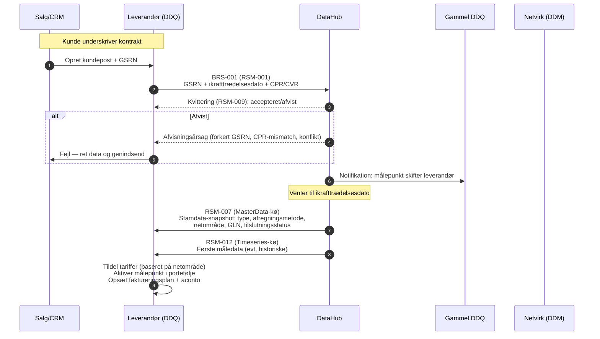
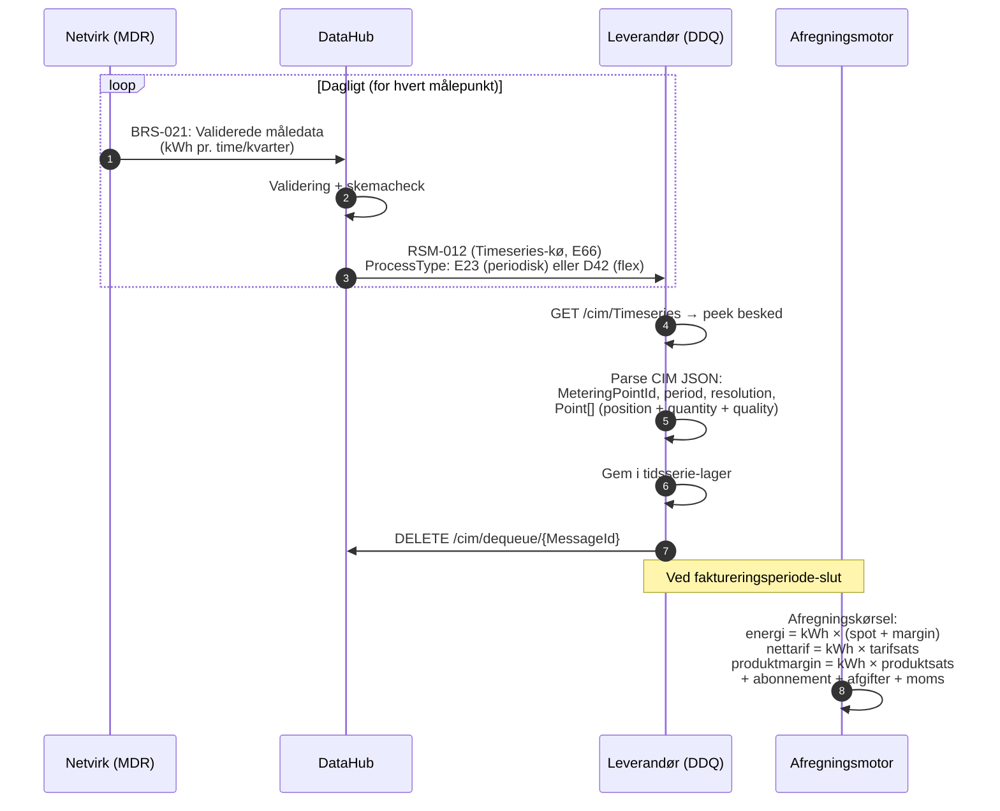
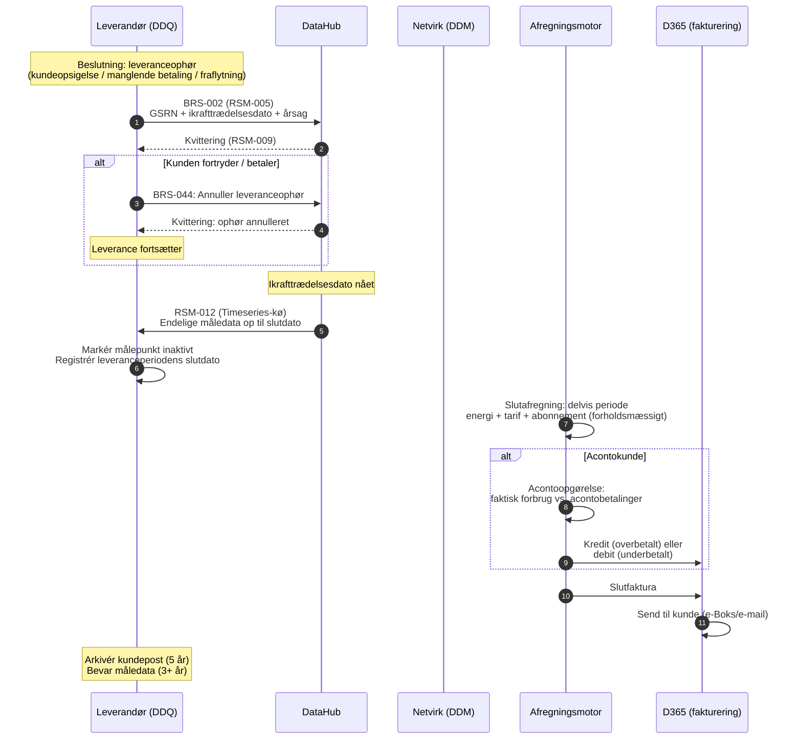
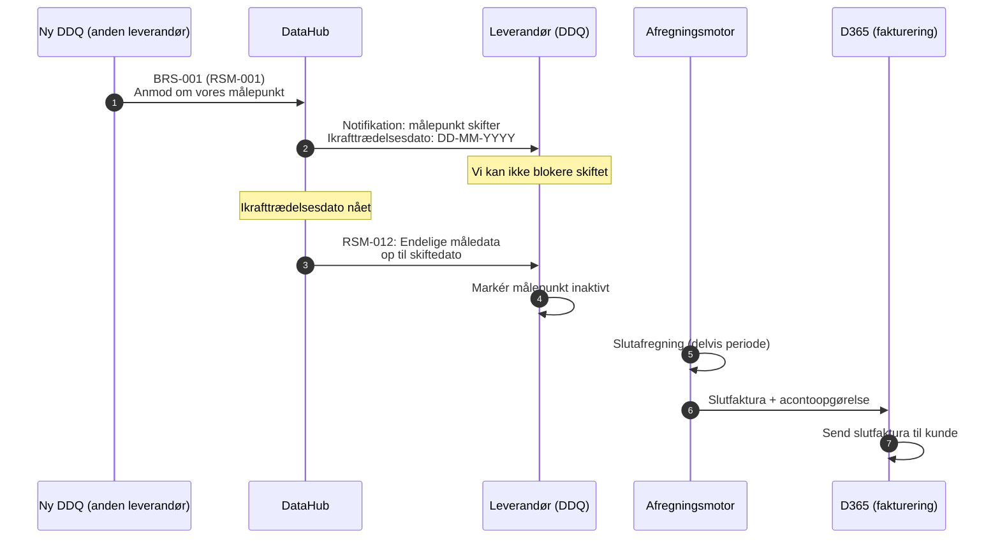
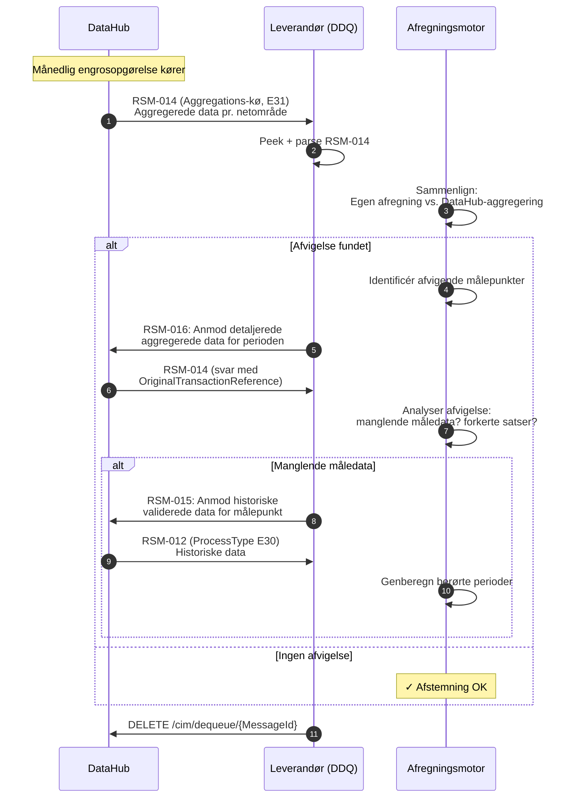
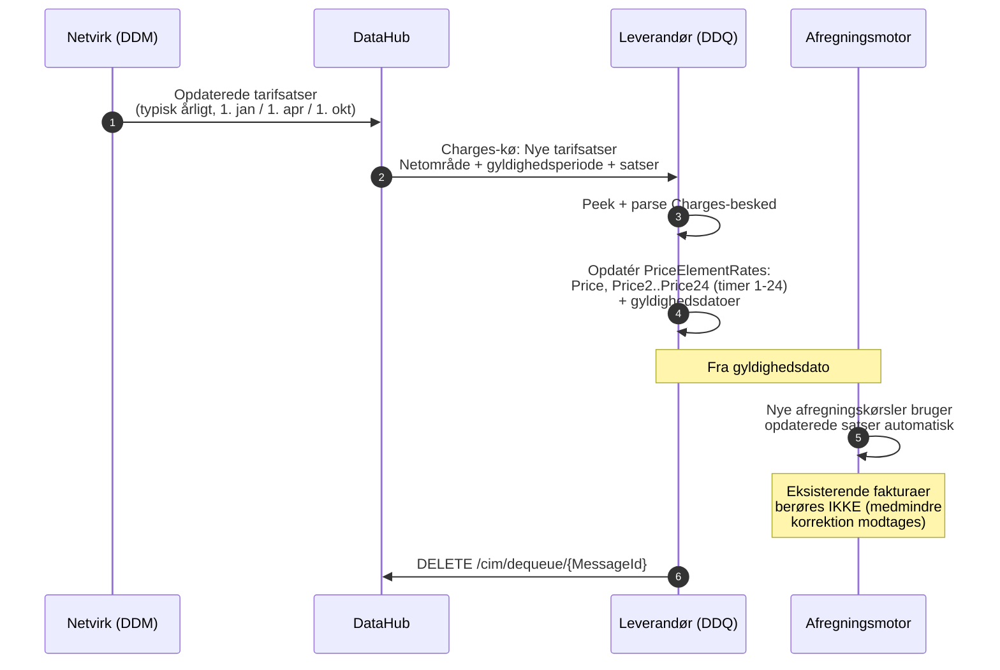
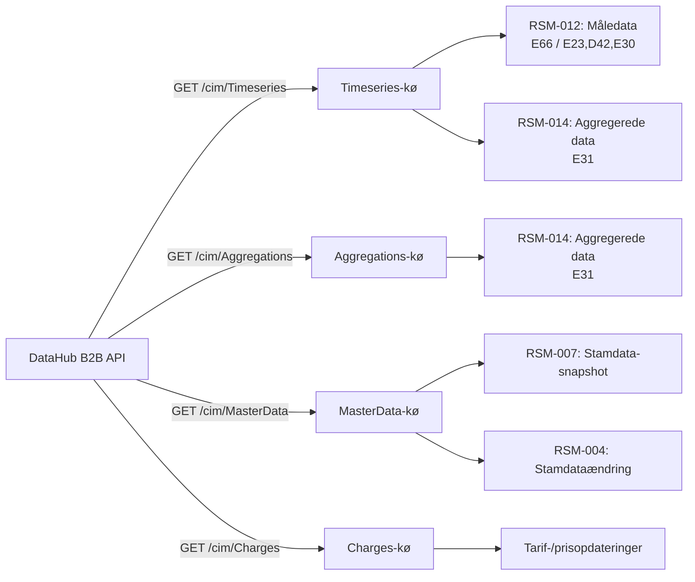

# DataHub 3: Sekvensdiagrammer for meddelelsesflows

Diagrammerne viser kommunikationen mellem aktører i de vigtigste forretningsprocesser. Bruges som supplement til [Kundelivscyklus](datahub3-customer-lifecycle.md).

**Aktører:**
- **Leverandør (DDQ)** — elleverandør
- **DataHub** — Energinets centrale datahub
- **Netvirk (DDM/MDR)** — netvirksomhed / måledataansvarlig
- **Gammel DDQ** — den fratrædende leverandør (ved skifte)
- **Ny DDQ** — den tiltrædende leverandør (ved indgående skifte)
- **Settl** — internt afregningssystem
- **D365** — Dynamics 365 (fakturering/ERP)

---

## 1. BRS-001: Leverandørskifte (vi overtager kunde)

Det mest almindelige onboarding-flow. Kunden har valgt os som ny leverandør.

**Tidsfrister:** Min. 15 hverdage varsel (BRS-001) eller 1 hverdag (BRS-043 kort varsel).

**Annullering:** Kunden fortryder → send BRS-003 inden ikrafttrædelsesdato.

---

## 2. RSM-012: Dagligt måledataflow (drift)

Det daglige heartbeat — netvirksomheden aflæser målere, DataHub validerer og videresender.

**Vigtige felter i RSM-012:**
- `Series/MarketEvaluationPoint/mRID` = GSRN (18 cifre)
- `Series/Period/resolution` = PT15M, PT1H eller P1M
- `Series/Period/Point/quantity` = kWh (max 3 decimaler)
- `Series/Period/Point/quality` = A01/A02/A03/A06

---

## 3. BRS-002: Leveranceophør (vi opsiger)

Kunden opsiger eller fraflytter. Vi initierer ophøret.

**Offboarding-scenarier:**
- **Scenarie A:** Anden leverandør sender BRS-001 for vores målepunkt → vi modtager, ikke initierer
- **Scenarie B/D:** Vi sender BRS-002 (opsigelse / manglende betaling)
- **Scenarie C:** Fraflytning → BRS-010

---

## 4. BRS-001 indgående: Leverandørskifte (vi mister kunde)

En anden leverandør overtager vores kunde. Vi er den passive part.

---

## 5. Engrosopgørelse og afstemning (BRS-027)

Månedlig afstemning af vores egne afregningsberegninger mod DataHubs engrosopgørelse.

**Aggregeringstyper (⚠ VERIFICÉR koder):**
- D03 = Foreløbig aggregering
- D04 = Korrigeret aggregering
- D05 = Endelig aggregering

---

## 6. Tarifopdatering (Charges-kø)

Netvirksomheden ændrer tarifsatser — påvirker fremtidige afregningsberegninger.

---

## 7. Overblik: Kø-routing

Oversigt over hvilke meddelelser der ankommer i hvilke køer:

---

## Kilder

- [Kundelivscyklus: Onboarding til offboarding](datahub3-customer-lifecycle.md)
- [DataHub 3 DDQ Forretningsproces-reference](datahub3-ddq-business-processes.md)
- [RSM-012 Måledata-reference](rsm-012-datahub3-measure-data.md)
- [Foreslået systemarkitektur](datahub3-proposed-architecture.md)
- [Autentificering og sikkerhed](datahub3-authentication-security.md)
- CIM Webservice Interface (Dok. 22/03077-1)
- CIM EDI Guide (Dok. 15/00718-191)
