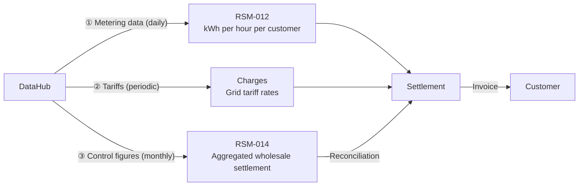
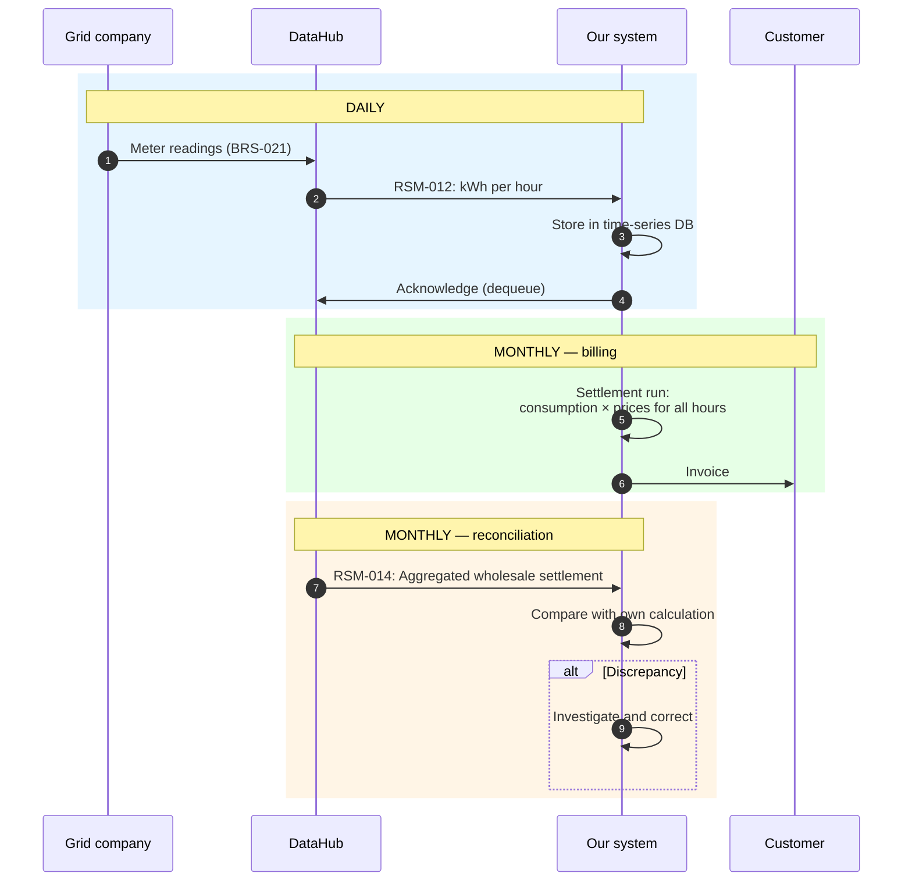

# Settlement and DataHub: Developer Overview

## What is this project about?

We are an electricity supplier (DDQ, "elleverandør"). We are building an open source system that:

1. **Receives data** from Energinet's central data hub (DataHub 3)
2. **Calculates invoices** based on consumption, market prices, and tariffs
3. **Reconciles** our calculations against DataHub's control figures

Everything happens via a REST API with JSON queues, secured with OAuth2.

---

## The Actors

```
┌──────────────┐     ┌──────────────┐     ┌──────────────┐     ┌──────────┐
│ Grid company │     │   DataHub    │     │  Supplier    │     │ Customer │
│ (reads meter)│────→│ (central hub)│────→│ (us/system)  │────→│          │
└──────────────┘     └──────────────┘     └──────────────┘     └──────────┘
  Reads meters        Validates and        Calculates and       Receives
  Provides tariffs    forwards             invoices             invoice
```

- **The grid company (netvirksomheden)** owns the power grid and reads the meters. We do not control them.
- **DataHub** is Energinet's central platform. All market communication goes through it.
- **The supplier (us, leverandøren)** receives data and invoices the customer.
- We **never communicate directly** with the grid company — DataHub is always the intermediary.

---

## The Three Data Streams We Build the System Around



| # | What | Frequency | Content |
|---|------|-----------|---------|
| ① | **Metering data** (RSM-012) | Daily | kWh per hour for each metering point |
| ② | **Tariffs** (Charges queue) | Typically annually | Grid company prices for electricity transport |
| ③ | **Control figures** (RSM-014) | Monthly | DataHub's own settlement — we reconcile against this |

In addition, we fetch **Nordpool spot prices** (hourly electricity price from the power exchange) from an external market data feed.

---

## What Settlement Actually Is

Settlement (afregning) = calculate what the customer owes for their electricity in a period.

The calculation happens **per hour** for the entire billing period (~720 hours/month):

```
kWh (from DataHub) × price (from various sources) = amount
```

An invoice consists of these layers — each with its own price source:

```
┌─────────────────────────────────────────────────────────────────────┐
│  Energy          kWh × (spot price + our margin)                    │
│                  Source: Nordpool + contract terms                   │
├─────────────────────────────────────────────────────────────────────┤
│  Grid tariff     kWh × grid company rate (time-differentiated)      │
│  (nettarif)                                                         │
│  System tariff   kWh × Energinet system tariff (systemtarif)        │
│  Transmission    kWh × Energinet transmission tariff                │
│  tariff          Source: Charges queue (DataHub)                     │
├─────────────────────────────────────────────────────────────────────┤
│  Electricity tax kWh × statutory rate (state)                       │
│  (elafgift)      Source: Legislation (typically updated annually)    │
├─────────────────────────────────────────────────────────────────────┤
│  Subscriptions   fixed monthly fees (grid + our own)                │
│                  Source: Charges queue + contract terms              │
├─────────────────────────────────────────────────────────────────────┤
│  VAT (moms)      25% of all the above                               │
│                  Source: The state                                   │
└─────────────────────────────────────────────────────────────────────┘
```

### Who Sets the Prices?

| Price source | What they determine | How we obtain it |
|-----------|-------------------|--------------------|
| **Nordpool** (power exchange) | Spot price per hour | External market data feed |
| **Grid company** (DDM) | Grid tariff (transport in local grid) + grid subscription | Charges queue via DataHub |
| **Energinet** (TSO) | System tariff (systemtarif) + transmission tariff (transmissionstarif) | Charges queue via DataHub |
| **The state** | Electricity tax (elafgift) + VAT (25%) | Legislation — we maintain the rates manually |
| **Us** (the supplier) | Supplier margin + product surcharge + own subscription | Contract terms / product plan |

All kWh-based prices are multiplied by the **same consumption** from RSM-012.

---

## System Lifecycle — What Happens When



---

## Corrections — The Most Important Edge Case

The grid company can submit **corrected meter readings** for an already invoiced period. There is **no explicit flag** — the system must compare with stored data on its own and calculate the difference.

> Details: [Edge cases and error handling](datahub3-edge-cases.md#1-metering-data-corrections) (detection logic, formulas, causes)

---

## Customer Lifecycle (Brief)

Settlement is only one part of the system. We also need to handle the customer's full lifecycle via DataHub:

| Phase | What happens | Key process |
|------|-----------|-------------|
| **Onboarding** | Customer chooses us as supplier | BRS-001 (supplier switch / leverandørskifte) |
| **Activation** | We receive master data + first metering data | RSM-007 + RSM-012 |
| **Operation** | Daily data reception, monthly billing | RSM-012 + settlement |
| **Offboarding** | Customer switches supplier or moves out | BRS-002 / BRS-010 |
| **Termination** | Final settlement + aconto settlement (acontoopgørelse) | Final invoice |

> Details: [Customer lifecycle](datahub3-customer-lifecycle.md)

---

## Technical Integration with DataHub

DataHub exposes a REST API with **queue-based communication**:

```
We poll → DataHub returns next message → we acknowledge

GET  /v1.0/cim/Timeseries     → peek (fetch next message)
DELETE /v1.0/cim/dequeue/{id}  → acknowledge (remove from queue)
POST /v1.0/cim/{process}      → send request (e.g. supplier switch)
```

Four queues with different message types:

| Queue | Content | We use it for |
|----|---------|-------------------|
| **Timeseries** | Metering data (RSM-012) + aggregations (RSM-014) | Settlement + reconciliation |
| **Charges** | Tariff rates from grid company | Updating price tables |
| **MasterData** | Master data for metering points (RSM-007) | Portfolio management |
| **Aggregations** | Aggregated wholesale data (RSM-014) | Wholesale settlement (engrosopgørelse) |

Authentication: OAuth2 Client Credentials (Azure AD). Token expires after 1 hour.

---

## Scope: What Do We Need to Build?

```
┌──────────────────────────────────────────────────────────┐
│                    Our system                             │
│                                                          │
│  ┌─────────────────┐  ┌───────────────┐  ┌────────────┐ │
│  │ DataHub         │  │ Settlement    │  │ Customer & │ │
│  │ Integration     │  │ Engine        │  │ Portfolio  │ │
│  │                 │  │               │  │            │ │
│  │ • Queue polling │  │ • Calculation │  │ • Master   │ │
│  │ • OAuth2        │  │ • Invoicing   │  │   data     │ │
│  │ • CIM parsing   │  │ • Correction  │  │ • Switch   │ │
│  │ • Idempotency   │  │ • Reconcil.   │  │ • On/off   │ │
│  └────────┬────────┘  └───────┬───────┘  └─────┬──────┘ │
│           └───────────────────┼──────────────────┘       │
│                               │                          │
│                    ┌──────────┴──────────┐               │
│                    │  PostgreSQL /       │               │
│                    │  TimescaleDB        │               │
│                    └─────────────────────┘               │
└──────────────────────────────────────────────────────────┘
         │                                        │
         ▼                                        ▼
   DataHub 3 API                          Back office / ERP
```

Three core services:

1. **DataHub Integration** — fetches and sends data, handles auth and queues
2. **Settlement Engine** (afregningsmotor) — calculates what customers owe, handles corrections
3. **Customer & Portfolio Service** — manages metering points, supply periods, lifecycle

> Details: [Proposed architecture](datahub3-proposed-architecture.md)

---

## Key Concepts

| Concept | Explanation |
|--------|------------|
| **DataHub** | Energinet's central platform — all communication goes through it |
| **DDQ** | Electricity supplier (us) |
| **GSRN** | 18-digit ID for a metering point (a meter) |
| **RSM-012** | Message with kWh consumption data per hour |
| **RSM-014** | Message with aggregated data (for reconciliation) |
| **BRS-001** | Supplier switch process (leverandørskifte) |
| **Spot price** | Nordpool exchange hourly price for electricity |
| **Grid tariff (nettarif)** | Grid company fee for transport |
| **Flex settlement** | Settlement based on actual hourly consumption (most customers) |
| **Aconto** | Customer pays a fixed estimate; settled at each billing period (faktureringsperiode) |

---

## Further Reading

| Document | What it covers |
|----------|-----------------|
| [Customer lifecycle](datahub3-customer-lifecycle.md) | Detailed walkthrough of all 6 phases |
| [Sequence diagrams](datahub3-sequence-diagrams.md) | Mermaid diagrams for each BRS/RSM flow |
| [Business processes](datahub3-ddq-business-processes.md) | Reference for all BRS/RSM processes |
| [RSM-012 reference](rsm-012-datahub3-measure-data.md) | Technical detail on metering data format |
| [System architecture](datahub3-proposed-architecture.md) | Technology choices, data model, operating costs |
| [Authentication and security](datahub3-authentication-security.md) | OAuth2, credentials, GDPR, audit log |
| [Class diagram](datahub3-class-diagram.md) | Domain model with entities and relations |
| [Database model](datahub3-database-model.md) | PostgreSQL/TimescaleDB schema with DDL |
| [Edge cases and error handling](datahub3-edge-cases.md) | Metering data corrections, erroneous processes, reconciliation discrepancies, elvarme, solar |
| [CIS platform and external systems](datahub3-cis-and-external-systems.md) | ERP, customer portal, payment services, market data integrations |
| [Implementation plan](datahub3-implementation-plan.md) | MVP-driven build plan, DataHub simulator, testing strategy |
| [MVP 1 detailed plan](mvp1-implementation-plan.md) | Step-by-step tasks, code interfaces, golden master test data |
| [Eloverblik integration](datahub3-eloverblik-integration.md) | Third-party API for onboarding: GSRN lookup, historical consumption, tariffs |
