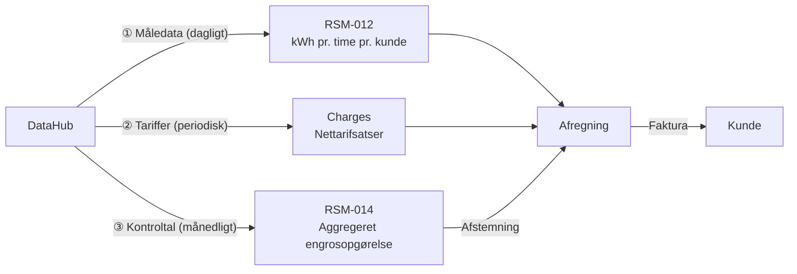
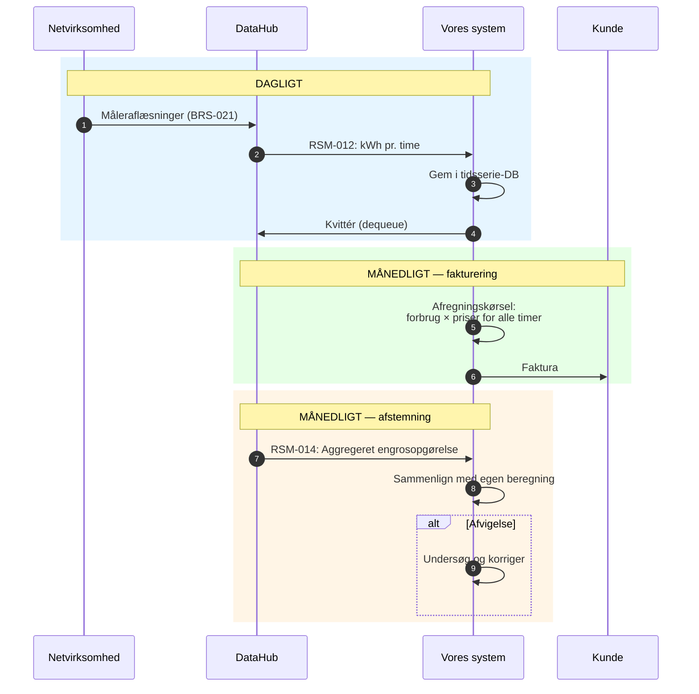

# Afregning og DataHub: Overblik for udviklere

## Hvad handler projektet om?

Vi er en elleverandør (DDQ). Vi skal bygge et open source-system der:

1. **Modtager data** fra Energinets centrale datahub (DataHub 3)
2. **Beregner fakturaer** ud fra forbrug, markedspriser og tariffer
3. **Afstemmer** vores beregninger mod DataHubs kontroltal

Alt foregår via en REST API med JSON-køer, sikret med OAuth2.

---

## Aktørerne

```
┌──────────────┐     ┌──────────────┐     ┌──────────────┐     ┌──────────┐
│ Netvirksomhed│     │   DataHub    │     │  Leverandør  │     │  Kunde   │
│ (måler strøm)│────→│ (central hub)│────→│ (os/systemet)│────→│          │
└──────────────┘     └──────────────┘     └──────────────┘     └──────────┘
  Aflæser målere       Validerer og         Beregner og          Modtager
  Leverer tariffer     videresender         fakturerer           faktura
```

- **Netvirksomheden** ejer elnettet og aflæser målerne. Vi styrer dem ikke.
- **DataHub** er Energinets centrale platform. Al markedskommunikation går igennem den.
- **Leverandøren (os)** modtager data og fakturerer kunden.
- Vi kommunikerer **aldrig direkte** med netvirksomheden — DataHub er altid mellemmand.

---

## De tre datastrømme vi bygger systemet omkring



| # | Hvad | Frekvens | Indhold |
|---|------|----------|---------|
| ① | **Måledata** (RSM-012) | Dagligt | kWh pr. time for hvert målepunkt |
| ② | **Tariffer** (Charges-kø) | Typisk årligt | Netvirksomhedens priser for transport af strøm |
| ③ | **Kontroltal** (RSM-014) | Månedligt | DataHubs egen opgørelse — vi afstemmer mod denne |

Derudover henter vi **Nordpool-spotpriser** (timepris for strøm fra elbørsen) fra en ekstern markedsdata-feed.

---

## Hvad afregning faktisk er

Afregning = beregn hvad kunden skylder for sin strøm i en periode.

Beregningen sker **pr. time** for hele faktureringsperioden (~720 timer/måned):

```
kWh (fra DataHub) × pris (fra forskellige kilder) = beløb
```

En faktura består af disse lag — hver med sin egen priskilde:

```
┌─────────────────────────────────────────────────────────────────────┐
│  Energi          kWh × (spotpris + vores margin)                    │
│                  Kilde: Nordpool + kontraktvilkår                   │
├─────────────────────────────────────────────────────────────────────┤
│  Nettarif        kWh × netvirksomhedens sats (tidsdifferentieret)  │
│  Systemtarif     kWh × Energinets systemtarif                      │
│  Transmissions-  kWh × Energinets transmissionstarif               │
│  tarif           Kilde: Charges-kø (DataHub)                       │
├─────────────────────────────────────────────────────────────────────┤
│  Elafgift        kWh × lovbestemt sats (staten)                    │
│                  Kilde: Lovgivning (opdateres typisk årligt)       │
├─────────────────────────────────────────────────────────────────────┤
│  Abonnementer    faste månedlige gebyrer (net + vores eget)        │
│                  Kilde: Charges-kø + kontraktvilkår                │
├─────────────────────────────────────────────────────────────────────┤
│  Moms            25% af alt ovenstående                            │
│                  Kilde: Staten                                     │
└─────────────────────────────────────────────────────────────────────┘
```

### Hvem fastsætter priserne?

| Priskilde | Hvad de bestemmer | Hvordan vi får det |
|-----------|-------------------|--------------------|
| **Nordpool** (elbørsen) | Spotpris pr. time | Ekstern markedsdata-feed |
| **Netvirksomheden** (DDM) | Nettarif (transport i lokalt net) + netabonnement | Charges-kø via DataHub |
| **Energinet** (TSO) | Systemtarif + transmissionstarif | Charges-kø via DataHub |
| **Staten** | Elafgift + moms (25%) | Lovgivning — vi vedligeholder satserne manuelt |
| **Os selv** (leverandøren) | Leverandørmargin + produkttillæg + eget abonnement | Kontraktvilkår / produktplan |

Alle kWh-baserede priser ganges med det **samme forbrug** fra RSM-012.

---

## Systemets livscyklus — hvad sker hvornår



---

## Korrektioner — den vigtigste edge case

Netvirksomheden kan indsende **rettede målinger** for en allerede faktureret periode. Når det sker:

1. Vi modtager en ny RSM-012 for samme målepunkt + periode
2. Der er **ingen markering** der siger "dette er en korrektion" — vi skal selv sammenligne med det vi har gemt
3. Vi beregner differencen og udsteder en kredit- eller debitnota

Dette er en kernekompleksitet i systemet: enhver RSM-012 kan potentielt være en korrektion.

---

## Kundens livscyklus (kort)

Afregning er kun én del af systemet. Vi skal også håndtere kundens fulde livscyklus via DataHub:

| Fase | Hvad sker | Nøgleproces |
|------|-----------|-------------|
| **Onboarding** | Kunde vælger os som leverandør | BRS-001 (leverandørskifte) |
| **Aktivering** | Vi modtager stamdata + første måledata | RSM-007 + RSM-012 |
| **Drift** | Daglig datamodtagelse, månedlig fakturering | RSM-012 + afregning |
| **Offboarding** | Kunde skifter leverandør eller fraflytter | BRS-002 / BRS-010 |
| **Afslutning** | Slutafregning + acontoopgørelse | Slutfaktura |

→ Detaljer: [Kundelivscyklus](datahub3-customer-lifecycle.md)

---

## Teknisk integration med DataHub

DataHub eksponerer en REST API med **kø-baseret kommunikation**:

```
Vi poller → DataHub returnerer næste besked → vi kvitterer

GET  /v1.0/cim/Timeseries     → peek (hent næste besked)
DELETE /v1.0/cim/dequeue/{id}  → acknowledge (fjern fra kø)
POST /v1.0/cim/{process}      → send anmodning (f.eks. leverandørskifte)
```

Fire køer med forskellige meddelelsestyper:

| Kø | Indhold | Vi bruger det til |
|----|---------|-------------------|
| **Timeseries** | Måledata (RSM-012) + aggregeringer (RSM-014) | Afregning + afstemning |
| **Charges** | Tarifsatser fra netvirksomhed | Opdatering af pristabeller |
| **MasterData** | Stamdata for målepunkter (RSM-007) | Porteføljestyring |
| **Aggregations** | Aggregerede engrosdata (RSM-014) | Engrosopgørelse |

Autentificering: OAuth2 Client Credentials (Azure AD). Token udløber efter 1 time.

---

## Scope: Hvad skal vi bygge?

```
┌──────────────────────────────────────────────────────────┐
│                    Vores system                          │
│                                                          │
│  ┌─────────────────┐  ┌───────────────┐  ┌────────────┐ │
│  │ DataHub         │  │ Afregnings-   │  │ Kunde- &   │ │
│  │ Integration     │  │ motor         │  │ Portefølje │ │
│  │                 │  │               │  │            │ │
│  │ • Kø-polling    │  │ • Beregning   │  │ • Stamdata │ │
│  │ • OAuth2        │  │ • Fakturering │  │ • Skifte   │ │
│  │ • CIM-parsing   │  │ • Korrektion  │  │ • On/off   │ │
│  │ • Idempotens    │  │ • Afstemning  │  │ • Tilstand │ │
│  └────────┬────────┘  └───────┬───────┘  └─────┬──────┘ │
│           └───────────────────┼──────────────────┘       │
│                               │                          │
│                    ┌──────────┴──────────┐               │
│                    │  PostgreSQL /       │               │
│                    │  TimescaleDB        │               │
│                    └─────────────────────┘               │
└──────────────────────────────────────────────────────────┘
         │                                        │
         ▼                                        ▼
   DataHub 3 API                          Backoffice / ERP
```

Tre kerneservices:

1. **DataHub Integration** — henter og sender data, håndterer auth og køer
2. **Afregningsmotor** — beregner hvad kunderne skylder, håndterer korrektioner
3. **Kunde- & Porteføljeservice** — styrer målepunkter, leveranceperioder, livscyklus

→ Detaljer: [Foreslået arkitektur](datahub3-proposed-architecture.md)

---

## Nøglebegreber

| Begreb | Forklaring |
|--------|------------|
| **DataHub** | Energinets centrale platform — al kommunikation går igennem den |
| **DDQ** | Elleverandør (os) |
| **GSRN** | 18-cifret ID for et målepunkt (en måler) |
| **RSM-012** | Besked med kWh-forbrugsdata pr. time |
| **RSM-014** | Besked med aggregerede data (til afstemning) |
| **BRS-001** | Leverandørskifte-proces |
| **Spotpris** | Nordpool-børsens timepris for strøm |
| **Nettarif** | Netvirksomhedens gebyr for transport |
| **Flex-afregning** | Afregning på faktisk timeforbrug (de fleste kunder) |
| **Aconto** | Kunden betaler fast estimat, afstemmes ved hver faktureringsperiode |

---

## Videre læsning

| Dokument | Hvad det dækker |
|----------|-----------------|
| [Kundelivscyklus](datahub3-customer-lifecycle.md) | Detaljeret gennemgang af alle 6 faser |
| [Sekvensdiagrammer](datahub3-sequence-diagrams.md) | Mermaid-diagrammer for hvert BRS/RSM-flow |
| [Forretningsprocesser](datahub3-ddq-business-processes.md) | Reference for alle BRS/RSM-processer |
| [RSM-012 reference](rsm-012-datahub3-measure-data.md) | Teknisk detalje om måledata-formatet |
| [Systemarkitektur](datahub3-proposed-architecture.md) | Teknologivalg, datamodel, driftsomkostninger |
| [Autentificering og sikkerhed](datahub3-authentication-security.md) | OAuth2, credentials, GDPR, auditlog |
| [Klassediagram](datahub3-class-diagram.md) | Domænemodel med entiteter og relationer |
| [Databasemodel](datahub3-database-model.md) | PostgreSQL/TimescaleDB-skema med DDL |
