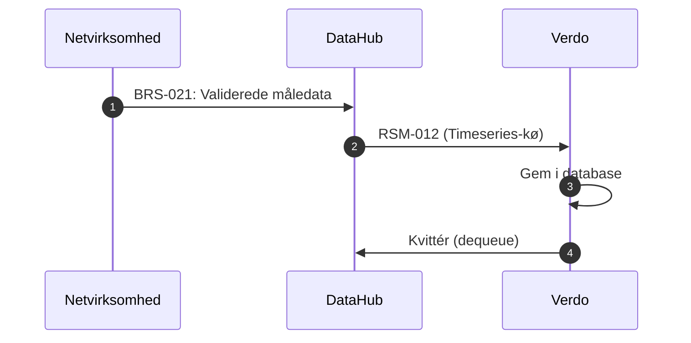
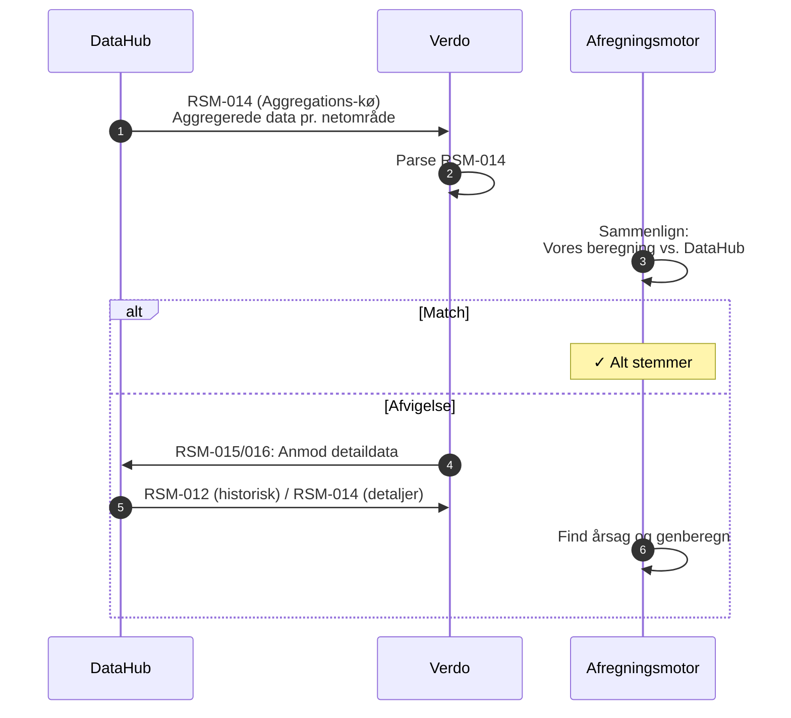
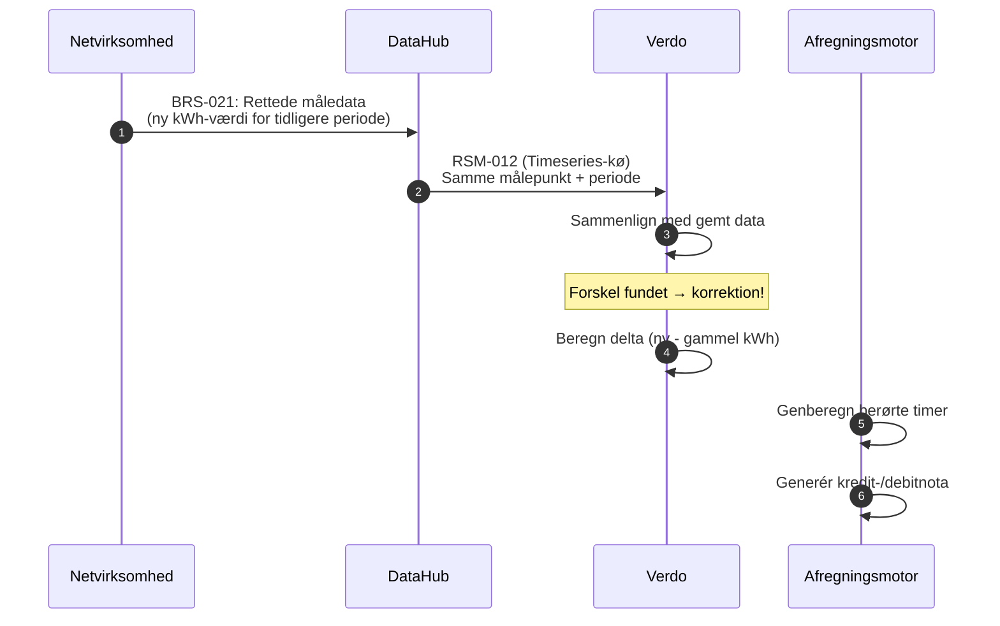

# Afregning og DataHub-kommunikation: Overblik

En enkel gennemgang af hvordan afregning (settlement) fungerer for en elleverandør (DDQ), og hvordan DataHub leverer de data der driver processen.

---

## Det store billede

```
Netvirksomhed          DataHub              Verdo                  Kunde
     │                    │                    │                      │
     │── Måleraflæsning ─→│                    │                      │
     │   (BRS-021)        │── RSM-012 ────────→│                      │
     │                    │   (kWh pr. time)   │                      │
     │                    │                    │── Gem måledata ──→ DB │
     │                    │                    │                      │
     │── Tarifsatser ────→│                    │                      │
     │   (Charges-kø)     │── Charges ────────→│                      │
     │                    │                    │── Opdatér satser → DB │
     │                    │                    │                      │
     │                    │                    │── Afregningskørsel    │
     │                    │                    │   (beregn faktura)    │
     │                    │                    │                      │
     │                    │── RSM-014 ────────→│                      │
     │                    │   (engrosopgørelse) │── Afstem ───────────→│
     │                    │                    │                      │
     │                    │                    │──── Faktura ─────────→│
     │                    │                    │                      │
```

**Kort sagt:** Netvirksomheden måler strømmen. DataHub videresender data til os. Vi beregner fakturaen. DataHub leverer også en kontrolsum vi afstemmer mod.

---

## Trin for trin

### Trin 1: Vi modtager måledata (dagligt)

Hver dag sender netvirksomheden aflæsninger til DataHub, som validerer og videresender til os:



**Hvad vi modtager i RSM-012:**

| Felt | Eksempel | Betydning |
|------|----------|-----------|
| MeteringPointId | 571313100000012345 | Kundens målepunkt (GSRN) |
| Resolution | PT1H | Timeopløsning |
| Period | 2025-01-01 → 2025-01-02 | Én dags data |
| Point (position 1) | 1,234 kWh / A03 | Forbrug i time 1, estimeret |
| Point (position 2) | 0,876 kWh / A06 | Forbrug i time 2, beregnet |
| ... | ... | 24 punkter for én dag |

**Kvalitetskoder:**
- **A01** = Korrigeret (justeret af netvirksomhed)
- **A02** = Manglende (ingen data)
- **A03** = Estimeret
- **A06** = Beregnet

---

### Trin 2: Vi modtager tarifsatser (periodisk)

Netvirksomheden opdaterer tariffer (typisk årligt). DataHub sender dem til os via Charges-køen:

| Data | Eksempel | Bruges til |
|------|----------|------------|
| Nettarifsatser | 0,15 kr./kWh (dag) / 0,08 kr./kWh (nat) | Transport af strøm |
| Systemtarif | 0,054 kr./kWh | Energinets systemtarif |
| Netabonnement | 49,00 kr./måned | Fast månedligt gebyr |
| Gyldighedsperiode | 2025-01-01 → 2025-12-31 | Hvornår satserne gælder |

Satserne gemmes i databasen og bruges ved afregningskørslen.

---

### Trin 3: Afregningskørsel (månedligt)

Når faktureringsperioden slutter, beregner vi fakturaen. Beregningen sker **pr. time** for hele perioden:

```
For HVER time i faktureringsperioden:
┌─────────────────────────────────────────────────────────────────┐
│                                                                 │
│  kWh (fra RSM-012)                                              │
│    │                                                            │
│    ├── × (spotpris + Verdo-margin)  = energi                    │
│    ├── × nettarifsats               = nettarif                  │
│    ├── × produktsats                = produktmargin              │
│    ├── × afgiftssats                = elafgift                   │
│    └── + daglig abonnementssats / 24 = abonnement               │
│                                                                 │
└─────────────────────────────────────────────────────────────────┘

Fakturatotal = sum af alle timer + moms (25%)
```

#### Fakturakomponenter forklaret

| Komponent | Kilde for pris | Kilde for forbrug | Hvad er det? |
|-----------|---------------|-------------------|--------------|
| **Energi** | Nordpool spotpris + Verdo-margin | RSM-012 (kWh) | Selve strømmen |
| **Nettarif** | Charges-kø (netvirksomhed) | RSM-012 (kWh) | Transport af strøm gennem nettet |
| **Produktmargin** | Kontraktvilkår | RSM-012 (kWh) | Verdos ekstra tillæg (f.eks. grøn energi) |
| **Elafgift** | Lovbestemt sats | RSM-012 (kWh) | Statslig afgift |
| **Abonnement (net)** | Charges-kø | Fast pr. dag | Netvirksomhedens faste gebyr |
| **Abonnement (eget)** | Produktplan | Fast pr. dag | Verdos faste gebyr |
| **Moms** | 25% | Sum af alt ovenstående | Moms |

#### Eksempel: Én times afregning

```
Time: 2025-01-15 kl. 14:00-15:00
Forbrug (RSM-012):        1,5 kWh
Nordpool spotpris:         0,85 kr./kWh
Verdo-margin:              0,05 kr./kWh
Nettarif (dagstakst):      0,15 kr./kWh
Produktmargin:             0,03 kr./kWh
Elafgift:                  0,008 kr./kWh
Netabonnement:             49 kr./md ÷ 720 timer = 0,068 kr.
Eget abonnement:           29 kr./md ÷ 720 timer = 0,040 kr.

Energi:         1,5 × (0,85 + 0,05)  = 1,350 kr.
Nettarif:       1,5 × 0,15           = 0,225 kr.
Produktmargin:  1,5 × 0,03           = 0,045 kr.
Elafgift:       1,5 × 0,008          = 0,012 kr.
Abonnement:     0,068 + 0,040        = 0,108 kr.
                                      ─────────
Subtotal:                               1,740 kr.
Moms (25%):                             0,435 kr.
                                      ─────────
Time-total:                             2,175 kr.
```

En hel månedsfaktura = summen af alle ~720 timer (30 dage × 24 timer).

---

### Trin 4: Afstemning mod DataHub (månedligt)

DataHub kører sin egen engrosopgørelse og sender os resultatet. Vi sammenligner:



**Typiske årsager til afvigelse:**
- Vi mangler måledata for ét eller flere målepunkter
- Vi har brugt forkerte tarifsatser
- Netvirksomheden har rettet data vi ikke har modtaget endnu

---

### Trin 5: Korrektioner (når data ændres)

Hvis netvirksomheden indsender rettede målinger for en allerede afregnet periode, modtager vi en ny RSM-012. Der er **ingen markering** der siger "dette er en korrektion" — vi opdager det selv:



**Korrektionsberegning:**
```
Delta kWh = ny kWh − gammel kWh

Energikorrektion:  delta kWh × spotpris for den time
Tarifkorrektion:   gammel kWh × (ny sats − gammel sats) + delta kWh × ny sats
Produktkorrektion: delta kWh × produktsats
```

---

## Samlet flow: Fra måler til faktura

```
                     DAGLIGT                              MÅNEDLIGT
              ┌─────────────────┐                  ┌─────────────────────┐
              │                 │                  │                     │
Netvirksomhed │  Aflæs målere   │                  │                     │
     │        │  (BRS-021)      │                  │                     │
     ▼        │       │         │                  │                     │
  DataHub ────┤       ▼         │                  │                     │
     │        │  Validér data   │                  │  Engrosopgørelse    │
     │        │       │         │                  │  (BRS-027)          │
     ▼        │       ▼         │                  │       │             │
  Verdo ──────┤  RSM-012        │                  │       ▼             │
     │        │  → Gem i DB     │                  │  RSM-014            │
     │        │       │         │                  │  → Afstem           │
     │        └───────┼─────────┘                  │       │             │
     │                │                            │       ▼             │
     │                ▼                            │  Match? ──→ ✓ OK   │
     │         Tidsserie-DB                        │    │                │
     │                │                            │    └── Nej → Ret   │
     │                │                            │                     │
     │                └──────────┐                 └─────────────────────┘
     │                           │
     │                    FAKTURERINGSPERIODE SLUT
     │                           │
     │                           ▼
     │                    Afregningskørsel
     │                    (beregn alle timer)
     │                           │
     │                           ▼
     │                    Faktura → Kunde
     │
     │              VED KORREKTIONER
     │              ┌─────────────────┐
     │              │ Ny RSM-012 for  │
     │              │ allerede afregnet│
     │              │ periode          │
     │              │      │          │
     │              │      ▼          │
     │              │ Beregn delta    │
     │              │      │          │
     │              │      ▼          │
     │              │ Kredit-/debit-  │
     │              │ nota → Kunde    │
     │              └─────────────────┘
```

---

## Acontomodel vs. faktisk afregning

De fleste privatkunder bruger **aconto** — en fast månedlig betaling baseret på estimat. Forskellen:

| | Aconto | Faktisk |
|--|--------|---------|
| **Kunden betaler** | Fast beløb hver måned | Reelt forbrug hver måned |
| **Afregningskørsel** | Kører stadig (internt) | Kører og danner faktura |
| **Årsopgørelse** | Ja — faktisk vs. betalt → kredit/debit | Nej — hver faktura er endelig |
| **Ved offboarding** | Slutafstemning obligatorisk | Kun delperiode-faktura |

Acontobeløbet estimeres ved onboarding ud fra forventet årsforbrug og justeres typisk årligt.

---

## Tidslinje: Hvornår sker hvad?

```
Dag 1        Dag 2        ...        Dag 30       Dag 31-35     Dag ~45
  │            │                       │              │             │
  ▼            ▼                       ▼              ▼             ▼
RSM-012    RSM-012                  RSM-012    Afregnings-    Faktura
modtages   modtages                modtages   kørsel         sendt til
(time 1-24)(time 1-24)            (time 1-24) (alle 720      kunde
  │            │                       │        timer)
  ▼            ▼                       ▼           │
  Gem          Gem                     Gem          ▼
  i DB         i DB                    i DB     RSM-014
                                               modtages
                                               → afstem
```

---

## Nøglebegreber

| Begreb | Forklaring |
|--------|------------|
| **RSM-012** | Meddelelse med validerede måledata (kWh pr. time) |
| **RSM-014** | Meddelelse med aggregerede data (til afstemning) |
| **BRS-021** | Netvirksomhed indberetter målinger til DataHub |
| **BRS-027** | DataHub kører engrosopgørelse (månedlig kontrolsum) |
| **Spotpris** | Nordpool-børsens timepris for strøm |
| **Nettarif** | Netvirksomhedens gebyr for transport af strøm |
| **GSRN** | 18-cifret ID for et målepunkt |
| **Flex-afregning** | Afregning baseret på faktisk timeforbrug (de fleste kunder) |
| **Aconto** | Fast månedsbetaling baseret på estimat, afstemt årligt |

---

## Kilder

- [Kundelivscyklus: Onboarding til offboarding](datahub3-customer-lifecycle.md)
- [Sekvensdiagrammer for alle DataHub-flows](datahub3-sequence-diagrams.md)
- [RSM-012 Måledata-reference](rsm-012-datahub3-measure-data.md)
- [DataHub 3 DDQ Forretningsproces-reference](datahub3-ddq-business-processes.md)
- [Foreslået systemarkitektur](datahub3-proposed-architecture.md)
