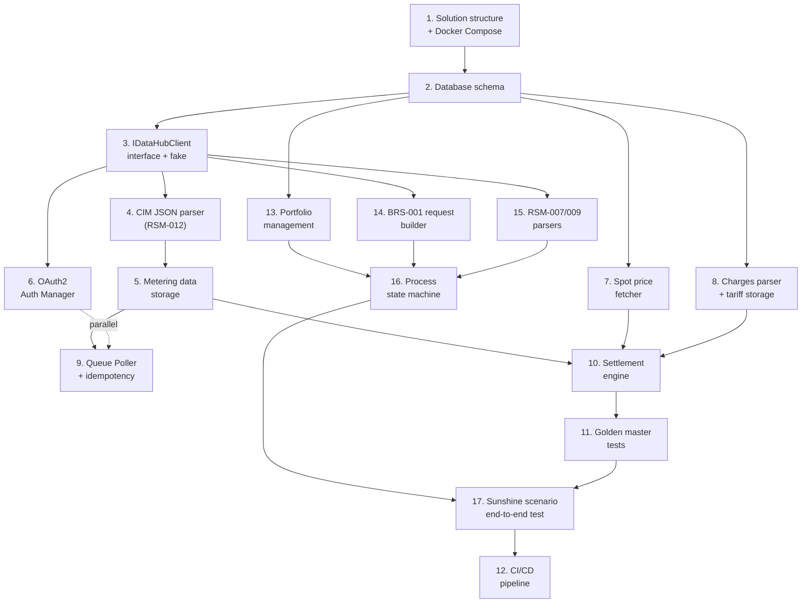

# MVP 1: Sunshine Scenario — Implementation Plan

Prove the entire sunshine path works end-to-end — from customer signup, through supplier switch (BRS-001), metering data reception, to a verifiable settlement result. Happy path only: no rejections, no cancellations, no offboarding.

**Delivered outcome:** A customer is signed up, the switch is accepted, master data and metering data arrive, and the settlement run produces an invoice that matches a hand-calculated golden master.

---

## Simulator Strategy

MVP 1 uses an **in-process fake** (`FakeDataHubClient`) behind the same `IDataHubClient` interface the real client will implement. No HTTP server, no Docker networking — just fixture-loaded queues in memory.

The fake supports:
- Timeseries queue (RSM-012 from fixture files)
- MasterData queue (RSM-007 from fixture files)
- Charges queue (tariff rate fixtures)
- Peek / dequeue semantics matching the real DataHub API
- Outbound BRS-001 acceptance (returns RSM-009 accepted)
- Fake token endpoint (returns a hardcoded JWT)
- State reset between tests

The fake does **not** support Aggregations, error injection (401, 503, rejections), or HTTP transport. Those come in MVP 2-3.

The `IDataHubClient` abstraction means the transition from fake → HTTP simulator → real DataHub is a configuration change, not a rewrite. Three implementations over time:

| Implementation | MVP | Description |
|---------------|-----|-------------|
| `FakeDataHubClient` | 1 | In-process, fixture-loaded. No HTTP. Fast. |
| `SimulatorDataHubClient` | 2 | HTTP client pointing at standalone Docker simulator |
| `RealDataHubClient` | 3 | HTTP client pointing at DataHub B2B API with OAuth2 |

---

## Observability

MVP 1 includes the **.NET Aspire Dashboard** for runtime monitoring — no custom UI code needed.

The Aspire Dashboard runs as a Docker container alongside TimescaleDB. The .NET worker and API services export telemetry via OpenTelemetry (OTLP), and the dashboard collects and displays it.

**What it provides:**
- **Structured logs** — all services, filterable and searchable
- **Distributed traces** — follow a message from queue poll through parsing, storage, and settlement
- **Metrics** — queue poll rates, message processing times, settlement durations

**Setup:**
- Add `mcr.microsoft.com/dotnet/aspire-dashboard` to `docker-compose.yml`
- Add `OpenTelemetry.Extensions.Hosting` + OTLP exporter NuGet packages to the .NET worker
- Configure `OTEL_EXPORTER_OTLP_ENDPOINT` to point at the dashboard container
- Dashboard accessible at `http://localhost:18888`

This replaces the need for any custom UI in MVP 1. When the system runs, you open the dashboard to see what's happening — which messages are being processed, how long settlement takes, and any errors.

---

## Build Order

Tasks are ordered by dependency. Each produces a testable result before the next starts. Tasks 1-11 are the settlement core, tasks 13-17 add the customer flow.

### Settlement core (tasks 1-12)

| # | Component | What it proves |
|---|-----------|---------------|
| 1 | **Solution structure + Docker Compose** | .NET solution builds, TimescaleDB starts, Aspire Dashboard shows logs/traces, CI pipeline runs |
| 2 | **Database schema (MVP 1 subset)** | Migrations create all needed tables, hypertable enabled |
| 3 | **IDataHubClient + FakeDataHubClient** | Peek/dequeue lifecycle works, BRS-001 accepted, fixture loading |
| 4 | **CIM JSON parser (RSM-012)** | Raw CIM JSON → domain model (GSRN, period, resolution, points) |
| 5 | **Metering data storage** | Parsed data persisted in hypertable, upsert for corrections |
| 6 | **OAuth2 Auth Manager** | Token caching, proactive renewal, thread-safe access |
| 7 | **Spot price fetcher** | Nordpool prices stored and queryable by hour (seed or Energi Data Service) |
| 8 | **Charges parser + tariff storage** | Grid/system/transmission tariffs stored with time-of-day + validity |
| 9 | **Queue Poller + idempotency** | BackgroundService polls → parses → stores → dequeues. Duplicate MessageId skipped. Dead-letter on failure |
| 10 | **Settlement engine** | Pure calculation: consumption + spot + tariffs + product plan → invoice lines |
| 11 | **Golden master tests** | Hand-calculated reference invoices reproduced exactly |
| 12 | **CI/CD pipeline** | Build + unit tests + integration tests on every push |

### Customer flow (tasks 13-17)

| # | Component | What it proves |
|---|-----------|---------------|
| 13 | **Portfolio management** | Customer, metering point, contract, supply period CRUD |
| 14 | **BRS-001 request builder** | Valid CIM JSON produced, sent via IDataHubClient |
| 15 | **RSM-009 + RSM-007 parsers** | Acknowledgement and master data extraction |
| 16 | **Process state machine** | BRS-001 lifecycle: Pending → Sent → Acknowledged → Completed |
| 17 | **Sunshine scenario E2E test** | Full chain using FakeDataHubClient: signup → BRS-001 → RSM-007 → RSM-012 → settlement → golden master |

**Parallel tracks:**
- Track A (settlement): 1 → 2 → 5 → 9 → 10 → 11
- Track B (customer flow): 3 → 14 + 15 → 13 → 16 → 17
- Track C (independent): 6, 7, 8

---

## Test Fixtures

All fixtures are version-controlled. Values chosen for hand-calculability.

| Fixture | Content |
|---------|---------|
| `rsm012-single-day.json` | 1 GSRN, 1 day, 24 hours, PT1H, quality A01 |
| `rsm012-multi-day/` (31 files) | Same GSRN, full January |
| `rsm007-activation.json` | GSRN activation, grid area 344, flex settlement |
| `charges-grid-tariff.json` | Grid area 344: day/night/peak rates, subscription 49 DKK/month |
| `charges-system-tariff.json` | System 0.054, transmission 0.049 DKK/kWh |
| `spot-prices-january.json` | 744 hours with time-differentiated prices |

Fixtures follow the CIM EDI Guide structure (Dok. 15/00718-191).

---

## Golden Master: Full Month Settlement

The core verification. All inputs are deterministic, all outputs are hand-calculated.

**Setup:** Spot customer, GSRN `571313100000012345`, grid area 344 (DK1), margin 4 øre/kWh, supplier subscription 39 DKK/month. January 2025, 744 hours.

**Consumption:** 3 patterns — night 0.3 kWh/h, day 0.5 kWh/h, peak 1.2 kWh/h, late night 0.4 kWh/h. Total: 412.3 kWh.

**Spot prices:** Night 0.45, day 0.85, peak 1.25, late night 0.55 DKK/kWh.

**Tariffs:** Grid night 0.06, day 0.18, peak 0.54. System 0.054, transmission 0.049, elafgift 0.008 DKK/kWh. Grid subscription 49 DKK/month.

| Invoice line | Amount (DKK) |
|-------------|-------------|
| Energy (spot + margin) | 392.99 |
| Grid tariff (time-differentiated) | 116.62 |
| System tariff | 22.26 |
| Transmission tariff | 20.20 |
| Electricity tax | 3.30 |
| Grid subscription | 49.00 |
| Supplier subscription | 39.00 |
| **Subtotal** | **643.37** |
| VAT (25%) | **160.84** |
| **Total** | **804.21** |

A second golden master covers a partial period (16 days, mid-month start) to verify pro-rata subscription handling. Expected total: 415.08 DKK.

---

## Test Approach

| Layer | What | Dependencies |
|-------|------|-------------|
| Unit tests | CIM parser, settlement engine, auth manager, fake client, state machine | None — pure functions and in-memory |
| Integration tests | Ingestion pipeline, spot/charges ingestion, portfolio CRUD | FakeDataHubClient + PostgreSQL |
| End-to-end | Sunshine scenario: signup → BRS-001 → data reception → settlement | FakeDataHubClient + PostgreSQL |

**Rounding:** Full precision during hourly calculations, round to 2 decimal DKK on invoice line totals, VAT on the summed subtotal.

---

## Simulator Evolution (Post-MVP 1)

| MVP | Simulator change |
|-----|-----------------|
| 2 | **Standalone HTTP simulator introduced.** Error responses (rejections, 403). Offboarding scenarios. Aconto flows |
| 3 | Error injection (401, 503, malformed). Correction scenarios. Aggregations queue. Parallel with real Actor Test |
| 4 | Performance: 80K metering points, realistic timing |

---

## Exit Criteria

- [ ] `docker compose up` starts TimescaleDB and Aspire Dashboard
- [ ] Aspire Dashboard accessible at `http://localhost:18888` with logs, traces, and metrics
- [ ] FakeDataHubClient delivers RSM-012, RSM-007, Charges fixtures
- [ ] CIM parser handles all fixture files correctly
- [ ] Ingestion pipeline: 31 days ingested, all messages dequeued, no dead letters
- [ ] Duplicate MessageId skipped (idempotency)
- [ ] Tariff rates parsed and queryable by grid area + hour
- [ ] Portfolio: customer + metering point + contract + supply period created
- [ ] BRS-001 sent → RSM-009 accepted (via FakeDataHubClient)
- [ ] RSM-007 → metering point activated, supply period created
- [ ] State machine: Pending → Sent → Acknowledged → Completed
- [ ] Settlement golden master #1 (full month) passes
- [ ] Settlement golden master #2 (partial period) passes
- [ ] Sunshine scenario E2E: signup → BRS-001 → data → settlement → golden master (all via FakeDataHubClient)
- [ ] All tests green in CI

---

## What MVP 1 Does NOT Include

| Feature | Deferred to |
|---------|-------------|
| Offboarding (BRS-002, BRS-010) | MVP 2 |
| Cancellations / rejections (BRS-003, RSM-009 rejected) | MVP 2 |
| Aconto calculation and settlement | MVP 2 |
| Standalone HTTP DataHub simulator | MVP 2 |
| Invoice generation (PDF/document) | MVP 2 |
| Metering data corrections (delta detection) | MVP 3 |
| Reconciliation (RSM-014) | MVP 3 |
| Elvarme / solar (E18) | MVP 3 |
| Real DataHub communication (Actor Test) | MVP 3 |
| ERP integration, customer portal | MVP 4 |

---

## Sources

- [Implementation plan](datahub3-implementation-plan.md) — MVP overview and testing strategy
- [Database model](datahub3-database-model.md) — full PostgreSQL/TimescaleDB schema
- [Class diagram](datahub3-class-diagram.md) — domain model
- [Product structure and billing](datahub3-product-and-billing.md) — invoice lines, energy models, aconto
- [RSM-012 reference](rsm-012-datahub3-measure-data.md) — CIM JSON format and business rules
- [Proposed architecture](datahub3-proposed-architecture.md) — technology choices, services, data architecture
- [Settlement overview](datahub3-settlement-overview.md) — the three data streams, settlement calculation
