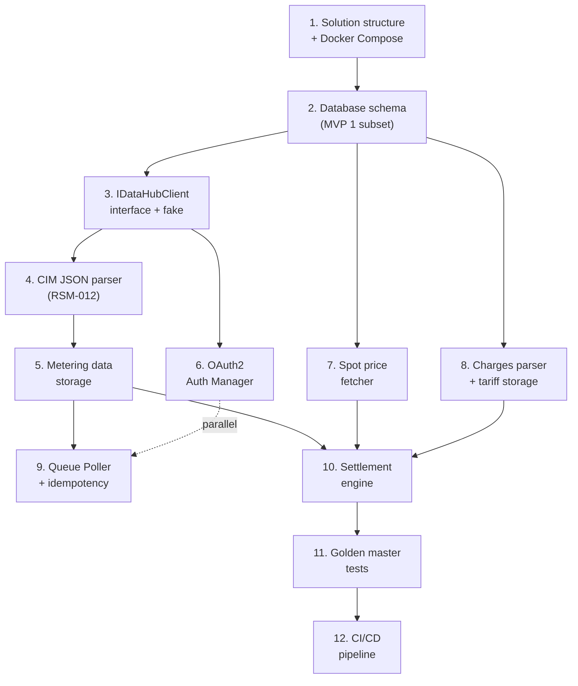

# MVP 1: One Correct Invoice — Detailed Implementation Plan

**Goal:** Prove the entire chain works end-to-end — from simulated DataHub messages to a verifiable settlement result for one metering point. Happy path only.

**Delivered outcome:** A calculated invoice you can put next to a hand-calculated reference and confirm they match, line by line.

---

## Implementation Order

The tasks below are ordered by dependency. Each task produces a testable result before moving to the next.



---

## Task 1: Solution Structure + Docker Compose

**What:** Create the .NET solution, project structure, and `docker-compose.yml` for local development.

**Technical details:**

```
DataHub.Settlement/
├── src/
│   ├── DataHub.Settlement.Domain/          # Domain entities, value objects, enums
│   ├── DataHub.Settlement.Application/     # Use cases, interfaces (IDataHubClient, ISettlementEngine)
│   ├── DataHub.Settlement.Infrastructure/  # DB access, HTTP clients, CIM parsing
│   ├── DataHub.Settlement.Worker/          # Background services (Queue Poller, Settlement Runner)
│   └── DataHub.Settlement.Api/             # REST API (future — minimal in MVP 1)
├── tests/
│   ├── DataHub.Settlement.UnitTests/       # Domain + application tests
│   └── DataHub.Settlement.IntegrationTests/ # DB + full pipeline tests
├── fixtures/                               # CIM JSON fixture files
├── docker-compose.yml                      # PostgreSQL + TimescaleDB
├── Directory.Build.props                   # Shared build configuration
└── DataHub.Settlement.sln
```

**Docker Compose:**

```yaml
services:
  db:
    image: timescale/timescaledb:latest-pg16
    environment:
      POSTGRES_DB: datahub_settlement
      POSTGRES_USER: settlement
      POSTGRES_PASSWORD: dev_password
    ports:
      - "5432:5432"
    volumes:
      - pgdata:/var/lib/postgresql/data
      - ./db/init:/docker-entrypoint-initdb.d   # migration scripts

volumes:
  pgdata:
```

**Definition of done:**
- `dotnet build` succeeds
- `docker compose up` starts TimescaleDB and it accepts connections
- All projects reference each other correctly (Domain has no dependencies, Application references Domain, Infrastructure references Application)

---

## Task 2: Database Schema (MVP 1 Subset)

**What:** Create the database migration scripts for the tables needed in MVP 1. Not the full schema — only what we need to produce one correct invoice.

**Tables needed for MVP 1:**

| Schema | Table | Why |
|--------|-------|-----|
| `portfolio` | `grid_area` | Grid area → price area mapping (DK1/DK2) |
| `portfolio` | `metering_point` | GSRN, type, settlement method, grid area |
| `portfolio` | `product` | Margin, subscription, energy model |
| `portfolio` | `customer` | Minimal — name, CPR/CVR |
| `portfolio` | `contract` | Binds customer ↔ metering point ↔ product |
| `metering` | `metering_data` | **Hypertable** — kWh per hour per metering point |
| `metering` | `spot_price` | Nordpool hourly spot prices (DK1/DK2) |
| `tariff` | `grid_tariff` | Grid/system/transmission tariff headers |
| `tariff` | `tariff_rate` | Hourly rates (1-24) per tariff |
| `tariff` | `subscription` | Grid + supplier subscriptions |
| `tariff` | `electricity_tax` | Elafgift rate |
| `settlement` | `billing_period` | Period start/end, frequency |
| `settlement` | `settlement_run` | Run metadata (status, version, executed_at) |
| `settlement` | `settlement_line` | Result per metering point per charge type |
| `datahub` | `inbound_message` | Message log |
| `datahub` | `processed_message_id` | Idempotency |
| `datahub` | `dead_letter` | Failed messages |

**Tables NOT needed in MVP 1 (deferred):**

| Table | Deferred to |
|-------|-------------|
| `portfolio.supply_period` | MVP 2 (lifecycle) |
| `settlement.aconto_payment` | MVP 2 (aconto) |
| `settlement.aconto_settlement` | MVP 2 (aconto) |
| `invoicing.invoice` | MVP 2 (invoicing) |
| `invoicing.invoice_line` | MVP 2 (invoicing) |
| `lifecycle.process_request` | MVP 2 (lifecycle) |
| `lifecycle.process_event` | MVP 2 (lifecycle) |
| `datahub.outbound_request` | MVP 2 (BRS requests) |
| `metering.daily_summary` | MVP 1 or 2 (continuous aggregate, optional optimization) |

**Migration approach:** Plain SQL migration files, run in order at container startup. Use a simple migration tool (e.g. DbUp or FluentMigrator) — not EF Core Migrations for MVP 1.

**Definition of done:**
- `docker compose up` creates all schemas and tables
- TimescaleDB extension is enabled
- `metering_data` is a hypertable partitioned by month
- Can INSERT and SELECT from all tables

---

## Task 3: IDataHubClient Interface + FakeDataHubClient

**What:** Define the abstraction boundary for all DataHub communication. Implement an in-process fake for unit and integration tests.

**The interface:**

```csharp
public interface IDataHubClient
{
    /// Peek the next message from a queue. Returns null if the queue is empty.
    Task<DataHubMessage?> PeekAsync(QueueName queue, CancellationToken ct);

    /// Acknowledge and remove a message from the queue.
    Task DequeueAsync(string messageId, CancellationToken ct);
}

public record DataHubMessage(
    string MessageId,
    string MessageType,        // "NotifyValidatedMeasureData", "NotifyAggregatedMeasureData", etc.
    string? CorrelationId,
    string RawPayload          // CIM JSON string
);

public enum QueueName { Timeseries, MasterData, Charges, Aggregations }
```

**FakeDataHubClient (in-process, for tests):**

```csharp
public class FakeDataHubClient : IDataHubClient
{
    private readonly ConcurrentDictionary<QueueName, ConcurrentQueue<DataHubMessage>> _queues = new();

    /// Test helper: enqueue a fixture message
    public void Enqueue(QueueName queue, DataHubMessage message) { ... }

    public Task<DataHubMessage?> PeekAsync(QueueName queue, CancellationToken ct)
    {
        // Return the next message without removing it (peek semantics)
    }

    public Task DequeueAsync(string messageId, CancellationToken ct)
    {
        // Remove the message from the queue
    }
}
```

**Three implementations over time:**

| Implementation | MVP | Description |
|---------------|-----|-------------|
| `FakeDataHubClient` | 1 | In-process, loads CIM JSON fixture files. No HTTP. Fast. |
| `SimulatorDataHubClient` | 2 | HTTP client pointing at standalone Docker simulator |
| `RealDataHubClient` | 3 | HTTP client pointing at DataHub B2B API with OAuth2 |

Switching between implementations is **configuration**, not code change:

```json
{
  "DataHub": {
    "ClientType": "Fake",       // "Fake", "Simulator", or "Real"
    "BaseUrl": "https://...",   // only used for Simulator/Real
    "FixturesPath": "fixtures/" // only used for Fake
  }
}
```

**Definition of done:**
- `IDataHubClient` interface defined in Application project
- `FakeDataHubClient` in test project, can enqueue and peek fixture messages
- Unit test: enqueue a message → peek returns it → dequeue removes it → peek returns null

---

## Task 4: CIM JSON Parser (RSM-012)

**What:** Parse CIM JSON messages (RSM-012 / NotifyValidatedMeasureData) into domain objects.

**Input:** Raw CIM JSON string from `DataHubMessage.RawPayload`.

**Output:** Domain object:

```csharp
public record ParsedTimeSeries(
    string MessageId,
    string MeteringPointId,      // GSRN (18 digits)
    string ProcessType,          // "E23", "D42", "E30"
    Resolution Resolution,       // PT1H, PT15M, P1M
    DateTimeOffset PeriodStart,
    DateTimeOffset PeriodEnd,
    IReadOnlyList<TimeSeriesPoint> Points
);

public record TimeSeriesPoint(
    int Position,                // 1-based
    decimal QuantityKwh,
    string QualityCode           // "A01", "A02", "A03", "A06"
);
```

**CIM JSON structure to parse** (from CIM EDI Guide):

```json
{
  "NotifyValidatedMeasureData_MarketDocument": {
    "mRID": "msg-uuid",
    "type": { "value": "E66" },
    "process.processType": { "value": "D42" },
    "sender_MarketParticipant.mRID": { ... },
    "receiver_MarketParticipant.mRID": { ... },
    "createdDateTime": "2025-01-02T06:00:00Z",
    "Series": [
      {
        "mRID": "series-uuid",
        "marketEvaluationPoint.mRID": { "value": "571313100000012345" },
        "product": "8716867000030",
        "quantity_Measure_Unit.name": { "value": "KWH" },
        "Period": {
          "resolution": "PT1H",
          "timeInterval": {
            "start": { "value": "2025-01-01T23:00Z" },
            "end":   { "value": "2025-01-02T23:00Z" }
          },
          "Point": [
            { "position": { "value": 1 }, "quality": { "value": "A03" }, "quantity": 0.456 },
            { "position": { "value": 2 }, "quality": { "value": "A03" }, "quantity": 0.312 },
            ...
          ]
        }
      }
    ]
  }
}
```

**Key parsing rules:**
- Period start/end are UTC — convert positions to timestamps: `start + (position - 1) × resolution`
- For PT1H: 24 points per day. For PT15M: 96 points per day
- If `quality = A02` and quantity is missing, record as 0 kWh with quality A02
- Validate: GSRN is 18 digits, resolution is known, positions are sequential

**Test approach:**
- Create fixture files based on Energinet CIM EDI Guide examples and [opengeh-edi](https://github.com/Energinet-DataHub/opengeh-edi) test data
- Unit tests: parse each fixture → assert all fields extracted correctly

**Fixture files for MVP 1:**

| File | Content | Tests |
|------|---------|-------|
| `rsm012-single-day.json` | One GSRN, PT1H, 24 hours, 1 Jan 2025 | Basic parsing |
| `rsm012-multi-day.json` | One GSRN, PT1H, 31 days (January), 31 messages | Full monthly ingestion |
| `rsm012-missing-quantity.json` | One point has quality A02 (missing) | Missing data handling |
| `charges-tariff-update.json` | Grid tariff rates for grid area 344 | Tariff parsing |

**Definition of done:**
- `CimJsonParser.ParseRsm012(string json)` returns `ParsedTimeSeries`
- All fixture files parse without error
- Unit tests cover: normal data, missing quantities, multiple series in one message

---

## Task 5: Metering Data Storage

**What:** Persist parsed RSM-012 data into the `metering.metering_data` hypertable. Handle upsert semantics (for future corrections).

**Key design decisions:**
- Use `INSERT ... ON CONFLICT (metering_point_id, timestamp) DO UPDATE` — this makes correction handling automatic: new data for the same hour overwrites old data
- Use Dapper or raw `NpgsqlCommand` for bulk inserts (not EF Core) — performance matters for 720+ inserts per message
- Use `COPY` protocol for bulk loading if needed (Npgsql supports binary COPY)

**Interface:**

```csharp
public interface IMeteringDataRepository
{
    Task StoreTimeSeriesAsync(string meteringPointId, IReadOnlyList<MeteringDataRow> rows, CancellationToken ct);
    Task<IReadOnlyList<MeteringDataRow>> GetConsumptionAsync(string meteringPointId, DateTimeOffset from, DateTimeOffset to, CancellationToken ct);
}

public record MeteringDataRow(
    string MeteringPointId,
    DateTimeOffset Timestamp,
    string Resolution,
    decimal QuantityKwh,
    string QualityCode,
    string SourceMessageId
);
```

**Test approach:**
- Integration test (requires Docker PostgreSQL): store 24 hours → query back → assert all 24 rows
- Integration test: store 24 hours → store again with different quantities → query back → assert updated values (upsert / correction)

**Definition of done:**
- Parse RSM-012 fixture → store → query → data matches
- Upsert works: storing data for same hour replaces old data
- Performance: 720 rows (one month of hourly data per metering point) inserts in < 100ms

---

## Task 6: OAuth2 Auth Manager

**What:** Implement OAuth2 Client Credentials flow for DataHub B2B API authentication.

This runs in parallel with Tasks 4-5 — no dependency. Not strictly needed for MVP 1 (the fake client does not authenticate), but implementing early validates the pattern.

**Interface:**

```csharp
public interface IAuthTokenProvider
{
    Task<string> GetTokenAsync(CancellationToken ct);
}
```

**Implementation:**

```csharp
public class DataHubAuthManager : IAuthTokenProvider
{
    // Caches the token, refreshes proactively 5 minutes before expiry
    // POST to Azure AD token endpoint:
    //   https://login.microsoftonline.com/{tenantId}/oauth2/v2.0/token
    //   grant_type=client_credentials&client_id=...&client_secret=...&scope=.../.default
    // Token expires after ~3600 seconds
}
```

**Test approach:**
- Unit test: mock the HTTP endpoint → verify token is cached → verify it renews before expiry
- Unit test: simulate 401 → verify single retry with new token

**Definition of done:**
- Token is fetched and cached
- Proactive renewal before expiry
- Single retry on 401 (token expired during call)
- No real Azure AD required — all tested against mocked endpoint

---

## Task 7: Spot Price Fetcher

**What:** Fetch and store Nordpool hourly spot prices for DK1 and DK2.

**Data source:** Energi Data Service (open API, no authentication required):

```
GET https://api.energidataservice.dk/dataset/Elspotprices
    ?offset=0
    &start=2025-01-01T00:00
    &end=2025-02-01T00:00
    &filter={"PriceArea":["DK1","DK2"]}
    &sort=HourUTC asc
    &columns=HourUTC,SpotPriceDKK,PriceArea
```

Response contains `SpotPriceDKK` per MWh — we need to convert to DKK/kWh (÷ 1000).

**Interface:**

```csharp
public interface ISpotPriceRepository
{
    Task StorePricesAsync(IReadOnlyList<SpotPriceRow> prices, CancellationToken ct);
    Task<decimal> GetPriceAsync(string priceArea, DateTimeOffset hour, CancellationToken ct);
    Task<IReadOnlyList<SpotPriceRow>> GetPricesAsync(string priceArea, DateTimeOffset from, DateTimeOffset to, CancellationToken ct);
}
```

**For MVP 1:** Seed the database with known spot prices for the golden master test period — fetching from the real API is a bonus. The settlement engine must work regardless of whether prices came from a seed script or a live API.

**Definition of done:**
- Spot prices stored in `metering.spot_price` table
- `GetPriceAsync("DK1", hour)` returns correct price
- Golden master test data includes hardcoded spot prices (for deterministic tests)

---

## Task 8: Charges Parser + Tariff Storage

**What:** Parse tariff/charge updates from the Charges queue and store them.

The Charges queue delivers tariff rate updates from grid companies and Energinet. For MVP 1, we need to support:
- Grid tariff (nettarif) — time-differentiated, 24 hourly rates
- System tariff (systemtarif) — flat rate per kWh
- Transmission tariff (transmissionstarif) — flat rate per kWh
- Grid subscription (netabonnement) — fixed DKK/month
- Electricity tax (elafgift) — flat rate per kWh (we maintain this manually, not from queue)

**For MVP 1:** Seed the database with known tariffs for the golden master test period. Parsing real Charges messages is a bonus — the settlement engine just reads from the `tariff` schema.

**Interfaces:**

```csharp
public interface ITariffRepository
{
    Task<IReadOnlyList<TariffRateRow>> GetRatesAsync(
        string gridAreaCode, string tariffType, DateOnly date, CancellationToken ct);
    Task<decimal> GetSubscriptionAsync(
        string gridAreaCode, string subscriptionType, DateOnly date, CancellationToken ct);
    Task<decimal> GetElectricityTaxAsync(DateOnly date, CancellationToken ct);
}
```

**Definition of done:**
- Tariff tables populated with golden master test data
- `GetRatesAsync("344", "grid", date)` returns 24 hourly rates
- `GetRatesAsync("344", "system", date)` returns flat rate (same for all 24 hours)
- `GetSubscriptionAsync("344", "grid", date)` returns monthly amount
- `GetElectricityTaxAsync(date)` returns elafgift rate

---

## Task 9: Queue Poller + Idempotency

**What:** Background service that continuously polls DataHub queues, routes messages to the correct handler, tracks processed messages, and handles failures.

**Design:**

```csharp
public class QueuePollerService : BackgroundService
{
    // Poll loop per queue:
    // 1. Peek next message
    // 2. Check processed_message_id table — skip if already seen
    // 3. Route by MessageType:
    //    - "NotifyValidatedMeasureData" → CIM parser → metering data storage
    //    - (future: RSM-007, RSM-014, etc.)
    // 4. If success: record in processed_message_id, record in inbound_message, dequeue
    // 5. If parse error: dead-letter, dequeue (to free the queue)
    // 6. If DB error: do NOT dequeue (retry on next poll)
    // 7. If queue empty (204): wait interval, retry
}
```

**Idempotency guarantee:**
- Before processing, check `datahub.processed_message_id` table for the MessageId
- If found → skip (already processed) → dequeue
- If not found → process → INSERT into `processed_message_id` → dequeue
- The INSERT + dequeue should happen in the same transaction (or at least: insert first, then dequeue)

**Test approach:**
- Integration test with `FakeDataHubClient`:
  - Enqueue 3 RSM-012 messages → start poller → verify 3 × 24 hours stored in DB
  - Enqueue same MessageId twice → verify only processed once
  - Enqueue malformed JSON → verify dead-letter entry

**Definition of done:**
- Poller runs as `BackgroundService`
- Processes RSM-012 messages end-to-end (peek → parse → store → dequeue)
- Idempotent: duplicate MessageId → skipped
- Dead-letter: malformed message → dead_letter table + dequeued
- Inbound message log: all messages recorded in `datahub.inbound_message`

---

## Task 10: Settlement Engine

**What:** The core calculation — compute what a customer owes for a billing period.

**Interface:**

```csharp
public interface ISettlementEngine
{
    Task<SettlementResult> CalculateAsync(SettlementRequest request, CancellationToken ct);
}

public record SettlementRequest(
    string MeteringPointId,       // GSRN
    Guid BillingPeriodId,
    DateOnly PeriodStart,
    DateOnly PeriodEnd,
    string GridAreaCode,
    string PriceArea,             // DK1 or DK2
    Guid ProductId
);

public record SettlementResult(
    string MeteringPointId,
    IReadOnlyList<SettlementLineResult> Lines,
    decimal TotalExVat,
    decimal VatAmount,
    decimal TotalInclVat
);

public record SettlementLineResult(
    string ChargeType,            // "energy", "grid_tariff", etc.
    decimal TotalKwh,             // NULL for subscriptions
    decimal Amount,               // DKK excl. VAT
    decimal VatAmount             // 25%
);
```

**Calculation per charge type:**

### Energy line

```
For each hour in period:
    energy_amount += consumption_kwh[hour] × (spot_price[hour] + margin_per_kwh + supplement_per_kwh)

Where:
    spot_price = metering.spot_price for price_area + hour
    margin_per_kwh = portfolio.product.margin_ore_per_kwh / 100  (øre → DKK)
    supplement_per_kwh = portfolio.product.supplement_ore_per_kwh / 100  (nullable, default 0)
```

### Grid tariff line

```
For each hour in period:
    grid_amount += consumption_kwh[hour] × grid_tariff_rate[hour_of_day]

Where:
    grid_tariff_rate = tariff.tariff_rate for grid_area + tariff_type='grid' + hour_number (1-24)
    hour_of_day = extract hour from timestamp (CET/CEST) + 1  (DB convention: 1-24)
```

### System tariff line

```
system_amount = total_kwh × system_tariff_rate

Where:
    system_tariff_rate = tariff.tariff_rate for grid_area + tariff_type='system'
    (flat rate — same for all 24 hours, use hour 1)
```

### Transmission tariff line

```
transmission_amount = total_kwh × transmission_tariff_rate

Where:
    transmission_tariff_rate = tariff.tariff_rate for grid_area + tariff_type='transmission'
    (flat rate — same for all 24 hours, use hour 1)
```

### Electricity tax line

```
tax_amount = total_kwh × elafgift_rate

Where:
    elafgift_rate = tariff.electricity_tax for the period
```

### Grid subscription line

```
grid_sub_amount = grid_subscription_kr_per_month × months_in_period

For partial periods:
    grid_sub_amount = grid_subscription_kr_per_month × (days_in_period / days_in_month)
```

### Supplier subscription line

```
supplier_sub_amount = product.subscription_kr_per_month × months_in_period

For partial periods:
    supplier_sub_amount = product.subscription_kr_per_month × (days_in_period / days_in_month)
```

### VAT

```
vat = (energy + grid_tariff + system_tariff + transmission + elafgift + grid_sub + supplier_sub) × 0.25
```

### Rounding

- All line amounts are rounded to **2 decimal places** (DKK)
- VAT is calculated on the **subtotal** (sum of all lines excl. VAT), not per line
- kWh quantities keep **3 decimal places** (as per CIM spec)

**Definition of done:**
- Given seeded test data, `CalculateAsync` produces correct `SettlementResult`
- Each charge type calculated separately as a `SettlementLineResult`
- Results stored in `settlement.settlement_run` + `settlement.settlement_line`
- Golden master tests pass (Task 11)

---

## Task 11: Golden Master Tests

**What:** Hand-calculated reference invoices that the settlement engine must reproduce exactly. These are the most important tests in the system.

### Golden Master #1: Simple spot customer, one full month

**Setup:**

| Parameter | Value |
|-----------|-------|
| Customer | Test Customer A |
| GSRN | `571313100000012345` |
| Grid area | `344` (N1, price area DK1) |
| Product | "Spot Standard" |
| Energy model | Spot |
| Supplier margin | 4.00 øre/kWh (= 0.04 DKK/kWh) |
| Product surcharge | 0 |
| Supplier subscription | 39.00 DKK/month |
| Period | 1 January 2025 – 31 January 2025 (744 hours) |
| Billing frequency | Monthly |
| Payment model | Post-payment (arrears billing) |

**Consumption data (simplified — 3 distinct patterns across the month):**

| Hours | Pattern | kWh/hour | Hours count | Total kWh |
|-------|---------|----------|-------------|-----------|
| 00:00–06:00 (night) | Low | 0.300 | 6 × 31 = 186 | 55.800 |
| 06:00–17:00 (day) | Medium | 0.500 | 11 × 31 = 341 | 170.500 |
| 17:00–21:00 (peak) | High | 1.200 | 4 × 31 = 124 | 148.800 |
| 21:00–00:00 (night) | Low | 0.400 | 3 × 31 = 93 | 37.200 |
| **Total** | | | **744** | **412.300** |

**Spot prices (simplified — 3 levels matching tariff periods):**

| Hours | Spot price (DKK/kWh) |
|-------|---------------------|
| 00:00–06:00 | 0.45 |
| 06:00–17:00 | 0.85 |
| 17:00–21:00 | 1.25 |
| 21:00–00:00 | 0.55 |

**Tariff rates for grid area 344:**

| Tariff | Rate (DKK/kWh) |
|--------|----------------|
| Grid tariff night (00-06, 21-00) | 0.0600 |
| Grid tariff day (06-17) | 0.1800 |
| Grid tariff peak (17-21) | 0.5400 |
| System tariff (all hours) | 0.0540 |
| Transmission tariff (all hours) | 0.0490 |
| Electricity tax (elafgift) | 0.0080 |
| Grid subscription | 49.00 DKK/month |

**Hand calculation:**

```
ENERGY LINE:
  Night (00-06):    55.800 × (0.45 + 0.04) = 55.800 × 0.49 =  27.342
  Day (06-17):     170.500 × (0.85 + 0.04) = 170.500 × 0.89 = 151.745
  Peak (17-21):    148.800 × (1.25 + 0.04) = 148.800 × 1.29 = 191.952
  Night (21-00):    37.200 × (0.55 + 0.04) =  37.200 × 0.59 =  21.948
  Total energy:                                                 392.987 → 392.99 DKK

GRID TARIFF LINE:
  Night (00-06):    55.800 × 0.06 =  3.348
  Day (06-17):     170.500 × 0.18 = 30.690
  Peak (17-21):    148.800 × 0.54 = 80.352
  Night (21-00):    37.200 × 0.06 =  2.232
  Total grid tariff:                 116.622 → 116.62 DKK

SYSTEM TARIFF LINE:
  412.300 × 0.054 = 22.264 → 22.26 DKK

TRANSMISSION TARIFF LINE:
  412.300 × 0.049 = 20.203 → 20.20 DKK

ELECTRICITY TAX LINE:
  412.300 × 0.008 = 3.298 → 3.30 DKK

GRID SUBSCRIPTION:
  49.00 × 1 month = 49.00 DKK

SUPPLIER SUBSCRIPTION:
  39.00 × 1 month = 39.00 DKK

─────────────────────────────
SUBTOTAL:  392.99 + 116.62 + 22.26 + 20.20 + 3.30 + 49.00 + 39.00 = 643.37 DKK
VAT (25%): 643.37 × 0.25 = 160.84 DKK
─────────────────────────────
TOTAL:     643.37 + 160.84 = 804.21 DKK
```

**Expected SettlementResult:**

| Charge type | kWh | Amount (DKK) | VAT (DKK) |
|-------------|-----|-------------|-----------|
| `energy` | 412.300 | 392.99 | — |
| `grid_tariff` | 412.300 | 116.62 | — |
| `system_tariff` | 412.300 | 22.26 | — |
| `transmission_tariff` | 412.300 | 20.20 | — |
| `electricity_tax` | 412.300 | 3.30 | — |
| `grid_subscription` | — | 49.00 | — |
| `supplier_subscription` | — | 39.00 | — |
| **Subtotal** | | **643.37** | **160.84** |
| **Total incl. VAT** | | | **804.21** |

### Golden Master #2: Partial period (mid-month start, 15 days)

**Setup:** Same as #1, except:

| Parameter | Value |
|-----------|-------|
| Period | 16 January 2025 – 31 January 2025 (16 days, 384 hours) |

**Consumption data (same hourly patterns, 16 days instead of 31):**

| Hours | kWh/hour | Hours count | Total kWh |
|-------|----------|-------------|-----------|
| Night (00-06) | 0.300 | 6 × 16 = 96 | 28.800 |
| Day (06-17) | 0.500 | 11 × 16 = 176 | 88.000 |
| Peak (17-21) | 1.200 | 4 × 16 = 64 | 76.800 |
| Night (21-00) | 0.400 | 3 × 16 = 48 | 19.200 |
| **Total** | | **384** | **212.800** |

**Hand calculation:**

```
ENERGY LINE:
  Night (00-06):   28.800 × 0.49 = 14.112
  Day (06-17):     88.000 × 0.89 = 78.320
  Peak (17-21):    76.800 × 1.29 = 99.072
  Night (21-00):   19.200 × 0.59 = 11.328
  Total energy:                    202.832 → 202.83 DKK

GRID TARIFF LINE:
  Night (00-06):   28.800 × 0.06 =  1.728
  Day (06-17):     88.000 × 0.18 = 15.840
  Peak (17-21):    76.800 × 0.54 = 41.472
  Night (21-00):   19.200 × 0.06 =  1.152
  Total grid tariff:                60.192 → 60.19 DKK

SYSTEM TARIFF:
  212.800 × 0.054 = 11.491 → 11.49 DKK

TRANSMISSION TARIFF:
  212.800 × 0.049 = 10.427 → 10.43 DKK

ELECTRICITY TAX:
  212.800 × 0.008 = 1.702 → 1.70 DKK

GRID SUBSCRIPTION (pro rata):
  49.00 × (16 / 31) = 49.00 × 0.516129 = 25.290 → 25.29 DKK

SUPPLIER SUBSCRIPTION (pro rata):
  39.00 × (16 / 31) = 39.00 × 0.516129 = 20.129 → 20.13 DKK

─────────────────────────────
SUBTOTAL:  202.83 + 60.19 + 11.49 + 10.43 + 1.70 + 25.29 + 20.13 = 332.06 DKK
VAT (25%): 332.06 × 0.25 = 83.02 DKK
─────────────────────────────
TOTAL:     332.06 + 83.02 = 415.08 DKK
```

**Expected SettlementResult:**

| Charge type | kWh | Amount (DKK) | VAT (DKK) |
|-------------|-----|-------------|-----------|
| `energy` | 212.800 | 202.83 | — |
| `grid_tariff` | 212.800 | 60.19 | — |
| `system_tariff` | 212.800 | 11.49 | — |
| `transmission_tariff` | 212.800 | 10.43 | — |
| `electricity_tax` | 212.800 | 1.70 | — |
| `grid_subscription` | — | 25.29 | — |
| `supplier_subscription` | — | 20.13 | — |
| **Subtotal** | | **332.06** | **83.02** |
| **Total incl. VAT** | | | **415.08** |

### Test implementation

```csharp
[Fact]
public async Task GoldenMaster1_SimpleSpotCustomer_FullMonth()
{
    // Arrange: seed DB with consumption, spot prices, tariffs, product, customer, contract
    // Act: run settlement engine
    // Assert: each line matches expected amount ± 0.00 DKK
    //         subtotal, VAT, and total match exactly
}

[Fact]
public async Task GoldenMaster2_PartialPeriod_15Days()
{
    // Same pattern, different data
}
```

**Definition of done:**
- Both golden master tests pass with exact amounts
- Tests are deterministic — same input always produces same output
- Test data is committed as fixtures in the repository

---

## Task 12: CI/CD Pipeline

**What:** Automated build, test, and (optional) container image push on every commit.

**Pipeline steps:**

```yaml
# .github/workflows/ci.yml  (or Azure DevOps equivalent)
steps:
  - name: Build
    run: dotnet build --configuration Release

  - name: Unit Tests
    run: dotnet test tests/DataHub.Settlement.UnitTests/ --configuration Release

  - name: Integration Tests
    services:
      postgres:
        image: timescale/timescaledb:latest-pg16
        env:
          POSTGRES_DB: datahub_settlement_test
          POSTGRES_USER: test
          POSTGRES_PASSWORD: test
    run: dotnet test tests/DataHub.Settlement.IntegrationTests/ --configuration Release
```

**Definition of done:**
- CI runs on every push to any branch
- Build + unit tests + integration tests all pass
- Integration tests use a service container (TimescaleDB) — no external dependencies

---

## MVP 1 Exit Criteria (Checklist)

| # | Criterion | How to verify |
|---|-----------|---------------|
| 1 | `docker compose up` starts the database and services | Manual: run it |
| 2 | FakeDataHubClient delivers RSM-012 fixtures | Unit test: enqueue → peek → dequeue |
| 3 | CIM JSON parser correctly extracts RSM-012 data | Unit test: parse fixtures |
| 4 | Metering data stored in TimescaleDB hypertable | Integration test: store → query |
| 5 | Spot prices stored and retrievable | Integration test |
| 6 | Tariff rates stored and retrievable | Integration test |
| 7 | Queue poller processes messages end-to-end | Integration test: enqueue → poll → stored |
| 8 | Idempotency: duplicate message → skipped | Integration test |
| 9 | Dead-letter: malformed message → dead_letter table | Integration test |
| 10 | **Golden Master #1 passes** (full month) | Unit test with seeded data |
| 11 | **Golden Master #2 passes** (partial period) | Unit test with seeded data |
| 12 | CI/CD runs all tests on every push | Verify pipeline |
| 13 | OAuth2 Auth Manager implemented and tested | Unit test (mocked endpoint) |

---

## Estimated Effort

| Task | Estimated size | Dependencies |
|------|---------------|-------------|
| 1. Solution structure + Docker | Small (1 day) | None |
| 2. Database schema | Small (1 day) | Task 1 |
| 3. IDataHubClient + Fake | Small (0.5 day) | None |
| 4. CIM JSON parser | Medium (2 days) | Task 3 |
| 5. Metering data storage | Small (1 day) | Tasks 2, 4 |
| 6. OAuth2 Auth Manager | Small (1 day) | None (parallel) |
| 7. Spot price fetcher | Small (0.5 day) | Task 2 |
| 8. Charges parser + tariff storage | Medium (1.5 days) | Task 2 |
| 9. Queue Poller + idempotency | Medium (2 days) | Tasks 3, 5 |
| 10. Settlement engine | Large (3 days) | Tasks 5, 7, 8 |
| 11. Golden master tests | Medium (2 days) | Task 10 |
| 12. CI/CD pipeline | Small (0.5 day) | All |
| **Total** | **~16 days** | |

Tasks 3-4, 6, 7, and 8 can run in parallel (separate developers or parallel focus areas). Critical path: 1 → 2 → 5 → 9 → 10 → 11 → 12.

---

## What MVP 1 Does NOT Include

These are explicitly deferred to later MVPs:

| Feature | Deferred to | Why |
|---------|-------------|-----|
| Customer lifecycle (onboarding/offboarding) | MVP 2 | Not needed for "one correct invoice" |
| BRS requests (supplier switch, etc.) | MVP 2 | No DataHub communication needed for MVP 1 |
| Aconto calculation and settlement | MVP 2 | MVP 1 only does post-payment (arrears billing) |
| Invoice generation (PDF/document) | MVP 2 | MVP 1 produces settlement lines, not formatted invoices |
| Metering data corrections (delta) | MVP 3 | MVP 1 handles upsert, but delta detection is MVP 3 |
| Reconciliation (RSM-014) | MVP 3 | No reconciliation in MVP 1 |
| Elvarme / solar (E18) | MVP 3 | Edge cases |
| Standalone HTTP simulator | MVP 2 | In-process fake is sufficient for MVP 1 |
| Real DataHub communication | MVP 3 | Actor Test environment |
| ERP integration | MVP 4 | Production concern |
| Customer portal | MVP 4 | Production concern |

---

## Sources

- [Implementation plan](datahub3-implementation-plan.md) — MVP overview and testing strategy
- [Database model](datahub3-database-model.md) — full PostgreSQL/TimescaleDB schema
- [Class diagram](datahub3-class-diagram.md) — domain model
- [Product structure and billing](datahub3-product-and-billing.md) — invoice lines, energy models, aconto
- [RSM-012 reference](rsm-012-datahub3-measure-data.md) — CIM JSON format and business rules
- [Proposed architecture](datahub3-proposed-architecture.md) — technology choices, services, data architecture
- [Settlement overview](datahub3-settlement-overview.md) — the three data streams, settlement calculation
